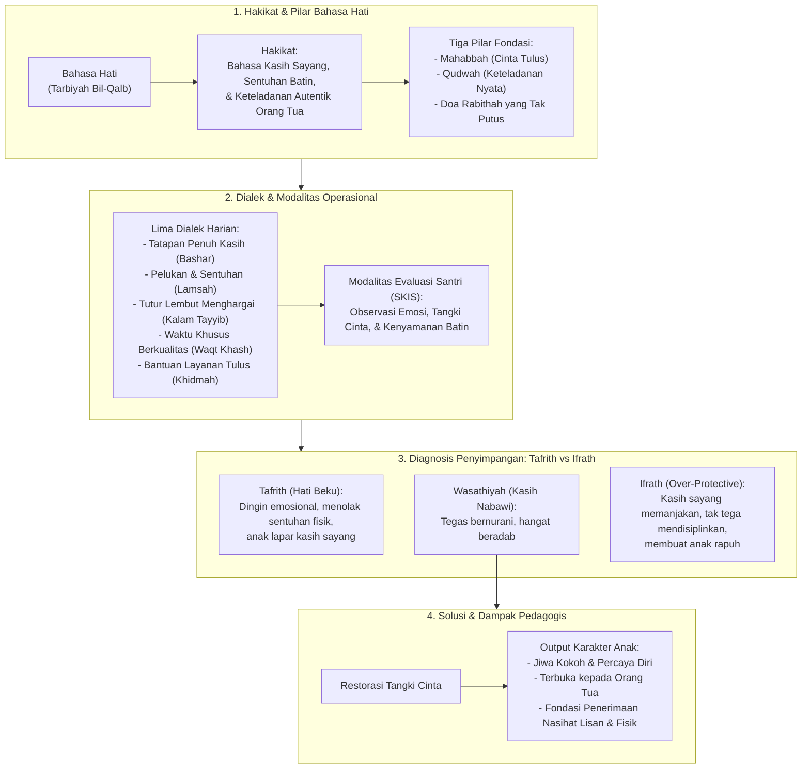

# Alur Materi: Bahasa Hati

> [!info] Artikel Lengkap
> Berkas materi lengkap: [[content/Paradigma - Implementasi PKN/Dokumen Pendidikan Karakter Nabawiyah/Paradigma & Implementasi/Pendidikan Ideal/Metode Mendidik/Bahasa Hati|Bahasa Hati]]

