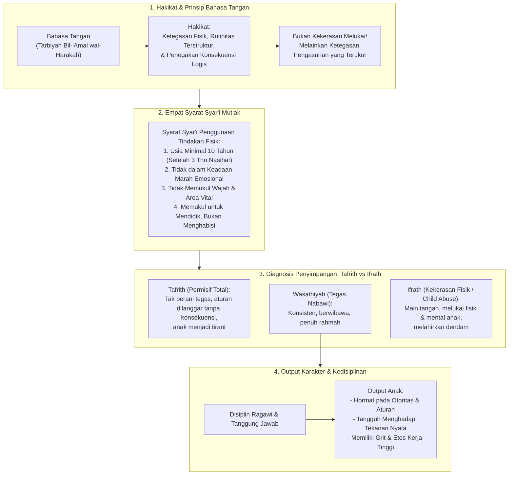

# Alur Materi: Bahasa Tangan

> [!info] Artikel Lengkap
> Berkas materi lengkap: [[content/Paradigma - Implementasi PKN/Dokumen Pendidikan Karakter Nabawiyah/Paradigma & Implementasi/Pendidikan Ideal/Metode Mendidik/Bahasa Tangan|Bahasa Tangan]]

