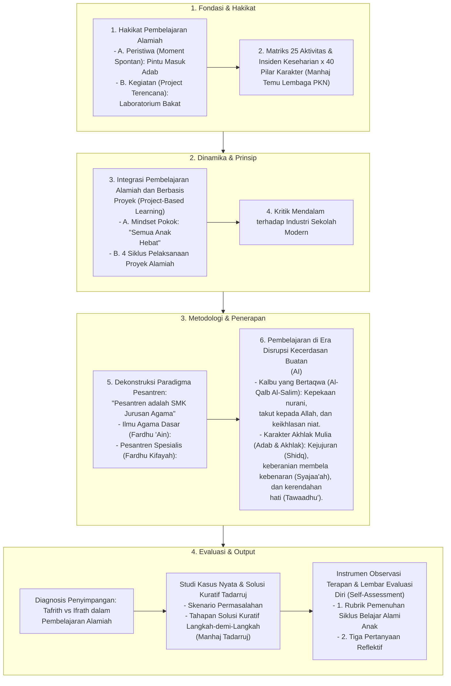

# Alur Materi: Pembelajaran Alamiah

> [!info] Artikel Lengkap
> Berkas materi lengkap: [[content/Paradigma - Implementasi PKN/Dokumen Pendidikan Karakter Nabawiyah/Paradigma & Implementasi/Pendidikan Ideal/Pembelajaran Alamiah|Pembelajaran Alamiah]]

