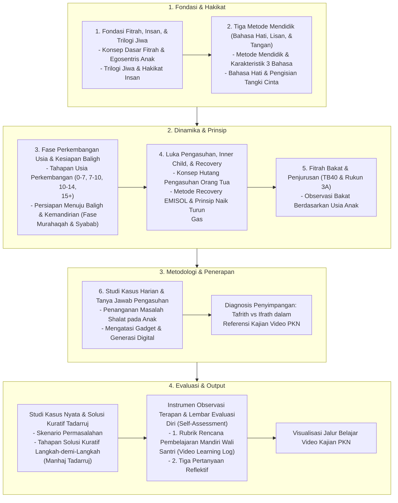

# Alur Materi: Referensi Kajian Video

> [!info] Artikel Lengkap
> Berkas materi lengkap: [[content/Paradigma - Implementasi PKN/Dokumen Pendidikan Karakter Nabawiyah/Referensi Kajian Video|Referensi Kajian Video]]

