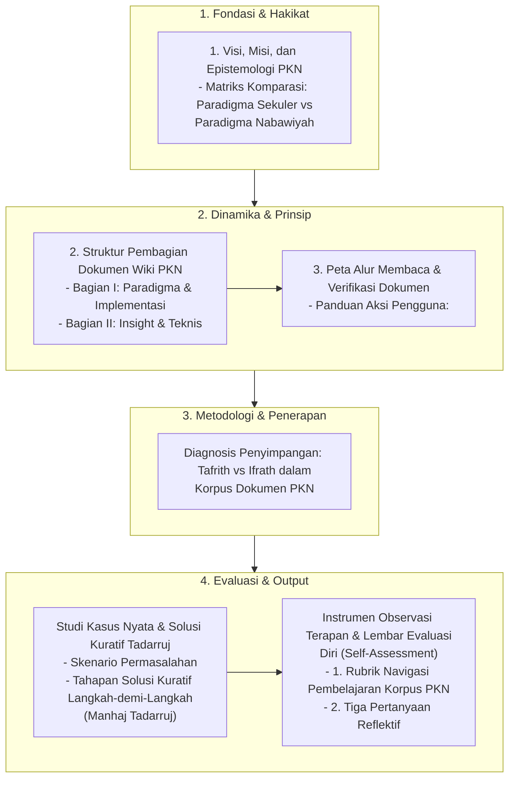

# Alur Materi: Dokumen Pendidikan Karakter Nabawiyah

> [!info] Artikel Lengkap
> Berkas materi lengkap: [[content/Paradigma - Implementasi PKN/Dokumen Pendidikan Karakter Nabawiyah/index|Dokumen Pendidikan Karakter Nabawiyah]]

