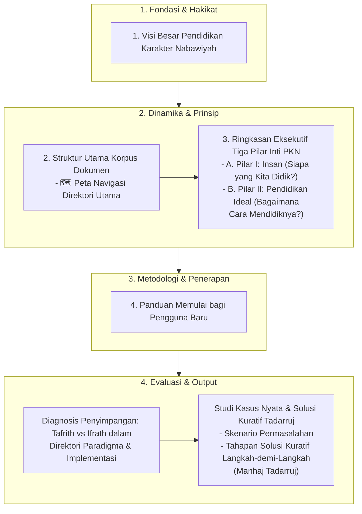

# Alur Materi: Paradigma - Implementasi PKN

> [!info] Artikel Lengkap
> Berkas materi lengkap: [[content/Paradigma - Implementasi PKN/index|Paradigma - Implementasi PKN]]

```mermaid
flowchart TD
    subgraph S1["1. Fondasi & Hakikat"]
        N1_1["1. Visi Besar Pendidikan Karakter Nabawiyah"]
    end

    subgraph S2["2. Dinamika & Prinsip"]
        N2_1["2. Struktur Utama Korpus Dokumen<br/>- 🗺️ Peta Navigasi Direktori Utama"]
        N2_2["3. Ringkasan Eksekutif Tiga Pilar Inti PKN<br/>- A. Pilar I: Insan (Siapa yang Kita Didik?)<br/>- B. Pilar II: Pendidikan Ideal (Bagaimana<br/>Cara Mendidiknya?)"]
        N2_1 --> N2_2
    end

    subgraph S3["3. Metodologi & Penerapan"]
        N3_1["4. Panduan Memulai bagi Pengguna Baru"]
    end

    subgraph S4["4. Evaluasi & Output"]
        N4_1["Diagnosis Penyimpangan: Tafrith vs Ifrath dalam<br/>Direktori Paradigma & Implementasi"]
        N4_2["Studi Kasus Nyata & Solusi Kuratif Tadarruj<br/>- Skenario Permasalahan<br/>- Tahapan Solusi Kuratif Langkah-demi-Langkah<br/>(Manhaj Tadarruj)"]
        N4_1 --> N4_2
    end

    S1 --> S2
    S2 --> S3
    S3 --> S4
```
