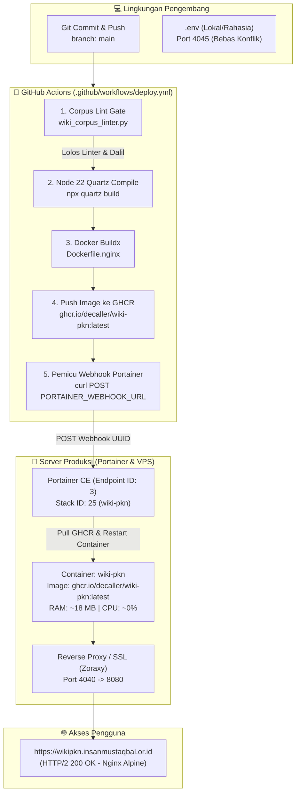

# Panduan Komprehensif CI/CD Deployment: Wiki-PKN

Dokumen ini merupakan panduan arsitektur dan operasional lengkap untuk alur integrasi berkelanjutan (*Continuous Integration*) dan penyebaran otomatis (*Continuous Deployment*) untuk **Wiki Pendidikan Karakter Nabawiyah (Wiki-PKN)**.

---

## 1. Ikhtisar Arsitektur Deployment

Wiki-PKN menggunakan arsitektur hybrid modern: kompilasi statis Quartz v5 dilakukan di cloud (*GitHub Actions*), artefak HTML/CSS/JS dibungkus ke dalam image container Nginx ultra-ringan (`ghcr.io/decaller/wiki-pkn:latest`), dan disebarkan ke VPS produksi melalui **Portainer GitOps Webhook**.



### Mengapa Nginx Container Menggantikan Node.js Runtime?
1. **Penghematan RAM Ekstrem:** Dari ~1.000 MB (Node.js runtime Quartz dev server) menjadi **~18 MB** (Nginx Alpine) — efisiensi memori mencapai **98.2%**.
2. **Beban CPU Server 0%:** Server produksi tidak lagi menjalankan kompilasi TypeScript atau bundling Markdown saat deploy. Seluruh beban kompilasi dipindahkan ke runner GitHub gratis.
3. **Keandalan Tinggi:** Nginx menangani clean URLs (`try_files $uri $uri.html $uri/ /index.html =404;`), kompresi Gzip, caching aset statis (30 hari), dan endpoint healthcheck `/healthz`.

---

## 2. Struktur Konfigurasi Lingkungan (`.env` vs `.env.example`)

Untuk menjaga keamanan repositori publik, **seluruh kredensial dan rahasia infrastruktur disimpan di file `.env` lokal** dan dilarang di-commit ke Git. File `.env.example` disediakan sebagai acuan struktur variabel.

### Variabel Lingkungan Utama

| Variabel | Lingkungan | Contoh Nilai | Keterangan |
| :--- | :--- | :--- | :--- |
| `DOMAIN` | Semua | `wikipkn.insanmustaqbal.or.id` | Domain kanonikal untuk sitemap & SEO |
| `PRODUCTION_URL` | Semua | `https://wikipkn.insanmustaqbal.or.id` | Alamat publik web produksi |
| `PORT` | Container | `8080` | Port listen internal Nginx |
| `HOST_PORT` | VPS Produksi | `4040` | Port host yang dipetakan reverse proxy ke container |
| `LOCAL_HOST_PORT` | Mesin Lokal | `4045` | Port aman lokal (menghindari bentrok dengan `api-tb40` di port 4040) |
| `GITHUB_REPOSITORY`| GitHub | `decaller/wiki-pkn` | Repositori sumber kode |
| `GHCR_IMAGE` | Docker | `ghcr.io/decaller/wiki-pkn:latest` | Target image di GitHub Container Registry |
| `PORTAINER_URL` | Infrastruktur | `https://portainer.insanmustaqbal.or.id` | Dashboard manajemen Portainer |
| `PORTAINER_ENDPOINT_ID` | Portainer | `3` | ID environment Docker Standalone |
| `PORTAINER_STACK_ID` | Portainer | `25` | ID Stack wiki-pkn di Portainer |
| `PORTAINER_WEBHOOK_UUID` | Portainer | `41440fa5-3131-42e1-a2b6-2a7bd675296d` | Token rahasia webhook AutoUpdate |
| `PORTAINER_WEBHOOK_URL` | Portainer | `https://portainer.insanmustaqbal.or.id/api/stacks/webhooks/...` | Endpoint webhook trigger redeployment |
| `UMAMI_HOST` | Analitik | `https://portainer.insanmustaqbal.or.id:3008` | Instance Umami self-hosted (Stack 27) |
| `QDRANT_HOST` | Korpus Dalil| `http://localhost:6333` | Vector database OpenBayan (11 juta matan) |
| `UNSTRUCTURED_HOST_PORT` | Ekstraksi | `8005` | Parsing PDF/PPTX via Unstructured API |

---

## 3. Konfigurasi GitHub Secrets

Agar GitHub Actions dapat memicu auto-deploy ke Portainer setelah selesai mem-push image ke GHCR, konfigurasikan secret berikut di GitHub:

1. Buka repositori di GitHub: `https://github.com/decaller/wiki-pkn/settings/secrets/actions`
2. Klik tombol **New repository secret**.
3. Tambahkan secret berikut:
   * **Name:** `PORTAINER_WEBHOOK_URL`
   * **Secret:** `https://portainer.insanmustaqbal.or.id/api/stacks/webhooks/41440fa5-3131-42e1-a2b6-2a7bd675296d`
4. Simpan (*Add secret*).

> [!NOTE]
> `GITHUB_TOKEN` tidak perlu dibuat manual karena disediakan otomatis oleh GitHub Actions dengan izin yang sudah dikonfigurasi (`contents: read`, `packages: write`) di file `.github/workflows/deploy.yml`.

---

## 4. Konfigurasi Portainer GitOps (Stack 25)

Stack 25 di Portainer dikonfigurasi dengan spesifikasi:

* **Endpoint ID:** `3`
* **Stack Name:** `wiki-pkn`
* **Repository URL:** `https://github.com/decaller/wiki-pkn`
* **Compose Path:** `docker-compose.yml`
* **AutoUpdate:**
  * `Webhook`: `41440fa5-3131-42e1-a2b6-2a7bd675296d`
  * `ForcePullImage`: `true` (Memastikan image `ghcr.io/decaller/wiki-pkn:latest` selalu ditarik baru)
  * `ForceUpdate`: `true`

Isi berkas `docker-compose.yml` produksi:
```yaml
services:
  wiki-pkn:
    image: ghcr.io/decaller/wiki-pkn:latest
    container_name: wiki-pkn
    restart: unless-stopped
    ports:
      - "${HOST_PORT:-4040}:${PORT:-8080}"
    environment:
      - DOMAIN=${DOMAIN:-wikipkn.insanmustaqbal.or.id}
      - PORT=${PORT:-8080}
    healthcheck:
      test: ["CMD-SHELL", "wget -q -O - http://127.0.0.1:${PORT:-8080}/healthz || exit 1"]
      interval: 30s
      timeout: 5s
      retries: 3
      start_period: 5s
```

---

## 5. Prosedur Deployment

Tersedia tiga metode deployment dari yang paling otomatis hingga opsi darurat:

### Opsi A: Deployment Otomatis (Rekomendasi Utama)
Setiap kali ada commit baru yang di-push ke branch `main`:
```bash
git add .
git commit -m "feat: pembaruan artikel dan dalil baru"
git push origin main
```
1. GitHub Actions otomatis menjalankan linter korpus (`python3 scripts/wiki_corpus_linter.py`).
2. Jika lulus audit, Quartz v5 mengompilasi halaman web statis.
3. Docker image Nginx dibangun dan di-push ke GHCR.
4. GitHub Actions memanggil webhook Portainer.
5. Portainer menarik image baru dan merefresh container tanpa downtime.

### Opsi B: Pemicu Manual via Webhook (cURL)
Jika image di GHCR sudah terbit atau ingin memaksa Portainer menarik image terbaru tanpa push kode:
```bash
curl -k -i -X POST https://portainer.insanmustaqbal.or.id/api/stacks/webhooks/41440fa5-3131-42e1-a2b6-2a7bd675296d
```
*Respons sukses:* `HTTP/2 204 No Content`.

### Opsi C: Manual Redeploy via Portainer MCP / Web UI
1. **Via Antigravity MCP:**
   Panggil tool `StackGitRedeploy` dengan parameter:
   ```json
   { "id": 25, "endpointId": 3 }
   ```
2. **Via Portainer Dashboard:**
   * Buka `https://portainer.insanmustaqbal.or.id`
   * Masuk ke Endpoint **3** $\to$ **Stacks** $\to$ **wiki-pkn**
   * Klik tombol **Redeploy this stack** dan centang **Re-pull image and redeploy**.

---

## 6. Verifikasi & Diagnostik Produksi

Setelah deployment selesai, lakukan verifikasi kesehatan sistem dengan langkah-langkah berikut:

### 1. Uji Respons HTTP Publik
```bash
curl -I https://wikipkn.insanmustaqbal.or.id/
```
Ekspektasi: `HTTP/2 200 OK` dengan server `nginx`.

### 2. Uji Healthcheck Internal
```bash
curl -I https://wikipkn.insanmustaqbal.or.id/healthz
```
Ekspektasi: `HTTP/2 200 OK` dengan payload `healthy\n`.

### 3. Periksa Log Container Produksi
Jalankan di server atau via Portainer:
```bash
docker logs wiki-pkn --tail 20
```

### 4. Periksa Penggunaan Sumber Daya (RAM & CPU)
```bash
docker stats wiki-pkn --no-stream
```
Ekspektasi: Penggunaan RAM stabil di kisaran **15 MB – 25 MB** dan CPU **0.00%**.

---

## 7. Penanganan Masalah & Rollback

### Problem: Image Gagal Di-pull (Unauthorized / 403)
* **Penyebab:** Paket GHCR belum berstatus publik.
* **Solusi:** Buka `https://github.com/users/decaller/packages/container/package/wiki-pkn/settings` $\to$ ubah visibilitas package menjadi **Public**.

### Problem: Healthcheck Container Unhealthy
* **Penyebab:** Pada Nginx Alpine, `wget` secara default mencoba me-resolve `localhost` ke IPv6 (`::1`).
* **Solusi:** Pastikan parameter healthcheck menggunakan IP eksplisit `http://127.0.0.1:8080/healthz` dan Nginx listen pada kedua stack (`listen 8080; listen [::]:8080;`).

### Prosedur Rollback Cepat
Jika deployment terbaru mengalami kesalahan fatal:
1. Revert commit terakhir di git:
   ```bash
   git revert HEAD
   git push origin main
   ```
   Pipeline CI/CD akan otomatis membangun kembali versi sebelumnya yang stabil.
2. Atau pada Portainer Stack 25, ubah sementara tag image di editor compose ke SHA stabil:
   ```yaml
   image: ghcr.io/decaller/wiki-pkn:sha-<previous-commit-hash>
   ```
