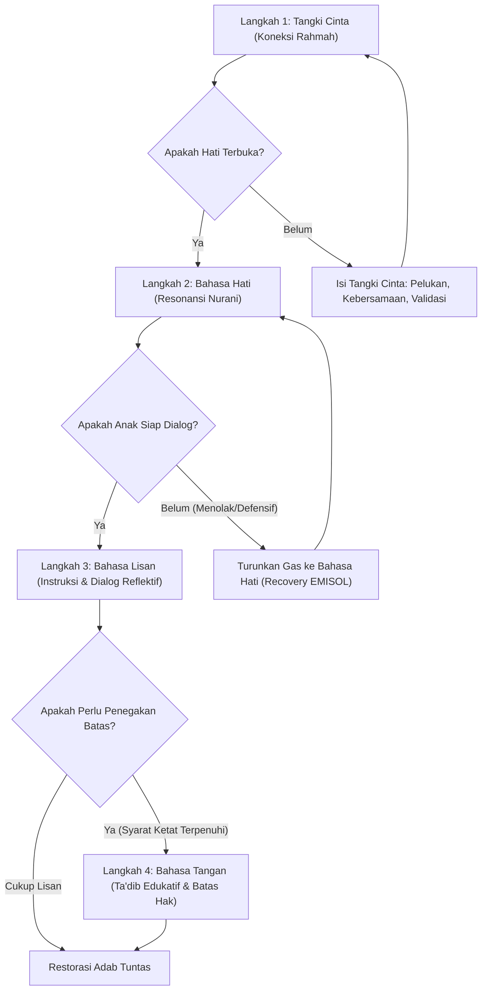

# Bank Studi Kasus Kurikulum Berbasis Peristiwa: Panduan Restorasi Adab & Karakter Anak

---

## 1. Landasan Filosofis: Mengatasi Kesenjangan Aqil-Baligh melalui Peristiwa

Dalam lanskap pendidikan kontemporer, kita menghadapi krisis arsitektural yang fundamental: fenomena di mana **"Baligh datang lebih cepat, namun Aqil datang lebih lambat"** (*Source 4*). Generasi digital hari ini mengalami akselerasi kematangan biologis, namun sering kali mengalami keterlambatan dalam kematangan akal, mental, dan spiritual. Ketimpangan ini bukan sekadar tren sosial, melainkan sebuah kegagalan sistemik yang memerlukan **Restorasi Karakter (*Character Recovery*)** sebagai prioritas strategis.

Kurikulum Berbasis Peristiwa adalah instrumen untuk melakukan pemulihan tersebut. Peristiwa harian—baik berupa konflik, pelanggaran, maupun hambatan perilaku—bukanlah gangguan bagi proses pendidikan, melainkan **pintu masuk utama (*entry point*)** bagi pendidikan adab yang paling organik. Jika peristiwa ini diabaikan atau ditangani secara keliru, kita berisiko melahirkan *"dewasa biologis namun anak-anak fungsional"*.

Setiap konflik adalah kesempatan bagi seorang anak untuk bertransformasi menjadi seorang *Muta'allim* (pembelajar) sejati. Untuk mengelola peristiwa ini, diperlukan kerangka kerja arsitektural empat langkah: **Tangki Cinta**, **Bahasa Hati**, **Bahasa Lisan**, dan **Bahasa Tangan**.

---

## 2. Kerangka Kerja Restorasi: Metode Empat Langkah (*The 4-Step Framework*)

Kerangka ini berakar pada prinsip *Adab al-Mu'allimin* (Etika Pendidik), di mana peran orang tua adalah sebagai arsitek jiwa yang memegang amanah berat.

### Penjelasan 4 Langkah:
1. **Langkah 1: Tangki Cinta (Koneksi Spiritual & Emosional)**  
   Seorang *Mu'allim* (pendidik) wajib menghadirkan kasih sayang (*rahmah*) sebelum instruksi. Merujuk pada *Source 35* (hal. 35), pendidik adalah pelindung yang menjaga anak dari konsekuensi berat *"pertanggungjawaban di hadapan Allah"*. Tangki Cinta bukan sekadar kenyamanan emosional, melainkan pemenuhan Amanah agar orang tua selamat di hari perhitungan kelak (*Source 13*).
2. **Langkah 2: Bahasa Hati (Empati & Niat)**  
   Restorasi bermula dari keikhlasan niat pendidik (*Source 13*). Sebelum menyentuh perilaku lahiriah, pendidik harus memastikan adanya resonansi kalbu yang mampu menembus fitrah anak. Tanpa keikhlasan, instruksi hanyalah paksaan yang akan ditolak oleh jiwa.
3. **Langkah 3: Bahasa Lisan (Instruksi & Dialog)**  
   Mengambil inspirasi dari tradisi Kuttab (*Source 19*) yang mendahulukan penguasaan "membaca dan menulis" sebelum ilmu-ilmu kompleks, pendidik harus memastikan anak mampu "membaca" bobot moral dari tindakannya. Dialog harus bersifat reflektif, membangun kesadaran intelektual (Aqil) sebelum beralih ke tindakan fisik.
4. **Langkah 4: Bahasa Tangan (Konsekuensi & Ketegasan/Ta'dib)**  
   Ketegasan dalam tradisi Nabawi disebut sebagai *Ta'dib*. Pendidik wajib menegakkan keadilan (*'adl*) bahkan dalam disiplin (*Source 35*). Bahasa tangan adalah bentuk perlindungan terhadap martabat anak, bukan pelampiasan emosi, yang bertujuan mengoreksi perilaku tanpa menghancurkan identitas diri.

### Perbandingan Paradigma Pendidikan

| Tahapan | Pendekatan Reaktif (Umum) | Pendekatan Restorasi Nabawi (Arsitektural) |
|---|---|---|
| **Tangki Cinta** | Menghukum saat emosi memuncak; hubungan bersifat transaksional. | Menjalankan Amanah melalui Rahmah untuk menyelamatkan anak (*Source 35*). |
| **Bahasa Hati** | Fokus pada kepatuhan luar demi ketenangan orang tua semata. | Fokus pada keikhlasan niat pendidik untuk menyentuh fitrah anak (*Source 13*). |
| **Bahasa Lisan** | Menggunakan ancaman, label (*labeling*), atau ceramah satu arah. | Dialog reflektif; anak diajak "membaca" dampak moralitas (Model Kuttab). |
| **Bahasa Tangan** | Hukuman fisik yang merendahkan martabat dan melampiaskan amarah. | Penegakan *Ta'dib* dan keadilan (*'adl*) yang menjaga martabat (*Source 35*). |

---

## 3. Studi Kasus 1: Anak Menolak/Mogok Shalat Fardhu

Shalat adalah fondasi adab pertama. Kegagalan dalam menangani hal ini akan merusak seluruh struktur adab lainnya (*Source 21*).

* **Tangki Cinta:** Bangun koneksi spiritual di mana shalat dilihat sebagai sarana hamba berlindung kepada Penciptanya, bukan beban administratif.
* **Bahasa Hati:** Selami hambatan internal anak. Apakah ini bentuk perlawanan pasif karena hilangnya koneksi emosional dengan orang tua?
* **Bahasa Lisan:** Merujuk pada *Source 21*, saat anak memasuki usia 7 tahun, ia berada pada ambang akuntabilitas baru. Pendidik harus bergeser dari sekadar mengajak menjadi memerintah dengan cara yang tetap mengandung rahmah.
* **Bahasa Tangan:** Terapkan konsekuensi edukatif yang konsisten namun menjaga kecintaan anak pada ibadah.

> **Analisis "So What?":**  
> Penanganan yang kasar tanpa dasar cinta pada tahap ini akan menciptakan trauma spiritual yang menjauhkan anak dari Tuhannya secara permanen.

---

## 4. Studi Kasus 2: Pertengkaran Hebat Antar-Saudara (*Sibling Rivalry*)

Konflik saudara adalah laboratorium untuk membangun akhlak *syakhshiyyah* (karakter pribadi).

* **Tangki Cinta:** Pendidik harus bertindak seperti *Mu'allim* di dalam kelas yang adil. Merujuk pada *Source 35*, guru wajib memperlakukan seluruh murid dengan kesamaan hak (*parity*).
* **Bahasa Hati:** Validasi emosi tanpa memihak. Keberpihakan orang tua dalam konflik akan menghancurkan tangki cinta baik bagi si korban maupun pelaku karena mengaburkan konsep keadilan.
* **Bahasa Lisan:** Ajarkan bahasa resolusi konflik sebagai bagian dari *social adab*.
* **Bahasa Tangan:** Intervensi fisik dilakukan sebagai bentuk perlindungan keamanan dan penegakan batas hak milik.

> **Analisis "So What?":**  
> Pengelolaan konflik yang adil akan membangun kecerdasan sosial yang krusial bagi masa depan anak sebagai anggota masyarakat yang beradab.

---

## 5. Studi Kasus 3: Adiksi Layar Gawai (*Gadget Screen Time*)

Gawai dalam konteks digital adalah *"Aqil-delayer"* (*Source 4*) yang menghambat kematangan mental anak.

* **Tangki Cinta:** Gantikan dopamin buatan dari layar dengan dopamin alami melalui koneksi nyata dengan orang tua.
* **Bahasa Hati:** Pahami bahwa anak mencari pengakuan di dunia digital karena defisit pengakuan di dunia nyata.
* **Bahasa Lisan:** Negosiasi jadwal penggunaan melalui *aqad* (perjanjian tertulis) yang jelas.
* **Bahasa Tangan:** Pengaturan teknis atau penyitaan gawai harus dibingkai sebagai *"Amanah Protection"*—tindakan orang tua dalam melindungi fitrah anak dari erosi digital (*Source 4*).

### 3 Takeaway Utama dalam Restorasi Gadget:
1. **Gawai sebagai Aqil-Delayer:** Batasi penggunaan untuk mempercepat kematangan akal.
2. **Amanah Protection:** Penyitaan bukan hukuman, melainkan perlindungan jiwa.
3. **Restorasi Dopamin:** Hubungan manusia adalah penyembuh utama adiksi digital.

---

## 6. Studi Kasus 4: Anak Tertangkap Berbohong (*Kadzib*)

Kejujuran (*Shidq*) adalah inti dari adab seorang pembelajar (*Muta'allim*).

* **Tangki Cinta:** Ciptakan *"Safe Zone"* di mana kejujuran lebih dihargai daripada kesempurnaan.
* **Bahasa Hati:** Teliti apakah bohong muncul karena ketakutan terhadap amarah orang tua atau meniru lingkungan.
* **Bahasa Lisan:** Gunakan dialog reflektif tanpa melabeli anak sebagai "pembohong".
* **Bahasa Tangan:** Terapkan restitusi (memperbaiki dampak kebohongan). Merujuk pada *Source 12* dan *13*, integritas anak adalah cerminan dari integritas pendidiknya. Seorang *Mu'allim* tidak akan bisa membentuk sifat Shidq pada anak jika ia sendiri sering menggunakan tipu daya (seperti janji palsu) dalam mendidik.

> **Analisis "So What?":**  
> Kejujuran anak adalah investasi bagi warisan orang tua; anak yang Shidq akan menjadi pembelajar yang senantiasa mendoakan orang tuanya (*Source 12*).

---

## 7. Penutup: Menjadi Mu'allim yang Beradab untuk Generasi Aqil-Baligh

Keberhasilan restorasi ini tidak bergantung pada teknik semata, melainkan pada kualitas diri orang tua sebagai *Mu'allim*. Sesuai dengan penegasan dalam *Source 37*, setiap orang tua memikul **"Tanggung Jawab yang Besar" (*Mas’uliyah ‘Adhimah*)** yang terkalung di leher mereka (*‘unuqihi*). Kita akan dimintai pertanggungjawaban atas setiap jiwa yang Allah amanahkan di bawah kekuasaan kita.

Setiap konflik, pelanggaran, dan peristiwa harian bukanlah beban, melainkan **"Kuttab di dalam rumah"** yang telah Allah rancang dengan sempurna. Melalui penerapan Kurikulum Berbasis Peristiwa ini, kita sedang melakukan arsitektur karakter untuk memastikan anak tidak hanya baligh secara biologis, tetapi juga mencapai derajat Aqil yang paripurna menuju hamba Allah yang beradab.
