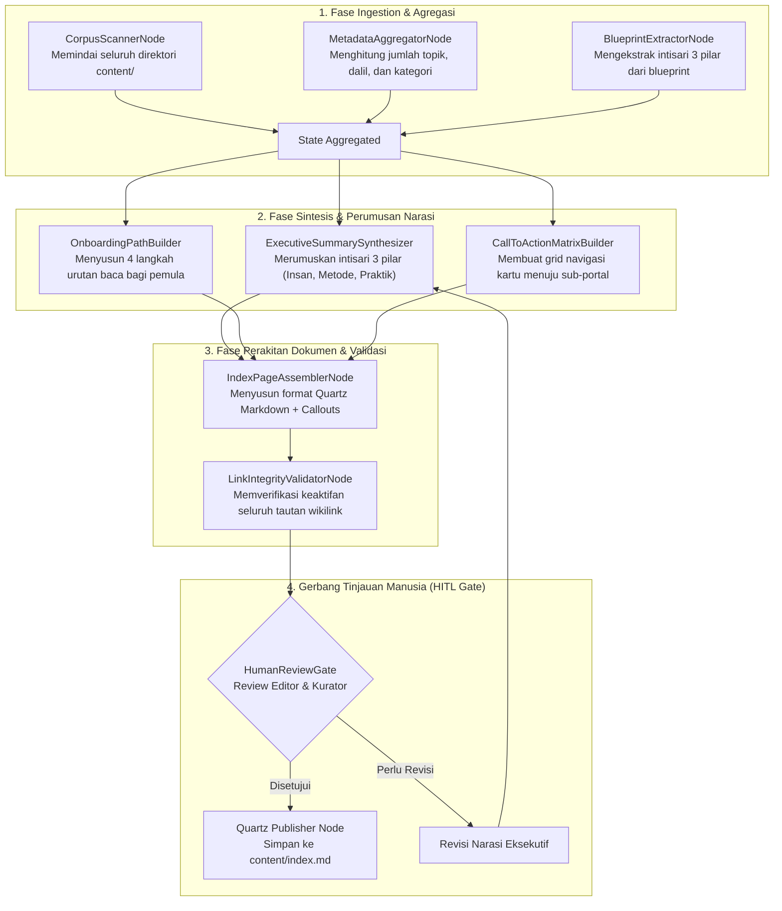

# Desain Pipeline 01: Halaman Utama / Portal Indeks (Home & Overview Hub)

Dokumen ini mengatur spesifikasi arsitektur pipeline otomatis untuk menyusun dan memperbarui **Halaman Utama (Landing Portal / Index)** pada Wiki Pendidikan Karakter Nabawiyah (PKN).

---

## 1. Karakteristik & Target Output Halaman

Halaman utama berfungsi sebagai gerbang sambutan, peta orientasi makro, dan etalase khazanah pemikiran PKN. 
- **Tujuan Utama:** Memberikan pemahaman fondasional instan kepada pembaca baru (guru, orang tua, pengelola sekolah), menyajikan ringkasan eksekutif 3 pilar inti, menampilkan metrik korpus materi, dan mengarahkan pengguna ke *Reading Path* yang tepat.
- **Komponen Kunci Output Markdown:**
  - Banner selamat datang visual & callout identitas peradaban.
  - Ringkasan Eksekutif Tiga Pilar:
    1. **Insan (Siapa yang Didik?):** Trilogi Jiwa (*Jasad, Ruh, Nafs*) & Fitrah.
    2. **Pendidikan Ideal (Bagaimana Mendidiknya?):** Metode Nabawi & 3 Bahasa Pendidik.
    3. **Implementasi (Di Mana & Siapa?):** Sinergi Ayah, Bunda, Guru, dan Ekosistem.
  - Kartu Navigasi Cepat (*Quick Access Cards*) ke kluster direktori utama.
  - Peta Alur Belajar Pemula (*Mulai dari Sini / Onboarding Path*).
  - Statistik Korpus & Status Pembaruan (Jumlah topik, dalil terverifikasi, studi kasus).

---

## 2. Sumber Bahan Baku (Multi-Modal Ingestion)

Masukan untuk pipeline halaman utama bersifat agregatif dari seluruh korpus:
1. **Naskah Visi & Blueprint:** Naskah fondasi seperti `content/Paradigma - Implementasi PKN/Dokumen Pendidikan Karakter Nabawiyah/Paradigma & Implementasi/PKN Blueprint Arsitektur Sistem.md`.
2. **Metadata Struktur Korpus:** Berkas pohon navigasi `nav_structure.json` dan database halaman di `content/`.
3. **Statistik Terkini Ekosistem:** Agregasi dari katalog dalil (`QURAN_DALIL_CATALOG.md`, `DALIL_MAPPING.md`) dan engine asesmen TB40 (`CONTAINERS_ECOSYSTEM.md`).

---

## 3. Diagram Alur State Graph LangGraph



---

## 4. Spesifikasi Node & State Schema

### Skema State Spesifik: `HomePageState`

```python
from typing import TypedDict, List, Dict, Any

class PillarSummary(TypedDict):
    pillar_id: str                   # 'insan', 'pendidikan_ideal', 'implementasi'
    title: str
    tagline: str
    key_points: List[str]
    target_link: str

class HomePageState(TypedDict):
    total_articles: int
    total_dalil: int
    total_case_studies: int
    pillars: List[PillarSummary]
    reading_steps: List[Dict[str, str]]
    navigation_clusters: List[Dict[str, Any]]
    markdown_output: str
    validation_errors: List[str]
    hitl_approved: bool
```

### Rincian Fungsi Tiap Node:
1. **`CorpusScannerNode`**: Memindai direktori `content/` menggunakan fs parser, mencatat jumlah berkas, rasio kelengkapan artikel, dan tag populer.
2. **`ExecutiveSummarySynthesizer`**: Menggunakan LLM dengan prompt sistem khusus PKN untuk merangkum esensi peradaban nabawiyah dalam 2 paragraf padat tanpa jargon rumit.
3. **`OnboardingPathBuilder`**: Mengambil relasi prasyarat tema dan mengemasnya dalam 4 urutan langkah sederhana:
   - *Langkah 1:* Memahami Hakikat Anak (Trilogi Jiwa).
   - *Langkah 2:* Menemukan Fitrah & Bakat (TB40).
   - *Langkah 3:* Menguasai Metode Tarbiyah (3 Bahasa Pendidik).
   - *Langkah 4:* Menata Ekosistem Praktik (Sinergi Ayah-Bunda-Sekolah).
4. **`LinkIntegrityValidatorNode`**: Memastikan setiap tautan `[[...]]` memiliki berkas target fisik di `content/`.

---

## 5. Strategi Prompting AI

```markdown
### System Prompt: ExecutiveSummarySynthesizer
Anda adalah Kurator Senior Pendidikan Karakter Nabawiyah (PKN).
Tugas Anda adalah merumuskan narasi pembuka Halaman Utama Wiki-PKN.

Panduan Penulisan:
1. Nada bicara: Teduh, berwibawa, ilmiah, dan berakar pada wahyu (Al-Qur'an dan Sunnah).
2. Hindari dikotomi sempit antara ilmu agama dan ilmu umum; tegaskan bahwa anak lahir membawa fitrah tauhid dan potensi kekhalifahan.
3. Rumuskan 3 pilar utama secara terstruktur:
   - Pilar I (Insan): Hakikat jasad, ruh, dan tiga keadaan jiwa (Ammarah, Lawwamah, Muthmainnah).
   - Pilar II (Pendidikan Ideal): Metode nabawiyah yang mengedepankan keteladanan, kasih sayang, dan pentahapan (tadarruj).
   - Pilar III (Implementasi): Tanggung jawab kepemimpinan ayah, kelembutan bunda, dan peran guru sebagai fasilitator fitrah.
4. Format output: Markdown bersih dengan callout Quartz (> [!note], > [!tip]).
```

---

## 6. Level Kebutuhan Human-in-the-Loop (HITL)

- **Tingkat Kebutuhan HITL:** `Sedang`
- **Kriteria Tinjauan:**
  - Kelayakan etika dan kehangatan sambutan naskah beranda.
  - Ketepatan kutipan ayat atau hadits pembuka peradaban.
  - Keselarasan tautan onboarding dengan kurikulum rujukan Ustadz Abdul Kholiq / Ustadz Bayu.
  - Keterbacaan tampilan di perangkat layar kecil (mobile responsive layout).

---

## 7. Contoh Cuplikan Dokumen Markdown Terformat

```markdown
---
title: "Wiki Pendidikan Karakter Nabawiyah (PKN)"
description: "Pusat rujukan komprehensif paradigma, kurikulum, dan implementasi pendidikan karakter berbasis fitrah dan sunnah Rasulullah ﷺ."
---

![[assets/banners/banner_beranda.webp]]
*Gerbang Utama Khazanah Pendidikan Karakter Nabawiyah*

> [!note] Visi Utama Pendidikan Karakter Nabawiyah
> Membangun kembali peradaban Islam melalui rekayasa pengasuhan berbasis fitrah, memulihkan peran kepemimpinan keluarga, dan mengantarkan anak menuju puncak kematangan aqil-baligh yang bertakwa dan berdaya guna bagi umat.

# Selamat Datang di Wiki-PKN

Pendidikan Karakter Nabawiyah bukan sekadar metode mengajar, melainkan sebuah **paradigma holistik** yang memandang anak sebagai amanah ilahi dengan bekal fitrah yang sempurna...

## 🏛️ Tiga Pilar Inti Khazanah PKN
1. **[[content/Paradigma - Implementasi PKN/Dokumen Pendidikan Karakter Nabawiyah/Paradigma & Implementasi/Insan/index|Pilar I: Insan]]** — Mengenal hakikat ciptaan, trilogi jiwa, dan peta fitrah bakat anak.
2. **[[content/Paradigma - Implementasi PKN/Dokumen Pendidikan Karakter Nabawiyah/Paradigma & Implementasi/Pendidikan Ideal/index|Pilar II: Pendidikan Ideal]]** — Meneladani metodologi Rasulullah ﷺ, menata bahasa hati, lisan, dan tangan.
3. **[[content/Paradigma - Implementasi PKN/Dokumen Pendidikan Karakter Nabawiyah/Paradigma & Implementasi/Implementasi/index|Pilar III: Implementasi Lapangan]]** — Membagi peran ayah, bunda, dan sekolah dalam kurikulum kehidupan.
```
