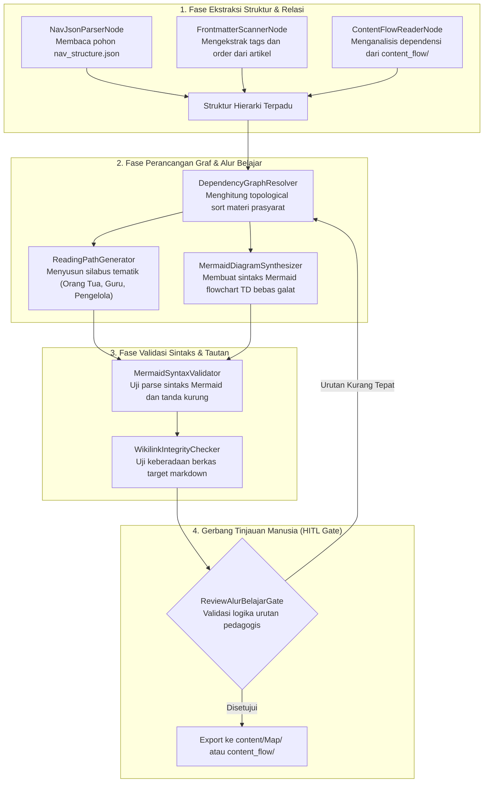
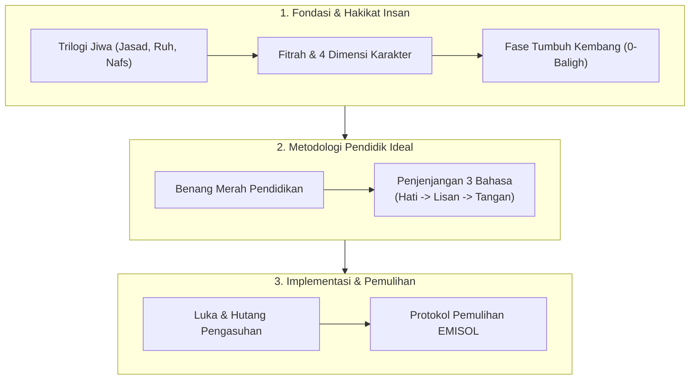

# Desain Pipeline 02: Halaman Navigasi, MOC & Peta Alur Materi (Navigation Hub & Content Flow)

Dokumen ini memaparkan spesifikasi pipeline pemrosesan dokumen untuk menghasilkan **Halaman Navigasi, Peta Alur Materi (Content Flow), dan Map of Content (MOC)** pada Wiki Pendidikan Karakter Nabawiyah.

---

## 1. Karakteristik & Target Output Halaman

Halaman navigasi berfungsi sebagai kompas mental bagi pembaca agar tidak tersesat dalam lebatnya belantara materi PKN.
- **Tujuan Utama:** Memetakan hierarki topik dari yang paling fundamental (akar) hingga cabang operasional (daun), menyediakan rute belajar terkurasi (*reading paths*), dan menampilkan diagram alur visual interaktif.
- **Komponen Kunci Output Markdown:**
  - Pohon Direktori Terstruktur dengan tautan aktif (`[[...]]`) ke setiap bab.
  - Diagram Alur Mermaid (`flowchart TD`) yang membagi alur materi menjadi 4 kuadran:
    1. Fondasi & Hakikat
    2. Dinamika & Prinsip
    3. Metodologi & Penerapan
    4. Evaluasi & Output
  - Matriks Prasyarat Topik (*Prerequisite Matrix*): Menjelaskan topik mana yang wajib dibaca sebelum topik turunan dipelajari.
  - Estimasi waktu baca dan tingkat kesulitan per kluster.

---

## 2. Sumber Bahan Baku (Multi-Modal Ingestion)

1. **Struktur Navigasi JSON:** Berkas master `nav_structure.json` yang memuat relasi parent-child seluruh artikel.
2. **Direktori Alur Konten:** Repositori alur materi di `content_flow/` (106 berkas flowchart Mermaid).
3. **Tagging & Metadata Artikel:** Frontmatter YAML (`tags`, `aliases`, `order`) dari seluruh berkas Markdown di `content/`.

---

## 3. Diagram Alur State Graph LangGraph



---

## 4. Spesifikasi Node & State Schema

### Skema State Spesifik: `NavigationState`

```python
from typing import TypedDict, List, Dict, Any, Tuple

class NavigationNode(TypedDict):
    node_id: str
    title: str
    relative_path: str
    prerequisites: List[str]
    children: List[str]
    target_audience: List[str]       # 'orang_tua', 'guru', 'asatidzah'

class NavigationState(TypedDict):
    hierarchy_tree: Dict[str, Any]
    nodes: Dict[str, NavigationNode]
    dependency_edges: List[Tuple[str, str]]
    recommended_paths: Dict[str, List[str]]
    generated_mermaid: str
    syntax_valid: bool
    review_approved: bool
```

### Rincian Fungsi Node:
1. **`DependencyGraphResolver`**: Membangun Directed Acyclic Graph (DAG) antartopik. Mengidentifikasi siklus tertutup (circular dependency) dan memastikan topik fondasi (misal: `Pembagian Jiwa.md`) selalu mendahului topik kuratif (misal: `Recovery.md`).
2. **`ReadingPathGenerator`**: Merumuskan 3 jalur belajar terkurasi:
   - *Jalur Orang Tua:* Fokus pada hakikat anak, bahasa kasih sayang, luka pengasuhan, dan penanganan perilaku harian.
   - *Jalur Guru & Asatidzah:* Fokus pada metodologi nabawiyah, adab KBM, TB40 di kelas, dan instrumen observasi tanpa angka.
   - *Jalur Pengelola Lembaga:* Fokus pada arsitektur sistem, benchmarking sekolah, dan budaya peradaban institusi.
3. **`MermaidSyntaxValidator`**: Menguji sintaks Mermaid menggunakan aturan ketat (seperti pada `scripts/validate_mermaid_syntax.py`): node label wajib diapit tanda petik ganda `["..."]` untuk menghindari galat rendering Quartz.

---

## 5. Strategi Prompting AI

```markdown
### System Prompt: ReadingPathGenerator
Anda adalah Arsitek Kurikulum Pendidikan Karakter Nabawiyah.
Tugas Anda adalah merumuskan rute bacaan (*Reading Path*) berbasis dependensi konsep.

Prinsip Penataan Alur:
1. **As-Salafiyyah at-Tadarrujiyyah (Tahapan Alami):** Pemahaman akidah dan hakikat fitrah jiwa harus tuntas sebelum masuk ke tata cara pendisiplinan.
2. **Koneksi Sebelum Koreksi:** Artikel tentang 'Tangki Cinta' dan 'Bahasa Hati' wajib dibaca sebelum artikel tentang 'Bahasa Tangan / Pukulan Edukatif'.
3. Sertakan alasan pedagogis singkat di samping setiap rekomendasi rute bacaan.
```

---

## 6. Level Kebutuhan Human-in-the-Loop (HITL)

- **Tingkat Kebutuhan HITL:** `Rendah - Sedang`
- **Kriteria Tinjauan:**
  - Keabsahan visual rendering diagram Mermaid pada tema gelap maupun terang.
  - Tidak ada simpul buntu (*orphan pages*) yang terlewat dalam peta navigasi.
  - Alur membaca terasa mengalir dan tidak membingungkan pemula.

---

## 7. Contoh Cuplikan Dokumen Markdown Terformat

```markdown
---
title: "Peta Navigasi & Alur Materi Khazanah PKN"
description: "Peta jalan konseptual dan rute belajar terkurasi untuk mendalami khazanah Pendidikan Karakter Nabawiyah secara bertahap."
---

# 🗺️ Peta Navigasi & Alur Materi PKN

Untuk mendapatkan pemahaman yang utuh tanpa terjebak pada penerapan parsial yang kaku (*ifrath*) atau kelalaian (*tafrith*), pembaca disarankan mengikuti peta alur materi berikut:



## 🧭 Rekomendasi Jalur Membaca (Reading Paths)

### 👨‍👩‍👧 Jalur 1: Ayah dan Bunda di Rumah
1. Mulai dengan memahami hakikat anak: [[content/Paradigma - Implementasi PKN/Dokumen Pendidikan Karakter Nabawiyah/Paradigma & Implementasi/Insan/Pembagian Jiwa|Pembagian Jiwa]]
2. Memenuhi kebutuhan afeksi: [[content/Paradigma - Implementasi PKN/Dokumen Pendidikan Karakter Nabawiyah/Paradigma & Implementasi/Insan/Tangki Cinta|Tangki Cinta]]
3. Menguasai komunikasi lembut: [[content/Paradigma - Implementasi PKN/Dokumen Pendidikan Karakter Nabawiyah/Paradigma & Implementasi/Pendidikan Ideal/Bahasa Hati|Bahasa Hati]]
```
