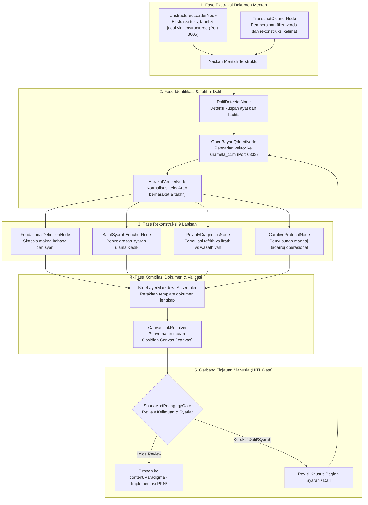

# Desain Pipeline 03: Halaman Fokus Bahasan Satu Tema (Deep-Dive Konseptual)

Dokumen ini mengatur spesifikasi teknis dan orkestrasi pipeline pemrosesan dokumen untuk menghasilkan **Halaman Fokus Bahasan Satu Tema (Materi Pokok PKN)** dengan menerapkan **Standar Anatomi 9 Lapisan Baku**.

---

## 1. Karakteristik & Target Output Halaman

Halaman fokus tema merupakan tulang punggung keilmuan Wiki-PKN. Setiap artikel mengupas tuntas satu konsep utama (misalnya: *Tangki Cinta, Pembagian Jiwa, Shidq, Manhaj Tadarruj, atau Bahasa Tangan*) dengan ketelitian ilmiah tinggi.
- **Tujuan Utama:** Menghasilkan artikel akademis-operasional yang menggabungkan ketajaman dalil Al-Qur'an/Hadits, syarah ulama salaf, diagnosis jurang ekstrim (*tafrith vs ifrath*), dan panduan praktis bagi pendidik.
- **Standar Anatomi 9 Lapisan Wajib:**
  1. **Frontmatter Baku:** `title`, `description`, `tags`, `aliases`.
  2. **Banner Visual:** Aset gambar ilustrasi tematik (`![[assets/banners/...]]`).
  3. **Callout Metodologi & Sumber:** Penghormatan sanad ilmu (Ustadz Abdul Kholiq, OpenBayan, Himmatul Ummah, SOTAB).
  4. **Paragraf Pengantar & Urgensi Peradaban:** Konteks problematika zaman dan kedudukan tema.
  5. **Callout Dalil Nabawiyah Primer:** Matan Arab berharakat penuh, terjemahan, takhrij kitab induk, relevansi pedagogis.
  6. **Definisi & Konsep Fondasional:** Makna etimologis bahasa Arab dan terminologis syar'i.
  7. **Relevansi Pedagogis & Syarah Ulama Klasik:** Ulasan kitab *Ihya Ulumiddin*, *Madarijus Salikin*, atau *Fathul Bari* serta teladan interaksi Rasulullah ﷺ bersama para sahabat.
  8. **Komponen & Taksonomi Karakter:** Matriks perilaku nyata dan referensi visual Obsidian Canvas (`.canvas`).
  9. **Diagnosis Penyimpangan & Solusi Kuratif:** Bedah jurang *Tafrith* (meremehkan), *Ifrath* (berlebihan), dan *Wasathiyah* (jalan tengah) serta tahapan kuratif langkah-demi-langkah.

---

## 2. Sumber Bahan Baku (Multi-Modal Ingestion)

1. **Modul Cetak & PDF Buku:** Berkas di `searchable_pdfs/` (diproses via Unstructured API).
2. **Slide Presentasi Daurah:** Berkas PPTX di `presentations/` (diekstraksi struktur poin & diagramnya).
3. **Transkrip Kajian Audio:** Berkas suara yang ditranskrip melalui model Whisper ke teks mentah.
4. **Naskah Arsip:** Dokumen teks di `old_backup/random/` yang memuat transkrip materi pendahulu.

---

## 3. Diagram Alur State Graph LangGraph



---

## 4. Spesifikasi Node & State Schema

### Skema State Spesifik: `ThemePageState`

```python
from typing import TypedDict, List, Dict, Any, Optional

class DalilEntry(TypedDict):
    arabic_text: str
    indonesian_translation: str
    source_citation: str             # e.g., 'HR. Bukhari No. 1234'
    openbayan_id: str
    pedagogical_relevance: str

class PolarityAnalysis(TypedDict):
    tafrith_symptoms: List[str]
    tafrith_root_causes: List[str]
    ifrath_symptoms: List[str]
    ifrath_root_causes: List[str]
    wasathiyah_solution: str
    tadarruj_steps: List[str]

class ThemePageState(TypedDict):
    theme_title: str
    slug: str
    intro_paragraphs: List[str]
    primary_dalil: List[DalilEntry]
    linguistic_definition: str
    terminological_definition: str
    salaf_syarah: List[Dict[str, str]]
    polarity_diagnostic: PolarityAnalysis
    canvas_file_path: Optional[str]
    markdown_output: str
    hitl_reviewer: Optional[str]
    hitl_status: str
```

### Rincian Fungsi Node Kunci:
1. **`UnstructuredLoaderNode`**: Memanggil endpoint `POST http://localhost:8005/general/v0/general` dengan parameter `strategy="hi_res"` untuk mengekstrak teks, hierarki judul, dan tabel dari dokumen modul PKN.
2. **`OpenBayanQdrantNode`**: Melakukan pencarian kemiripan semantik (*dense retrieval*) terhadap matan dalil ke Qdrant port 6333 koleksi `shamela_11m`, mengunci nomor hadits resmi dan teks Arab berharakat otentik.
3. **`PolarityDiagnosticNode`**: Mengekstrak fenomena penyimpangan perilaku pengasuhan menjadi dua jurang ekstrim (misal: pada tema *Disiplin*, Tafrith = pembiaran anarkis tanpa aturan; Ifrath = kekerasan fisik dan hukuman tanpa dialog emosional).
4. **`CanvasLinkResolver`**: Mengaitkan artikel dengan berkas visualisasi konsep `.canvas` (misal: `content/canvas/Trilogi_Jiwa.canvas`) sesuai panduan kestabilan Quartz.

---

## 5. Strategi Prompting AI

```markdown
### System Prompt: PolarityDiagnosticNode
Anda adalah Pakar Tarbiyah Islamiyah & Konsultan Psikologi Pengasuhan PKN.
Analisis tema yang diberikan dalam kerangka dialektika Tafrith (Melalaikan) vs Ifrath (Berlebihan):

1. **Tafrith:**
   - Apa bentuk kelalaian pendidik terhadap hak anak dalam tema ini?
   - Apa gejala perilaku santri jika hak ini diabaikan?
2. **Ifrath:**
   - Bagaimana jika tema ini diterapkan secara kaku, memaksa, atau melampaui kapasitas usia anak?
   - Apa trauma psikologis atau luka pengasuhan yang timbul?
3. **Wasathiyah Nabawiyah:**
   - Bagaimana Rasulullah ﷺ mencontohkan keseimbangan proporsional pada tema ini?
4. **Manhaj Tadarruj (Tahapan Solusi):**
   - Rumuskan 3–4 langkah pemulihan/penerapan berjenjang (dari pembenahan hati orang tua hingga pembiasaan anak).
```

---

## 6. Level Kebutuhan Human-in-the-Loop (HITL)

- **Tingkat Kebutuhan HITL:** `Tinggi`
- **Kriteria Tinjauan:**
  - Verifikasi keabsahan harakat teks Arab dalil (tidak boleh ada kesalahan i'rab).
  - Kesesuaian syarah ulama salaf yang dinukil dengan manhaj ahlus sunnah.
  - Kepekaan bahasa agar solusi kuratif tidak terkesan menyalahkan orang tua, melainkan membimbing dengan empati.

---

## 7. Contoh Cuplikan Dokumen Markdown Terformat

```markdown
---
title: "Tangki Cinta: Fondasi Keterikatan Jiwa dalam Pengasuhan Nabawiyah"
description: "Konsep pemenuhan afeksi emosional anak sebagai prasyarat mutlak sebelum penanaman disiplin dan beban taklif."
tags:
  - pendidikan-karakter-nabawiyah
  - insan
  - tema-pokok
---

![[assets/banners/banner_tangki_cinta.webp]]
*Visualisasi Pemenuhan Afeksi Jiwa Anak Sebelum Penegakan Taklif*

> [!note] Catatan Metodologi & Sumber Penyusunan Dokumen
> Naskah ini merupakan hasil sintesis narasumber Ustadz Abdul Kholiq, diverifikasi dengan korpus hadits OpenBayan dan khazanah kitab tarbiyatul aulad klasik.

# Tangki Cinta: Fondasi Keterikatan Jiwa

Sebelum seorang anak dapat memikul beban ketaatan (*taklif*), jiwanya harus terlebih dahulu terisi penuh oleh rasa aman dan penerimaan tanpa syarat...

> [!quote] Dalil & Rujukan Nabawiyah
> **Naskah Hadits:**  
> « مَنْ لا يَرْحَمُ لا يُرْحَمُ »
> 
> *"(Barang siapa yang tidak menyayangi, maka dia tidak akan disayangi.)"*  
> 📚 **Sumber Rujukan:** HR. Bukhari No. 5997 & Muslim No. 2318.  
> 💡 **Relevansi Pedagogis:** Kasih sayang orang tua adalah nutrisi ruhani pertama anak sebelum lisan mampu menerima perintah syariat.
```
