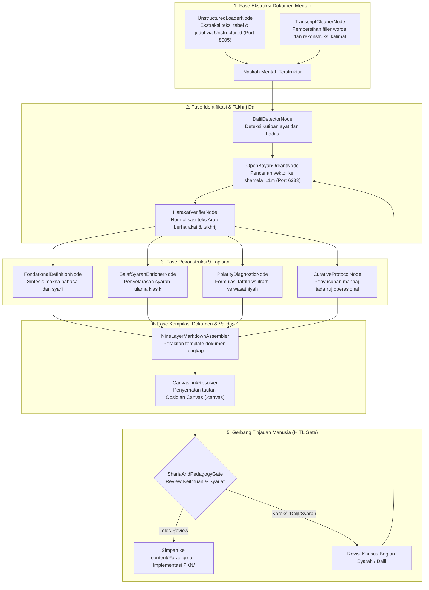

# Desain Pipeline 03: Halaman Fokus Bahasan Satu Tema (Deep-Dive Konseptual)

Dokumen ini mengatur spesifikasi teknis dan orkestrasi pipeline pemrosesan dokumen untuk menghasilkan **Halaman Fokus Bahasan Satu Tema (Materi Pokok PKN)** dengan menerapkan **Standar Anatomi 9 Lapisan Baku**.

---

## 1. Karakteristik & Target Output Halaman

Halaman fokus tema merupakan tulang punggung keilmuan Wiki-PKN. Setiap artikel mengupas tuntas satu konsep utama (misalnya: *Tangki Cinta, Pembagian Jiwa, Shidq, Manhaj Tadarruj, atau Bahasa Tangan*) dengan ketelitian ilmiah tinggi.
- **Tujuan Utama:** Menghasilkan artikel akademis-operasional yang menggabungkan ketajaman dalil Al-Qur'an/Hadits, syarah ulama salaf, diagnosis jurang ekstrim (*tafrith vs ifrath*), dan panduan praktis bagi pendidik dengan struktur baku 4 Zona MediaWiki.
- **Standar Anatomi 4 Zona Fungsional MediaWiki & 9 Lapisan Manhaj:**
  * **ZONA 1: Header dan Kontrol Halaman**
    1. *Frontmatter Baku:* `title`, `description`, `tags`, `aliases`, `authority_score`.
    2. *Kontrol Halaman (Quartz Layout):* Breadcrumbs, navigasi aksi dokumen, search bar, reader mode, riwayat revisi Git.
  * **ZONA 2: Area Konten Utama & Infobox**
    3. *Infobox Parameter Cepat:* Kartu vertikal kanan (`.wiki-infobox`) memuat istilah syar'i, tingkat otoritas, kluster jiwa, fase usia kritis, dan pilar komplementer (*'ilaj*).
    4. *Paragraf Pembuka (Lead Section) & TL;DR:* Callout `> [!SUMMARY]` 1 kalimat definisi inti + 3 poin capaian utama + 1-2 paragraf narasi global pengantar fitrah.
    5. *Bagan Konseptual Obsidian Canvas:* Embed visual makro `![[canvas/...canvas]]` sebagai arsitektur gagasan sebelum masuk ke rincian teknis.
    6. *Batang Tubuh Tulisan (H2, H3):* Landasan dalil nash wahyu berharakat, syarah ulama salaf mengalir, matriks sifat bertahap, diagnosis Tafrith vs Ifrath, protokol tadarruj, dan Instrumen Terapan (Rubrik 3-level, 3 pertanyaan muhasabah malam, 1 aksi Quick Win).
  * **ZONA 3: Lampiran, Verifikasi & Takhrij Sumber**
    7. *Lihat Pula:* Tautan internal silang dua arah (*bidirectional links*) ke konsep komplementer terkait.
    8. *Referensi dan Catatan Kaki:* Rujukan superskrip `[^1]` dan takhrij resmi korpus OpenBayan/Shamela.
    9. *Data Mentah & Catatan Sejarah Collapsible:* Tag `<details>` untuk transkrip audio, catatan *Active Truth vs Superseded*, dan relasi graf SurrealQL.
    10. *Bacaan Lanjutan & Pranala Luar:* Rekomendasi buku cetak dan tautan web resmi/portal video.
  * **ZONA 4: Metadata & Navigasi Bawah**
    11. *Kotak Navigasi Horizontal (Navbox):* Kartu templat `.wiki-navbox` merangkum kluster artikel terkait.
    12. *Taksonomi Kategori Dokumen:* Tag dan direktori tematik `[[Kategori:...]]` serta tautan mu'jam istilah Arab.

---

## 2. Sumber Bahan Baku (Multi-Modal Ingestion)

1. **Modul Cetak & PDF Buku:** Berkas di `searchable_pdfs/` (diproses via Unstructured API).
2. **Slide Presentasi Daurah:** Berkas PPTX di `presentations/` (diekstraksi struktur poin & diagramnya).
3. **Transkrip Kajian Audio:** Berkas suara yang ditranskrip melalui model Whisper ke teks mentah.
4. **Naskah Arsip:** Dokumen teks di `old_backup/random/` yang memuat transkrip materi pendahulu.

---

## 3. Diagram Alur State Graph LangGraph



---

## 4. Spesifikasi Node & State Schema

### Skema State Spesifik: `ThemePageState`

```python
from typing import TypedDict, List, Dict, Any, Optional

class DalilEntry(TypedDict):
    arabic_text: str
    indonesian_translation: str
    source_citation: str             # e.g., 'HR. Bukhari No. 1234'
    openbayan_id: str
    pedagogical_relevance: str

class PolarityAnalysis(TypedDict):
    tafrith_symptoms: List[str]
    tafrith_root_causes: List[str]
    ifrath_symptoms: List[str]
    ifrath_root_causes: List[str]
    wasathiyah_solution: str
    tadarruj_steps: List[str]

class ThemePageState(TypedDict):
    theme_title: str
    slug: str
    intro_paragraphs: List[str]
    primary_dalil: List[DalilEntry]
    linguistic_definition: str
    terminological_definition: str
    salaf_syarah: List[Dict[str, str]]
    polarity_diagnostic: PolarityAnalysis
    canvas_file_path: Optional[str]
    markdown_output: str
    hitl_reviewer: Optional[str]
    hitl_status: str
```

### Rincian Fungsi Node Kunci:
1. **`UnstructuredLoaderNode`**: Memanggil endpoint `POST http://localhost:8005/general/v0/general` dengan parameter `strategy="hi_res"` untuk mengekstrak teks, hierarki judul, dan tabel dari dokumen modul PKN.
2. **`OpenBayanQdrantNode`**: Melakukan pencarian kemiripan semantik (*dense retrieval*) terhadap matan dalil ke Qdrant port 6333 koleksi `shamela_11m`, mengunci nomor hadits resmi dan teks Arab berharakat otentik.
3. **`SalafSyarahEnricherNode` (Integrasi Qaf AI & Turats):** Memanggil client `qaf_wrapper` (`QafClient`) untuk menelusuri 320+ maraji' kitab klasik (seperti *Ihya Ulumiddin*, *Madarijus Salikin*, *Al-Mustashfa*, *Tuhfatul Maudud*, dan *Fathul Bari*) guna menyematkan kutipan kontekstual ulama salaf yang memperkuat dalil.
4. **`PolarityDiagnosticNode`**: Mengekstrak fenomena penyimpangan perilaku pengasuhan menjadi dua jurang ekstrim (misal: pada tema *Disiplin*, Tafrith = pembiaran anarkis tanpa aturan; Ifrath = kekerasan fisik dan hukuman tanpa dialog emosional).
5. **`CanvasLinkResolver`**: Mengaitkan artikel dengan berkas visualisasi konsep `.canvas` (misal: `content/canvas/Trilogi_Jiwa.canvas`) sesuai panduan kestabilan Quartz.

---

## 5. Strategi Prompting AI

```markdown
### System Prompt: PolarityDiagnosticNode
Anda adalah Pakar Tarbiyah Islamiyah & Konsultan Psikologi Pengasuhan PKN.
Analisis tema yang diberikan dalam kerangka dialektika Tafrith (Melalaikan) vs Ifrath (Berlebihan):

1. **Tafrith:**
   - Apa bentuk kelalaian pendidik terhadap hak anak dalam tema ini?
   - Apa gejala perilaku santri jika hak ini diabaikan?
2. **Ifrath:**
   - Bagaimana jika tema ini diterapkan secara kaku, memaksa, atau melampaui kapasitas usia anak?
   - Apa trauma psikologis atau luka pengasuhan yang timbul?
3. **Wasathiyah Nabawiyah:**
   - Bagaimana Rasulullah ﷺ mencontohkan keseimbangan proporsional pada tema ini?
4. **Manhaj Tadarruj (Tahapan Solusi):**
   - Rumuskan 3–4 langkah pemulihan/penerapan berjenjang (dari pembenahan hati orang tua hingga pembiasaan anak).
```

---

## 6. Level Kebutuhan Human-in-the-Loop (HITL)

- **Tingkat Kebutuhan HITL:** `Tinggi`
- **Kriteria Tinjauan:**
  - Verifikasi keabsahan harakat teks Arab dalil (tidak boleh ada kesalahan i'rab).
  - Kesesuaian syarah ulama salaf yang dinukil dengan manhaj ahlus sunnah.
  - Kepekaan bahasa agar solusi kuratif tidak terkesan menyalahkan orang tua, melainkan membimbing dengan empati.

---

## 7. Contoh Cuplikan Dokumen Markdown Terformat (4 Zona MediaWiki)

```markdown
---
title: "Tangki Cinta: Fondasi Keterikatan Jiwa dalam Pengasuhan Nabawiyah"
description: "Konsep pemenuhan afeksi emosional anak sebagai prasyarat mutlak sebelum penanaman disiplin dan beban taklif."
tags:
  - pkn/manhaj
  - karakter/afeksi
  - usia/thufulah-tamyiz
authority_score: 0.95
aliases:
  - "Kebutuhan Afeksi Anak"
  - "Mil'ul Qalb bil Mahabbah"
---

<!-- ZONA 1: HEADER & CONTROLS DIKELOLA OTOMATIS OLEH QUARTZ LAYOUT -->

# Tangki Cinta: Fondasi Keterikatan Jiwa

<!-- ZONA 2: AREA KONTEN UTAMA & INFOBOX -->

<div class="wiki-infobox">
  <div class="wiki-infobox-header">Tangki Cinta</div>
  <div class="wiki-infobox-image">
    
    <div class="wiki-infobox-caption">Pemenuhan Afeksi Jiwa Sebelum Taklif</div>
  </div>
  <table class="wiki-infobox-table">
    <tr>
      <th>Istilah Syar'i</th>
      <td><span dir="rtl" lang="ar"><b>مِلْءُ القَلْبِ بِالْمَحَبَّةِ</b></span></td>
    </tr>
    <tr>
      <th>Tingkat Otoritas</th>
      <td><b>Tier 1: Active Truth</b> (Buku Utama Bab 2)</td>
    </tr>
    <tr>
      <th>Kluster Jiwa</th>
      <td>[[Melayani]] / [[Berperasaan]]</td>
    </tr>
    <tr>
      <th>Fase Usia Kritis</th>
      <td>[[Thufulah]] (0–7 Tahun) & [[Tamyiz]]</td>
    </tr>
    <tr>
      <th>Pilar Komplementer</th>
      <td>[[Ketegasan Berbatas]] (Bahasa Tangan)</td>
    </tr>
    <tr>
      <th>Prasyarat Hulu</th>
      <td>[[Koneksi Sebelum Koreksi]]</td>
    </tr>
  </table>
</div>

> [!SUMMARY] Ringkasan Eksekutif (TL;DR Lead Section)
> **Definisi Inti:** Tangki Cinta adalah metafora ketersediaan rasa aman batin dan penerimaan fitrah tanpa syarat yang wajib dipenuhi orang tua sebelum menuntut kepatuhan syariat.
> * **Capaian Karakter Utama:** Terbentuknya *trust* batin anak terhadap ayah bunda sebagai pintu masuk penanaman adab.
> * **Titik Kritis Pengasuhan:** Usia 0–7 tahun (Thufulah) di mana perlakuan wajib 100% menggunakan Bahasa Hati.
> * **Tingkat Otoritas:** High (Prinsip Pokok Manhaj PKN) • Korpus [[Korpus Dalil & Atsar Klasik]].

Sebelum seorang anak dapat memikul beban ketaatan (*taklif*), jiwanya harus terlebih dahulu terisi penuh oleh rasa aman dan penerimaan tanpa syarat. Keberhasilan pengasuhan nabawiyah bertumpu pada hukum fitrah: ketaatan lahiriah tidak akan pernah bertahan lama jika tidak ditopang oleh kelekatan emosional (*emotional bonding*) yang kokoh antara orang tua dan anak.

Dalam pandangan Manhaj Pendidikan Karakter Nabawiyah, menyuruh anak beribadah saat tangki cintanya kering ibarat menstarter mobil tanpa bahan bakar—ia hanya akan menghasilkan gesekan mesin, amarah, dan pemberontakan diam-diam.

---

## 1. Arsitektur Konseptual Hubungan Manhaj (Obsidian Canvas)

![[canvas/Tangki_Cinta_Arsitektur_Jiwa.canvas]]
*Bagan 1.0: Peta Konseptual Hubungan Tangki Cinta terhadap Kesiapan Taklif dan Kestabilan Jiwa Anak.*

---

## 2. Landasan Dalil Nabawiyah & Syarah Ulama Salaf

> [!QUOTE] HR. Al-Bukhari No. 5997 & Muslim No. 2318
> <div dir="rtl" lang="ar" style="font-size: 1.3em; line-height: 2em; text-align: right; font-family: 'Amiri', 'Traditional Arabic', serif;">
> مَنْ لا يَرْحَمُ لا يُرْحَمُ
> </div>
> 
> *"Barang siapa yang tidak menyayangi, maka dia tidak akan disayangi."* [^1]
> 
> 💡 **Relevansi Pedagogis:** Kasih sayang orang tua adalah nutrisi ruhani pertama anak sebelum lisan mampu menerima perintah syariat.

Imam Ibnul Qayyim Al-Jauziyyah dalam *Tuhfatul Maudud* menjelaskan bahwa anak yang tumbuh dalam kekeringan kasih sayang akan memiliki jiwa yang keras dan sulit menerima kebenaran saat dewasa kelak.

---

## 3. Dinamika Jiwa & Penjabaran Bertahap

| Atribut Fitrah | Spesifikasi Nabawiyah | Implikasi Lapangan |
|:---|:---|:---|
| **Bahasa Utama** | Bahasa Hati (*Lisanul Qalb*) | Pelukan, tatapan hangat, validasi emosi |
| **Fase Usia** | 0–7 Tahun (*Thufulah*) | Belum ada hukuman fisik; pengisian tangki penuh |
| **Kebutuhan Hulu** | Rasa Aman (*Al-Amn Al-Nafsi*) | Syarat mutlak sebelum anak siap shalat di usia 7 th |

---

## 4. Diagnosis Patologi: Jurang Tafrith vs Ifrath

* **Jurang Tafrith (Pengabaian Afeksi):** Anak merasa tidak berharga, mencari pelarian ke gawai atau pergaulan bebas.
* **Jurang Ifrath (Kasih Sayang Memanjakan):** Anak menjadi rapuh (*fragile*), egosentris, dan tidak mengenal batasan adab.
* **Jalan Wasathiyah:** Menyayangi tanpa memanjakan, tegas tanpa menyakiti.
* **Terapi Penyeimbang (*'Ilaj*):** Tanamkan pilar [[Syaja'ah]] dan [[Ketegasan Berbatas]].

---

## 5. Instrumen Observasi Terapan

### A. Rubrik Observasi 3-Level
| No | Indikator Perilaku Fitrah | Belum Terlihat | Mulai Terlihat | Membudaya |
| :-: | :--- | :-: | :-: | :-: |
| 1 | Anak terbuka bercerita tanpa rasa takut | [ ] | [ ] | [ ] |
| 2 | Kontak mata hangat saat diajak bicara | [ ] | [ ] | [ ] |

### B. Tiga Pertanyaan Muhasabah Malam
1. *Berapa kali saya memeluk dan menatap mata anak saya dengan tulus hari ini?*
2. *Apakah instruksi saya tadi lahir dari Bahasa Hati atau emosi lelah saya?*
3. *Sudahkah anak saya tertidur dengan rasa aman bahwa ia dicintai apa adanya?*

### C. Aksi Cepat (*Quick Win*) Hari Ini
* **Lakukan Sekarang:** Masuk ke kamar anak yang sedang tertidur, elus kepalanya, dan doakan keberkahan fitrahnya.

---

<!-- ZONA 3: LAMPIRAN, VERIFIKASI SUMBER & TAKHRIJ -->

## Lihat Pula
* [[Koneksi Sebelum Koreksi]] — Metode komunikasi hati sebelum perbaikan adab.
* [[4 Etape Usia Nabawiyah]] — Pentahapan tarbiyah dari Thufulah hingga Syabab.
* [[Bahasa Hati]] — Seni berdialog melalui rasa dan keteladanan.

---

## Referensi dan Catatan Kaki

[^1]: **HR. Al-Bukhari**, *Kitab Al-Adab*, No. 5997; **HR. Muslim**, *Kitab Al-Fadhail*, No. 2318. Takhrij melalui OpenBayan Qdrant `shamela_11m_doc_39102`.

<details>
<summary><b>📜 Buka Takhrij Sanad Lengkap & Teks Kitab Syarah Salaf</b></summary>

* **Kitab Asli:** Ibnul Qayyim Al-Jauziyyah, *Tuhfatul Maudud bi Ahkam Al-Maulud*, Hal. 138.
* **Derajat Hadits:** Shahih Muttafaqun 'Alaih.
</details>

---

## Bacaan Lanjutan dan Pranala Luar
* **Buku Referensi:** Abdul Kholiq, *Pendidikan Karakter Nabawiyah*, 2024.
* **Website Resmi:** [Karakter Nabawiyah](https://karakternabawiyah.com/)

---

<!-- ZONA 4: METADATA, TAKSONOMI & NAVBOX -->

<div class="wiki-navbox">
  <div class="wiki-navbox-title">
    <span>Kluster Materi: Fondasi Manhaj PKN</span>
    <span>[ <a href="/content_flow/">Peta Navigasi</a> ]</span>
  </div>
  <div class="wiki-navbox-group">
    <div class="wiki-navbox-label">Prinsip Pokok</div>
    <div class="wiki-navbox-links">
      <a href="/content/index">Beranda</a> <span class="wiki-navbox-sep">•</span>
      <a href="/content/Koneksi Sebelum Koreksi">Koneksi Sebelum Koreksi</a> <span class="wiki-navbox-sep">•</span>
      <a href="/content/Tangki Cinta">Tangki Cinta</a> <span class="wiki-navbox-sep">•</span>
      <a href="/content/Tujuan Hidup Manusia">Tujuan Hidup Manusia</a>
    </div>
  </div>
</div>

**Kategori Direktori:** [[Kategori:Manhaj Pendidikan Karakter Nabawiyah]] • [[Kategori:Fondasi Afeksi]]
```

