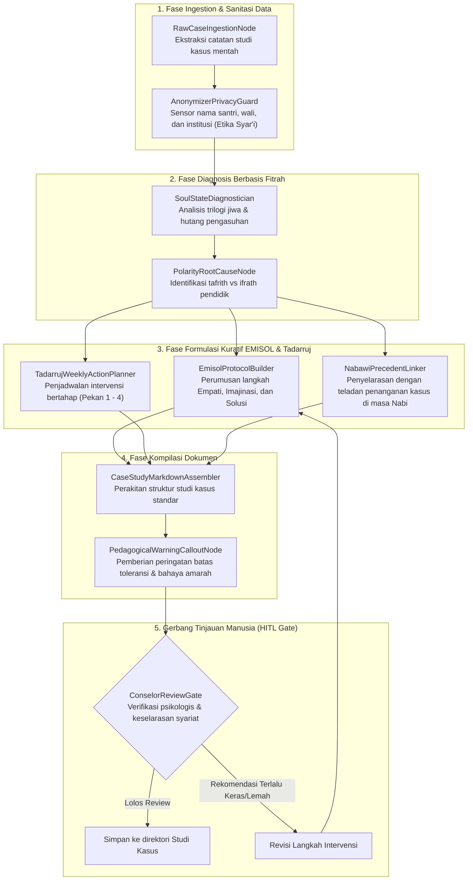

# Desain Pipeline 04: Halaman Studi Kasus & Solusi Kuratif Lapangan (Real-World Case Studies)

Dokumen ini memaparkan rancang bangun pipeline pemrosesan dokumen untuk mengolah catatan lapangan, log konseling, dan pengalaman pengasuhan menjadi **Halaman Studi Kasus Lapangan & Protokol Kuratif EMISOL** di Wiki Pendidikan Karakter Nabawiyah.

---

## 1. Karakteristik & Target Output Halaman

Halaman studi kasus menjembatani teori filosofis PKN dengan realitas problematika anak di rumah tangga dan sekolah.
- **Tujuan Utama:** Mendokumentasikan skenario masalah nyata, mendiagnosis akar persoalan (apakah akibat luka pengasuhan, defisit tangki cinta, atau ketidaktepatan pentahapan usia), serta merumuskan panduan kuratif langkah-demi-langkah berbasis **Manhaj Tadarruj** dan metode **EMISOL (Empati, Imajinasi, Solusi)**.
- **Komponen Kunci Output Markdown:**
  - **Skenario Kasus Teranonimasi:** Profil usia anak (Thufulah, Tamyiz, Murahaqah), latar belakang pengasuhan, dan manifestasi perilaku menyimpang.
  - **Diagnosis Akar Masalah (Root Cause Analysis):**
    - Identifikasi kondisi jiwa: *Nafs Ammarah*, *Lawwamah*, atau *Muthmainnah*.
    - Pemeriksaan *Hutang Pengasuhan (Parenting Debt)*.
    - Klasifikasi penyimpangan: apakah *Tafrith* (pembiaran) atau *Ifrath* (pemaksaan berlebihan).
  - **Protokol Kuratif EMISOL:**
    1. *Empati:* Menyelami perasaan anak, memulihkan koneksi emosional, dan mendengarkan tanpa menghakimi.
    2. *Imajinasi:* Mengajak anak membayangkan masa depan, hikmah ilahi, dan kisah teladan sahabat Nabi.
    3. *Solusi:* Menyepakati komitmen bertahap dan menetapkan konsekuensi logis yang adil.
  - **Tahapan Solusi Tadarruj:** Rencana aksi Pekan 1, Pekan 2, hingga evaluasi Bulan 1.
  - **Refleksi & Pelajaran Berharga bagi Pendidik.**

---

## 2. Sumber Bahan Baku (Multi-Modal Ingestion)

1. **Catatan Konseling Guru & Konselor:** Berkas catatan penanganan santri atau lembar konsultasi wali murid.
2. **Log Diskusi Studi Kasus:** Transkrip sesi bedah kasus praktisi PKN bersama Ustadz Bayu / Ustadz Abdul Kholiq.
3. **Laporan Evaluasi Rapor Karakter:** Data tren perilaku dari kluster database evaluasi santri (`rapor-karakter-postgres-1`).

---

## 3. Diagram Alur State Graph LangGraph



---

## 4. Spesifikasi Node & State Schema

### Skema State Spesifik: `CaseStudyState`

```python
from typing import TypedDict, List, Dict, Any, Optional

class CaseSubjectProfile(TypedDict):
    anonymous_alias: str            # e.g., 'Ananda F (13 Tahun, Usia Murahaqah)'
    development_stage: str          # 'Thufulah' (0-7), 'Tamyiz' (7-10/Baligh), 'Murahaqah'
    family_context: str
    reported_symptoms: List[str]    # e.g., ['Mogok shalat', 'Tantrum saat HP diambil']

class EmisolFramework(TypedDict):
    empathy_phase: str              # Langkah validasi emosi dan bahasa hati
    imagination_phase: str          # Analogi sirah dan proyeksi masa depan
    solution_phase: str             # Kesepakatan aturan & konsekuensi logis

class CaseStudyState(TypedDict):
    case_id: str
    case_title: str
    profile: CaseSubjectProfile
    root_cause_diagnosis: Dict[str, Any]
    emisol_actions: EmisolFramework
    weekly_milestones: List[Dict[str, str]]
    relevant_prophetic_example: str
    anonymized_markdown: str
    hitl_approved: bool
```

### Rincian Fungsi Node Kunci:
1. **`AnonymizerPrivacyGuard`**: Memindai entitas bernama (NER) untuk menghapus nama asli, alamat sekolah, nama kota, dan nomor kontak guna menjaga aib keluarga muslim sesuai kaidah syariat (*sitrul 'aurat wal 'uyub*).
2. **`SoulStateDiagnostician`**: Membedah apakah ledakan perilaku anak disebabkan oleh *Nafs Ammarah bissu'* yang belum terlatih atau akibat *luka pengasuhan (parenting debt)* masa kecil saat hak bermain usia 0-7 dirampas.
3. **`EmisolProtocolBuilder`**: Merumuskan panduan komunikasi non-konfrontatif: orang tua wajib berhenti menceramahi anak pada 3 hari pertama (fase mendinginkan), lalu masuk ke fase pelukan dan penerimaan (*Empati*).

---

## 5. Strategi Prompting AI

```markdown
### System Prompt: EmisolProtocolBuilder
Anda adalah Konsultan Pengasuhan Keluarga Berbasis Sunnah & Psikologi Fitrah.
Rumuskan protokol tindakan pemulihan (*recovery protocol*) untuk studi kasus ini dengan metode EMISOL:

1. **Empati (Koneksi Sebelum Koreksi):**
   - Larang penggunaan ancaman fisik atau labeling negatif ('anak pemalas', 'durhaka').
   - Susun dialog pembuka antara orang tua dan anak yang menunjukkan bahwa orang tua menyesali kekhilafan masa lalu dan ingin mendengarkan isi hati anak.
2. **Imajinasi:**
   - Gunakan kisah Sahabat Nabi yang sepadan dengan karakter anak (misal: Usamah bin Zaid, Ibnu Abbas, atau Ka'ab bin Malik).
   - Ajak anak membayangkan bagaimana rasanya memiliki jiwa yang tenang (*Muthmainnah*).
3. **Solusi (Manhaj Tadarruj):**
   - Mulai dari target pembiasaan terkecil yang pasti bisa dicapai anak dalam 7 hari pertama.
```

---

## 6. Level Kebutuhan Human-in-the-Loop (HITL)

- **Tingkat Kebutuhan HITL:** `Tinggi`
- **Kriteria Tinjauan:**
  - Jaminan kerahasiaan identitas 100% anonim.
  - Solusi tidak boleh bertentangan dengan batasan syariat (misalnya tidak boleh menyarankan hukuman fisik di luar ketentuan fikih atau menoleransi kemaksiatan).
  - Kelayakan beban tindakan bagi kemampuan orang tua di kehidupan nyata.

---

## 7. Contoh Cuplikan Dokumen Markdown Terformat

```markdown
---
title: "Studi Kasus: Menangani Pembangkangan dan Ledakan Emosi di Usia Murahaqah (14 Tahun)"
description: "Diagnosis akar masalah penolakan shalat dan adiksi gawai serta tahapan kuratif tadarruj dengan metode EMISOL."
tags:
  - studi-kasus
  - murahaqah
  - recovery
---

# Studi Kasus: Menangani Pembangkangan Santri Usia Murahaqah

> [!important] Perlindungan Privasi & Adab Syar'i
> Seluruh nama subjek, sekolah, dan lokasi dalam studi kasus ini telah disamarkan demi menjaga kehormatan keluarga muslim dan memprioritaskan edukasi peradaban.

## 1. Profil Masalah & Skenario Kasus
- **Subjek:** Ananda Z (Laki-laki, 14 Tahun, Fase Murahaqah Awal).
- **Gejala Utama:** Menolak melaksanakan shalat berjamaah di masjid, membanting pintu saat ditegur, dan menghabiskan 6 jam per hari di depan layar gawai.
- **Kondisi Pengasuhan:** Ayah sering bertugas di luar kota, bunda menerapkan pola asuh serba menuntut nilai akademik tinggi (*Ifrath*).

## 2. Diagnosis Akar Masalah (Root Cause Analysis)
1. **Luka Pengasuhan (Defisit Tangki Cinta):** Ananda merasa hanya dihargai jika membawa nilai ujian bagus; jiwanya haus akan pengakuan tanpa syarat (*Unconditional Love*).
2. **Ketiadaan Figur Ayah (Father Hunger):** Hilangnya transfer energi maskulin mengakibatkan jiwa ananda mencari pelampiasan ego ke dunia virtual.

## 3. Protokol Pemulihan EMISOL
- **Tahap 1: Empati (Pekan 1):** Ayah mengambil cuti 3 hari khusus untuk menemani ananda berolahraga dan makan bersama tanpa membahas masalah shalat atau gawai sama sekali.
- **Tahap 2: Imajinasi (Pekan 2):** Dialog santai tentang visi hidup dan kisah kepahlawanan para pemuda di masa Nabi.
- **Tahap 3: Solusi (Pekan 3-4):** Bersama ananda menyepakati zona bebas gawai di rumah dan jadwal shalat berjamaah.
```
