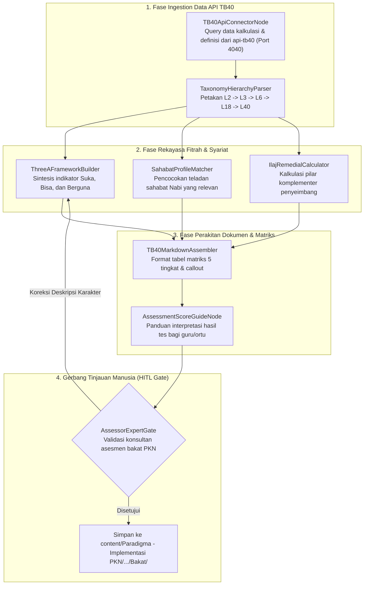

# Desain Pipeline 05: Halaman Bakat & Fitrah TB40 (Taksonomi 40 Karakter Nabawiyah)

Dokumen ini mengatur arsitektur pipeline otomatis untuk menyusun **Halaman Bakat & Fitrah Karakter** berbasis mesin asesmen **Tafsir Bakat 40 (TB40)** dan kurikulum fitrah PKN.

---

## 1. Karakteristik & Target Output Halaman

Halaman bakat dalam Wiki-PKN mendefinisikan potensi fitrah anak bukan sekadar bakat teknis/kejuruan (seperti melukis atau bernyanyi), melainkan **potensi kontribusi peradaban dan 40 pilar akhlak mulia (*fadhilah*)** yang diteladankan Rasulullah ﷺ dan para sahabat.
- **Tujuan Utama:** Mengintegrasikan data matematis-psikometrik API TB40 dengan penjelasan pedagogis Islam, memetakan rukun **3A (Suka, Bisa, Berguna)**, mendiagnosis batas aman potensi, serta merumuskan **formula terapi penyeimbang (*'ilaj*)**.
- **Komponen Kunci Output Markdown:**
  - Frontmatter lengkap dengan tag kluster bakat, kutub energi, dan kode pilar TB40 (misal: `TB40-L40-07`).
  - Matriks Hierarki 5 Tingkat:
    - *Level 2:* Kutub Energi (Introvert / *As-Sirr* vs Extrovert / *Al-'Alaniyah*).
    - *Level 3:* Dimensi Jiwa & Gaya Belajar (Karsa/Kinestetik, Cipta/Visual, Rasa/Auditori).
    - *Level 6:* Kluster Aksi (Bekerja Keras, Berpikir, Berperasaan, Mempengaruhi, Bekerjasama, Melayani).
    - *Level 18:* Gugus Karakter Perilaku.
    - *Level 40:* Definisi 40 Karakter Spesifik.
  - Rukun 3A: Indikator *Suka (Syaghaf)*, *Bisa (Kafa'ah)*, dan *Berguna (Naf'un)*.
  - Diagnosis Jurang Ekstrim (*Ifrath vs Tafrith* dari pilar bakat tersebut).
  - Formula Penyeimbang (*'Ilaj*): Pilar karakter lain yang wajib ditanamkan agar bakat ini tidak melahirkan kesombongan atau kemunduran mental.

---

## 2. Sumber Bahan Baku & Status Presedensi (Precedence & Lineage)

1. **Active Standard — Rujukan Kanonikal Utama:**
   - **Buku Tafsir Bakat (Master Naskah Lengkap Bab 1–12):** Buku terpenting kedua karya Ustadz Abdul Kholiq setelah Buku Utama PKN (disimpan di `sources/buku_tafsir_bakat/`). Memuat 118.464 kata dan 871.135 karakter yang mengupas tuntas:
     * *Bab 1–3:* Batasan makna bakat, fitrah manusia, dan dinamika bakat.
     * *Bab 4–8:* Jiwa manusia dan bakat, penciptaan alam ruh, penyatuan ruh & jasad.
     * *Bab 9–11:* Silsilah bakat (6 bagian, 18 kelompok), profesi peradaban, dan metodologi pemetaan bakat nabawiyah.
     * *Bab 12 (Pilar 1–40):* Uraian 40 bakat lengkap dalam **9 aspek baku** (Definisi, Teladan Nabi/Sahabat/Salaf, Ciri Kepribadian, Indikator Suka-Bisa-Berguna, Tafrith-Ifrath, dan Terapi Penyeimbang *'Ilaj*).
   - **Spesifikasi OpenAPI & Engine TB40 API:** Data terstruktur dari repositori API Observasi Karakter (`http://localhost:4040/api/tb40`).
2. **Status Hubungan terhadap Buku Utama PKN (Catatan Presedensi Penting):**
   - **Buku Utama PKN (Bab 1–7, 9–10):** Buku Babon / Acuan Utama untuk Dasar Pendidikan Islam, Konsep Fitrah, 4 Etape Usia Nabawiyah, Metode Pembelajaran, dan Tashlih/Recovery.
   - **Buku Tafsir Bakat (Bab 1–12):** **Menggantikan secara total (*fully supersedes*) Bab 8 Buku Utama PKN lama** yang dahulu mengutip instrumen barat (ST-30 Ramadhani/Rama Royani, Talents Mapping, dan Multiple Intelligence Gardner).
   - Seluruh instrumen pemetaan bakat di Wiki-PKN kini 100% berakar pada naskah **Buku Tafsir Bakat** karya Ustadz Abdul Kholiq.
3. **Sirah Sahabat Nabi & Syarah Salaf:** Referensi profil teladan sahabat Nabi dan nukilan kaidah Ibnul Qayyim (*Al-Akhlaqul Hamidah Yuwalidu Ba'dhuha Ba'dha*).

---

## 3. Diagram Alur State Graph LangGraph



---

## 4. Spesifikasi Node & State Schema

### Skema State Spesifik: `TalentPageState`

```python
from typing import TypedDict, List, Dict, Any

class LevelHierarchy(TypedDict):
    level2_pole: str                # 'Introvert (As-Sirr)' / 'Extrovert (Al-Alaniyah)'
    level3_dimension: str           # 'Karsa (Al-Hawa)', 'Cipta (Al-Aql)', 'Rasa (Al-Qalb)'
    level6_action: str              # 'Memimpin', 'Berpikir', 'Melayani', dll.
    level18_group: str
    level40_code: str               # e.g., 'TB40-40-SYAJAAH'

class ThreeAPillars(TypedDict):
    suka_indicators: List[str]      # Antusiasme alami tanpa disuruh
    bisa_indicators: List[str]      # Kecepatan belajar dan ketahanan raga
    berguna_applications: List[str] # Nilai manfaat bagi dakwah & umat

class TalentPageState(TypedDict):
    talent_name: str
    hierarchy: LevelHierarchy
    arabic_attribute: str           # e.g., 'الشَّجَاعَة (Asy-Syaja\'ah)'
    three_a: ThreeAPillars
    companion_archetype: str        # Tokoh Sahabat Nabi rujukan
    tafrith_manifestation: str      # Gejala jika bakat ditekan/mati
    ifrath_manifestation: str       # Bahaya jika bakat kebablasan
    ilaj_balancing_traits: List[str]# Obat penyeimbang dari pilar lain
    markdown_result: str
    hitl_status: str
```

### Rincian Fungsi Node Kunci:
1. **`TB40ApiConnectorNode`**: Mengambil metadata matematis dari kluster TB40 (rentang bobot *raw score*, deviasi standar, dan relasi antarpilar).
2. **`ThreeAFrameworkBuilder`**: Menjelaskan rukun 3A:
   - *Suka:* Tanda anak menikmati aktivitas (mata berbinar, waktu terasa cepat berlalu).
   - *Bisa:* Hasil kerja di atas rata-rata anak seusianya dengan waktu belajar yang singkat.
   - *Berguna:* Memiliki orientasi kemaslahatan (*khairunnas anfa'uhum linnas*).
3. **`IlajRemedialCalculator`**: Menyajikan prinsip bahwa bakat dominan jika tidak dibarengi akhlak penyeimbang akan merusak. (Contoh: Bakat keberanian/Syaja'ah tanpa *Hilmi/Lemah Lembut* akan bermutasi menjadi kezaliman dan agresi).

---

## 5. Strategi Prompting AI

```markdown
### System Prompt: SahabatProfileMatcher & ThreeABuilder
Anda adalah Ahli Pemetaan Karakter Islam & Psikolog Bakat Fitrah.
Uraikan pilar karakter TB40 ini ke dalam kerangka pedagogis nabawiyah:

1. Jelaskan bagaimana sifat ini menjelma menjadi amal peradaban.
2. Identifikasi salah satu Sahabat Rasulullah ﷺ yang paling menonjol dalam karakter ini, sertakan riwayat perilakunya.
3. Tetapkan indikator perilaku nyata yang dapat diobservasi guru di sekolah dan orang tua di rumah pada anak usia Tamyiz (7-10 tahun).
4. Rumuskan peringatan keras (*Red Flags*) jika orang tua memaksakan anak yang tidak memiliki bakat ini untuk menjadi ahli di bidang tersebut.
```

---

## 6. Level Kebutuhan Human-in-the-Loop (HITL)

- **Tingkat Kebutuhan HITL:** `Sedang - Tinggi`
- **Kriteria Tinjauan:**
  - Ketepatan pencocokan figur Sahabat Nabi (tidak boleh mendistorsi sejarah atau melabeli secara sembarangan).
  - Keharmonisan rumus *'ilaj* dengan konsep tazkiyatun nafs.
  - Kejelasan bahasa agar tidak menimbulkan kesan takdir pasif (*fatalisme bakat*), melainkan orientasi ikhtiar optimal.

---

## 7. Contoh Cuplikan Dokumen Markdown Terformat

```markdown
---
title: "Bakat Syaja'ah (Keberanian): Eksplorasi Pilar Karakter TB40"
description: "Peta fitrah potensi keberanian membela kebenaran, indikator rukun 3A, dan terapi penyeimbang nabawiyah."
tags:
  - tb40
  - bakat
  - fitrah-karakter
---

# Bakat Syaja'ah (الشَّجَاعَة) — Keberanian

Bakat *Syaja'ah* bukan sekadar keberanian fisik, melainkan keteguhan hati (*tsabatul qalb*) dalam memperjuangkan kebenaran di bawah naungan wahyu...

## 🧬 Kedudukan dalam Arsitektur 5 Tingkat TB40
- **Level 2 (Energi):** Extrovert (*Al-'Alaniyah*) — Energi tercurah ke luar.
- **Level 3 (Dimensi Jiwa):** Karsa / *Al-Hawa* (Kinestetik - *Al-Fuad*).
- **Level 6 (Aksi Inti):** Mempengaruhi & Menggerakkan (*At-Ta'tsir*).
- **Tokoh Sahabat Rujukan:** Khalid bin Walid radhiyallahu 'anhu.

## 🎯 Rukun 3A Bakat Syaja'ah
- **Suka (Syaghaf):** Bersemangat ketika menghadapi tantangan, berani tampil pertama di depan khalayak.
- **Bisa (Kafa'ah):** Cepat mengambil keputusan di saat kritis tanpa ragu-ragu.
- **Berguna (Naf'un):** Menjadi pembela teman yang dizalimi dan pelopor kebaikan kelas.

## ⚖️ Terapi Penyeimbang ('Ilaj)
> [!warning] Bahaya Ifrath (Kebablasan)
> Jika anak berkarakter Syaja'ah tidak didampingi pilar **Al-Hilm (Kelemahlembutan)** dan **Al-'Adl (Keadilan)**, keberaniannya berisiko menjadi perilaku perundungan (*bullying*) atau kenekatan tanpa perhitungan syariat.
```
