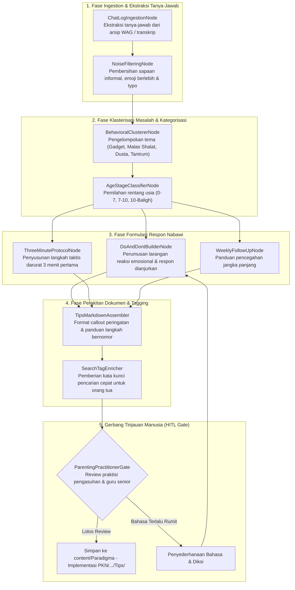

# Desain Pipeline 06: Halaman Tips & Trik Problematika Harian (FAQ & Respon Cepat)

Dokumen ini memaparkan rancang bangun pipeline pemrosesan dokumen untuk memproses arsip tanya-jawab, rekaman konsultasi, dan catatan lapangan menjadi **Halaman Tips & Trik Praktis serta FAQ Solusi Harian** di Wiki Pendidikan Karakter Nabawiyah.

---

## 1. Karakteristik & Target Output Halaman

Halaman tips dirancang untuk kebutuhan orang tua dan guru yang membutuhkan **solusi taktis cepat** saat menghadapi dinamika emosi atau pelanggaran adab santri di ruang kelas maupun di rumah.
- **Tujuan Utama:** Menghadirkan panduan *troubleshooting* pengasuhan yang ringkas, mudah dibaca di layar ponsel, menghindari respon kemarahan spontan (*reaktif*), dan menggantinya dengan respon bijaksana nabawiyah (*responsif-edukatif*).
- **Format Baku Anatomi Tips Harian:**
  1. **Pertanyaan / Gejala Spesifik (FAQ Heading):** Contoh: *"Anak 8 tahun tiba-tiba membangkang dan menolak mandi sore, bagaimana meresponnya?"*
  2. **Perspektif Fitrah Anak (Mengapa Mereka Berperilaku Begitu?):** Penjelasan kondisi kejiwaan anak pada fase usia tersebut (bukan mencap anak 'nakal').
  3. **Tindakan yang DIHARAMKAN / DILARANG (Kesalahan Fatal):** Mencegah bentakan, ancaman bohong, pemukulan di luar syariat, atau pelampiasan kekesalan pribadi.
  4. **Protokol 3 Menit Pertama (Respon Darurat di Tempat):** Panduan gestur tubuh, tatapan mata, nada suara, dan tarikan nafas orang tua.
  5. **Tindak Lanjut Pembiasaan Sepekan (Solusi Permanen):** Langkah penataan rutinitas dan kesepakatan keluarga.

---

## 2. Sumber Bahan Baku (Multi-Modal Ingestion)

1. **Arsip Percakapan Grup Diskusi:** Arsip chat WhatsApp/Telegram tanya-jawab wali santri bersama Ustadz Bayu dan tim pembina.
2. **Rekaman Sesi Q&A Kajian:** Audio sesi tanya-jawab webinar parenting nabawiyah.
3. **Log Lembar Bimbingan Konseling Sekolah:** Data rekapitulasi kendala disiplin santri di lingkungan asrama/madrasah.

---

## 3. Diagram Alur State Graph LangGraph



---

## 4. Spesifikasi Node & State Schema

### Skema State Spesifik: `TipsPageState`

```python
from typing import TypedDict, List, Dict, Any

class PracticalTipsItem(TypedDict):
    faq_question: str
    target_age_group: str           # '0-7 Tahun', '7-10 Tahun', 'Remaja'
    inner_drive_explanation: str    # Perspektif psikologi fitrah
    fatal_mistakes_to_avoid: List[str]
    immediate_3min_actions: List[str]
    long_term_curative_steps: List[str]
    search_keywords: List[str]

class TipsPageState(TypedDict):
    cluster_category: str           # e.g., 'Kedisiplinan & Rutinitas Harian'
    tips_collection: List[PracticalTipsItem]
    markdown_output: str
    hitl_status: str
```

### Rincian Fungsi Node Kunci:
1. **`BehavioralClustererNode`**: Menggunakan teknik clustering semantik berbasis embedding untuk mengelompokkan ratusan pertanyaan lepas menjadi kluster besar:
   - Kluster 1: Mogok belajar & kecanduan layar virtual.
   - Kluster 2: Pembangkangan lisan & ledakan amarah (tantrum).
   - Kluster 3: Ketidakjujuran (*kadzib*) dan penolakan tanggung jawab.
   - Kluster 4: Keengganan menjalankan ibadah harian (shalat, tilawah).
2. **`ThreeMinuteProtocolNode`**: Memastikan solusi instan yang diajarkan bersifat konkret secara fisik: *"Turunkan posisi tubuh sejajar mata anak, pegang kedua pundaknya dengan lembut, atur nafas orang tua hingga tenang, tatap matanya dan ucapkan kata pembuka empati."*

---

## 5. Strategi Prompting AI

```markdown
### System Prompt: ThreeMinuteProtocol & DoAndDontBuilder
Anda adalah Mentor Praktisi Pengasuhan Karakter Nabawiyah.
Susun tips pemecahan masalah perilaku anak berikut dengan gaya bahasa lugas, hangat, dan sangat aplikatif:

1. **Jelaskan Perspektif Anak:** Hindari memberi label negatif pada anak. Jelaskan sinyal kebutuhan jiwa apa yang sedang dia sampaikan melalui tingkah lakunya.
2. **Peringatan 'DILARANG':** Tegaskan bahwa kemarahan pendidik hanyalah pelampiasan ego, bukan pendidikan.
3. **Langkah 3 Menit Pertama:** Berikan 3 instruksi tindakan fisik yang bisa langsung dipraktekkan orang tua yang sedang panik atau lelah.
4. **Kalimat Siap Pakai:** Berikan contoh kalimat verbatim yang santun namun tegas yang dapat diucapkan langsung kepada anak.
```

---

## 6. Level Kebutuhan Human-in-the-Loop (HITL)

- **Tingkat Kebutuhan HITL:** `Tinggi`
- **Kriteria Tinjauan:**
  - Kalimat nasihat tidak boleh bernada menggurui atau menghakimi orang tua yang sedang mengalami kesulitan.
  - Petunjuk tindakan harus aman secara psikologis bagi anak dan terhindar dari trauma pengasuhan.
  - Kompatibel dengan adab komunikasi islami.

---

## 7. Contoh Cuplikan Dokumen Markdown Terformat

```markdown
---
title: "Tips Praktis: Menghadapi Anak yang Mogok Shalat Saat Asyik Bermain"
description: "Panduan respon cepat orang tua menghadapi anak usia 7-10 tahun yang menunda shalat tanpa bentakan dan tanpa ancaman bohong."
tags:
  - tips-harian
  - tamyiz
  - shalat
---

# Tips Praktis: Menghadapi Anak yang Mogok Shalat

> [!tip] Kaidah Emas Pendidik Nabawiyah
> *"Pahala kesabaran orang tua saat mengajak anak shalat jauh lebih besar daripada sekadar ketergesaan waktu. Jangan tukar kewajiban shalat anak dengan kebenciannya terhadap ibadah."*

### ❌ Kesalahan Fatal yang Harus Dihindari
- Berteriak dari kejauhan: *"Cepat shalat! Nanti masuk neraka disiksa ular!"*
- Mematikan mainan atau perangkat secara paksa tanpa peringatan waktu.
- Menyindir anak di depan saudara kandung atau teman-temannya.

### ⏱️ Protokol Respon 3 Menit Pertama
1. **Hampiri Secara Fisik:** Berjalan mendekat ke tempat anak bermain, jangan berteriak dari ruang lain.
2. **Apresiasi Karyanya:** Tatap apa yang sedang dikerjakannya selama 10 detik: *"Masya Allah, menara baloknya tinggi sekali ya, Kak."*
3. **Beri Peringatan Waktu Bertahap:** *"Kakak, waktu adzan tinggal 5 menit lagi. Silakan selesaikan susunan terakhir balok ini, lalu kita wudhu bersama ya."*
4. **Sentuhan Afeksi:** Usap kepalanya dengan senyuman tulus sebelum melangkah ke tempat wudhu.
```
