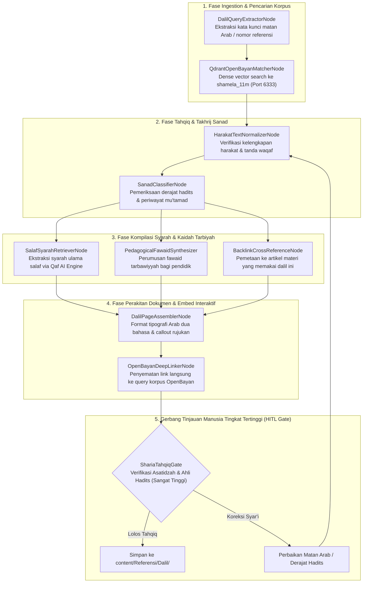

# Desain Pipeline 07: Halaman Dalil Mandiri & Syarah Klasik (Quranic & Prophetic Evidence Hub)

Dokumen ini memaparkan spesifikasi teknis dan orkestrasi pipeline untuk menyusun **Halaman Mandiri Khusus Dalil (Al-Qur'an dan Hadits)** dengan akurasi teks Arab berharakat, verifikasi sanad/derajat hadits, serta anotasi syarah ulama salaf.

---

## 1. Karakteristik & Target Output Halaman

Setiap dalil utama dalam Wiki-PKN tidak sekadar dikutip sebagai pemanis tulisan, melainkan memiliki **halaman entri mandiri (dedicated page)** yang menjadi rujukan ilmiah terbuka.
- **Tujuan Utama:** Menghadirkan ensiklopedia dalil tarbiyah nabawiyah yang terpercaya, tervalidasi harakat dan teks aslinya, dilengkapi takhrij resmi ke kitab induk hadits, serta menyajikan penafsiran ulama mu'tabar terkait aspek pendidikan anak.
- **Komponen Kunci Output Markdown:**
  - **Teks Arab Berharakat Lengkap:** Ditata dengan tipografi ramah pembaca web (font Amiri / Scheherazade).
  - **Terjemahan Resmi Bahasa Indonesia:** Terjemahan Kementerian Agama RI untuk ayat Al-Qur'an dan terjemahan shahih untuk hadits nabawi.
  - **Takhrij & Autentikasi Sanad:**
    - Nomor kitab, bab, dan nomor hadits resmi (*Kutubut Tis'ah*).
    - Derajat hadits (Shahih, Hasan) menurut para imam ahli hadits (Al-Bukhari, Muslim, At-Tirmidzi, Ibnu Hajar, Al-Albani).
  - **Syarah & Komentar Ulama Salaf:** Nukilan dari kitab induk syarah (misal: *Fathul Bari* Ibnu Hajar, *Al-Minhaj* Imam An-Nawawi, *Madarijus Salikin* Ibnul Qayyim, *Tafsir Ath-Thabari* / *Ibnu Katsir*).
  - **Intisari Kaidah Pedagogis PKN:** 3–5 poin faedah pendidikan anak yang diekstraksi dari dalil.
  - **Jejaring Dalil Terkait & Silang Tautan Topik:** Tautan ke tema materi yang menggunakan dalil ini.

---

## 2. Sumber Bahan Baku (Multi-Modal Ingestion)

1. **Vector Database Korpus Syamilah:** Koleksi Qdrant `shamela_11m` (Port 6333) dari Kluster OpenBayan.
2. **Katalog Induk Dalil PKN:** Berkas `QURAN_DALIL_CATALOG.md` dan `DALIL_MAPPING.md`.
3. **Pustaka Digital Hadits & Tafsir:** Database terindeks kitab-kitab induk hadits dan syarah klasik.

---

## 3. Diagram Alur State Graph LangGraph



---

## 4. Spesifikasi Node & State Schema

### Skema State Spesifik: `DalilPageState`

```python
from typing import TypedDict, List, Dict, Any, Optional

class SanadAuthentication(TypedDict):
    primary_source: str            # e.g., 'Shahih al-Bukhari'
    book_chapter: str              # e.g., 'Kitab al-Adab, Bab Rahmatin Naas'
    hadith_number: str             # e.g., 'No. 5997'
    hadith_degree: str             # 'Shahih', 'Hasan'
    authenticating_scholars: List[str]

class SalafCommentary(TypedDict):
    scholar_name: str              # e.g., 'Al-Hafizh Ibnu Hajar al-Asqalani'
    book_title: str                # e.g., 'Fathul Bari Syarah Shahih al-Bukhari'
    volume_page: str
    arabic_quote: str
    translation: str

class DalilPageState(TypedDict):
    dalil_id: str                  # e.g., 'DALIL-HD-BUKHARI-5997'
    dalil_type: str                # 'quran' atau 'hadits'
    arabic_matan: str              # Teks Arab lengkap berharakat
    translation_id: str            # Terjemahan resmi
    authentication: SanadAuthentication
    commentaries: List[SalafCommentary]
    fawaid_tarbawiyyah: List[str]  # Intisari faedah pendidikan
    related_wiki_articles: List[str]
    openbayan_url: str
    tahqiq_notes: Optional[str]
    hitl_approved: bool
```

### Rincian Fungsi Node Kunci:
1. **`QdrantOpenBayanMatcherNode`**: Menghubungi instance `local_qdrant` pada port 6333 untuk mencocokkan potongan lafaz dengan database teks Arab terbesar, mencegah kesalahan penyalinan (*tashhif* atau *tahrif*).
2. **`SanadClassifierNode`**: Memfilter hanya hadits-hadits yang berstatus **Shahih** atau **Hasan** untuk dijadikan dalil fondasi aqidah dan metodologi PKN. Hadits dha'if tidak boleh dijadikan rujukan mandiri tanpa catatan ketat.
3. **`SalafSyarahRetrieverNode` (Integrasi Qaf AI SDK)**: Mengintegrasikan SDK Python `qaf_wrapper` (`QafClient`) untuk menelusuri 320+ rujukan kitab klasik (Syarah Shahih Muslim An-Nawawi, Fathul Bari Ibnu Hajar, Tuhfatul Maudud Ibnul Qayyim, dll.) guna menyarikan penjelasan ulama mu'tabar yang spesifik membahas interaksi Nabi dengan anak-anak dan hukum tarbiyatul aulad.

---

## 5. Strategi Prompting AI

```markdown
### System Prompt: PedagogicalFawaidSynthesizer
Anda adalah Peneliti Hadits Nabawi & Pakar Fiqh Tarbiyatul Aulad.
Tugas Anda adalah merumuskan faedah pendidikan (*Fawa'id Tarbawiyyah*) dari dalil yang diberikan:

1. Fokuskan faedah pada ranah:
   - Pola asuh anak di rumah (*Tarbiyah Manziliyyah*).
   - Pendekatan guru di ruang kelas (*Adab al-Mu'allim*).
   - Pengendalian emosi dan penumbuhan fitrah jiwa santri.
2. Setiap faedah harus terikat langsung dengan potongan frasa matan dalil, bukan spekulasi bebas.
3. Gunakan bahasa yang jernih, bermartabat, dan penuh ketundukan pada sunnah Nabi ﷺ.
```

---

## 6. Level Kebutuhan Human-in-the-Loop (HITL)

- **Tingkat Kebutuhan HITL:** `Sangat Tinggi`
- **Kriteria Tinjauan Wajib:**
  - **Tahqiq Teks:** Pengecekan huruf per huruf teks Arab berharakat oleh asatidzah berkompeten.
  - **Keabsahan Sanad:** Memastikan nomor hadits dan nama periwayat akurat sesuai cetakan kitab mu'tabar.
  - **Otentisitas Kutipan Ulama:** Memastikan nukilan syarah tidak keluar dari konteks aslinya (*siyaqul kalam*).

---

## 7. Contoh Cuplikan Dokumen Markdown Terformat

```markdown
---
title: "Dalil: Hadits Pengangkatan Pena Taklif (Rufi'al Qalam)"
description: "Takhrij lengkap, teks Arab berharakat, dan syarah para ulama mengenai batas pertanggungjawaban syariat pada fase anak-anak."
tags:
  - dalil
  - hadits
  - fikih-anak
  - taklif
---

# Hadits Pengangkatan Pena (*Rufi'al Qalam*)

> [!quote] Teks Sabda Rasulullah ﷺ
> رُفِعَ الْقَلَمُ عَنْ ثَلاَثَةٍ: عَنِ النَّائِمِ حَتَّى يَسْتَيْقِظَ، وَعَنِ الصَّبِيِّ حَتَّى يَحْتَلِمَ، وَعَنِ الْمَجْنُونِ حَتَّى يَعْقِلَ
> 
> *"(Telah diangkat pena dari tiga golongan: dari orang yang tidur hingga ia terbangun, dari anak kecil hingga ia bermimpi basah/baligh, dan dari orang gila hingga ia berakal.)"*  
> 
> 📚 **Takhrij Sumber:** HR. Abu Dawud No. 4403, At-Tirmidzi No. 1423, An-Nasa'i No. 3432.  
> ⚖️ **Derajat Hadits:** Shahih (Disepakati oleh Al-Hakim, Adz-Dzahabi, dan Al-Albani).  
> 🔗 **Tinjauan Korpus:** [Buka Pencarian Takhrij di OpenBayan](http://localhost:6333)

---

## 📖 Syarah Ulama Salaf
Berkata Al-Imam Al-Munawi rahimahullah dalam *Faidhul Qadir*:
> *"Makna diangkatnya pena adalah ditiadakannya pencatatan dosa dan beban hukum syariat atas mereka. Anak kecil belum memiliki kesempurnaan akal untuk memikul amanah taklif, maka kewajiban pendidik adalah melatihnya dengan kelembutan, bukan menghukumnya sebagaimana orang dewasa yang bermaksiat."*

## 💡 Intisari Faedah Pendidikan PKN (Fawa'id Tarbawiyyah)
1. **Hak Bermain Bebas Usia 0-7:** Anak kecil tidak boleh dibebani target akademik yang memberatkan jiwanya sebelum akalnya siap.
2. **Koreksi Tanpa Vonis Dosa:** Kesalahan perilaku anak sebelum baligh adalah sarana belajar (*learning opportunity*), bukan tindak kriminal.
3. **Puncak Kesiapan Mukallaf:** Target akhir pendidikan PKN adalah menghantarkan anak mencapai usia aqil-baligh dalam kondisi siap memikul beban syariat secara mandiri.
```
