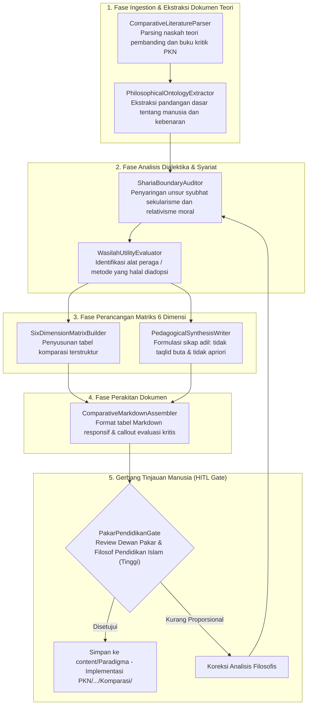

# Desain Pipeline 08: Halaman Komparasi Konsep & Kurikulum Pendidikan (Comparative Philosophy & Critique)

Dokumen ini mengatur spesifikasi teknis dan arsitektur pipeline pemrosesan dokumen untuk memproduksi **Halaman Telaah Kritis & Matriks Komparasi Konsep Pendidikan** (misal: PKN vs Tabula Rasa vs Pendidikan Konvensional vs Montessori vs Fitrah Based Education).

---

## 1. Karakteristik & Target Output Halaman

Halaman komparasi berfungsi memperjelas posisi distingtif (kekhasan) PKN di tengah beragam teori pendidikan modern dan alternatif.
- **Tujuan Utama:** Mendekonstruksi asumsi filosofis teori Barat yang bertentangan dengan fitrah tauhid, mengidentifikasi aspek teknis yang halal diadopsi sebagai sarana (*wasilah*), dan menyajikan tabel matriks perbandingan multi-dimensi.
- **Komponen Kunci Output Markdown:**
  - **Latar Belakang & Asal-Usul Teori Pembanding:** Sejarah penemu, konteks zaman, dan landasan ontologi/epistemologinya.
  - **Titik Temu (*Points of Convergence*):** Praktik baik atau keselarasan teknis yang bermanfaat dan tidak bertentangan dengan syariat.
  - **Titik Tolak Kritis (*Points of Divergence*):** Celah fatal (misal: menafikan fitrah tauhid, mengabaikan akhirat, memutlakkan kebebasan anak tanpa batasan syar'i).
  - **Matriks Komparasi 6 Dimensi:**
    1. Pandangan terhadap Hakikat Anak (*Insan*)
    2. Tujuan Puncak Pendidikan (*Ghayah*)
    3. Peran Pendidik / Orang Tua (*Murabbi*)
    4. Pendekatan Disiplin & Hukuman (*Adab & 'Uqubah*)
    5. Orientasi Keberhasilan (*Najaah*)
    6. Hubungan dengan Alam Akhirat & Ridha Allah
  - **Pedoman Seleksi & Adaptasi bagi Sekolah Islam.**

---

## 2. Sumber Bahan Baku (Multi-Modal Ingestion)

1. **Buku & Modul Telaah Kritis:** Modul internal seperti `Kritik Pendidikan Modern...` dan naskah komparasi fitrah di `old_backup/random/`.
2. **Dokumen Kurikulum Pembanding:** Buku pegangan Montessori, Charlotte Mason, Waldorf, Kurikulum Nasional, dan silabus FBE.
3. **Kajian Epistemologi Islam:** Tulisan para pakar pendidikan Islam tentang de-Westernisasi ilmu dan islamisasi sains.

---

## 3. Diagram Alur State Graph LangGraph



---

## 4. Spesifikasi Node & State Schema

### Skema State Spesifik: `ComparativePageState`

```python
from typing import TypedDict, List, Dict, Any

class DimensionComparison(TypedDict):
    dimension_name: str            # e.g., 'Hakikat Insan'
    conventional_or_target_view: str
    pkn_nabawiyah_view: str
    sharia_critique: str

class ComparativePageState(TypedDict):
    comparison_title: str          # e.g., 'PKN vs Teori Tabula Rasa John Locke'
    external_theory_name: str
    historical_background: str
    convergence_aspects: List[str] # Aspek teknis yang bermanfaat
    divergence_aspects: List[str]  # Aspek filosofis yang bertentangan
    matrix_dimensions: List[DimensionComparison]
    adoption_guidelines: List[str] # Panduan adopsi bagi guru
    markdown_output: str
    hitl_approved: bool
```

### Rincian Fungsi Node Kunci:
1. **`PhilosophicalOntologyExtractor`**: Menggali akar sekuler di balik suatu teori (misal: teori *Tabula Rasa* yang mengasumsikan jiwa anak bagaikan kertas putih kosong tanpa bekal fitrah tauhid).
2. **`ShariaBoundaryAuditor`**: Memastikan sikap yang diambil bersifat adil (*inshaf*): menghargai kontribusi sains dan observasi empiris manusia, namun menolak jika kebebasan anak melampaui rambu-rambu halal-haram.
3. **`SixDimensionMatrixBuilder`**: Merangkum komparasi ke dalam tabel matriks perbandingan 6 dimensi yang jelas dan mudah dipahami guru.

---

## 5. Strategi Prompting AI

```markdown
### System Prompt: SixDimensionMatrixBuilder
Anda adalah Pakar Filsafat Pendidikan Islam & Sejarah Pemikiran Tarbiyah.
Bandingkan konsep Pendidikan Karakter Nabawiyah dengan teori pembanding berikut:

Prinsip Telaah:
1. **Bersikap Adil & Obyektif:** Jangan mencela secara emosional. Jelaskan latar belakang mengapa teori barat tersebut lahir pada masanya (misal: Montessori lahir untuk merespon kekakuan sekolah industri di Eropa).
2. **Dekonstruksi Titik Cacat:** Tunjukkan di mana titik lemahnya saat dihadapkan pada fitrah nabawiyah (misal: minimnya penyiapan tanggung jawab taklif, ketiadaan orientasi pahala-dosa).
3. **Sikap Pendidik Muslim:** Berikan panduan praktis: mana yang boleh diadopsi sebagai metode alat (*wasilah*), dan mana yang wajib dibuang dari sisi aqidah (*ghayah*).
```

---

## 6. Level Kebutuhan Human-in-the-Loop (HITL)

- **Tingkat Kebutuhan HITL:** `Tinggi`
- **Kriteria Tinjauan:**
  - Ketajaman analisis aqidah dan pemikiran Islam.
  - Objektivitas representasi teori pembanding (tidak menyimpangkan fakta teori aslinya).
  - Ketepatan rekomendasi implementasi bagi sekolah Islam terpadu atau pesantren.

---

## 7. Contoh Cuplikan Dokumen Markdown Terformat

```markdown
---
title: "Komparasi Kritis: Pendidikan Karakter Nabawiyah vs Teori Tabula Rasa"
description: "Dekonstruksi doktrin kertas putih John Locke dalam perspektif fitrah penciptaan manusia dan konsekuensinya dalam metodologi pengasuhan."
tags:
  - komparasi
  - filsafat-pendidikan
  - fitrah
---

# Komparasi: PKN vs Teori Tabula Rasa (John Locke)

Doktrin *Tabula Rasa* yang digagas John Locke (1632–1704) memandang anak terlahir sebagai kertas kosong bersih yang sepenuhnya ditentukan oleh coretan lingkungan luar...

## 📊 Matriks Komparasi 6 Dimensi

| Dimensi Analisis | Teori Tabula Rasa (Sekuler) | Pendidikan Karakter Nabawiyah (PKN) |
| :--- | :--- | :--- |
| **1. Hakikat Insan** | Jiwa kosong tanpa muatan awal; moralitas sepenuhnya bentukan sensorik. | Membawa fitrah tauhid sejak alam arwah (*Al-A'raf: 172*) dan potensi bakat bawaan. |
| **2. Peran Pendidik** | 'Pencetak' atau 'pemahat' yang menentukan isi dan bentuk anak. | 'Fasilitator fitrah' dan pembersih karat jiwa (*Muzakki*), bukan pencipta. |
| **3. Tujuan Akhir** | Adaptasi sosial dan efisiensi masyarakat materialistik. | Keselamatan dunia-akhirat dan kesiapan memikul amanah kekhalifahan. |
| **4. Kedudukan Bakat** | Ditentukan oleh pengondisian lingkungan eksternal semata. | Sunnatullah ragam potensi yang wajib ditemukan dan diarahkan (*Syaghaf & Kafa'ah*). |

> [!important] Sikap Manhaj Nabawiyah
> Menolak pandangan bahwa anak adalah kertas kosong. Pendidik muslim tidak boleh memaksakan kehendak pribadinya kepada anak, melainkan berkewajiban merawat benih fitrah iman dan bakat yang telah Allah sematkan dalam dada mereka.
```
