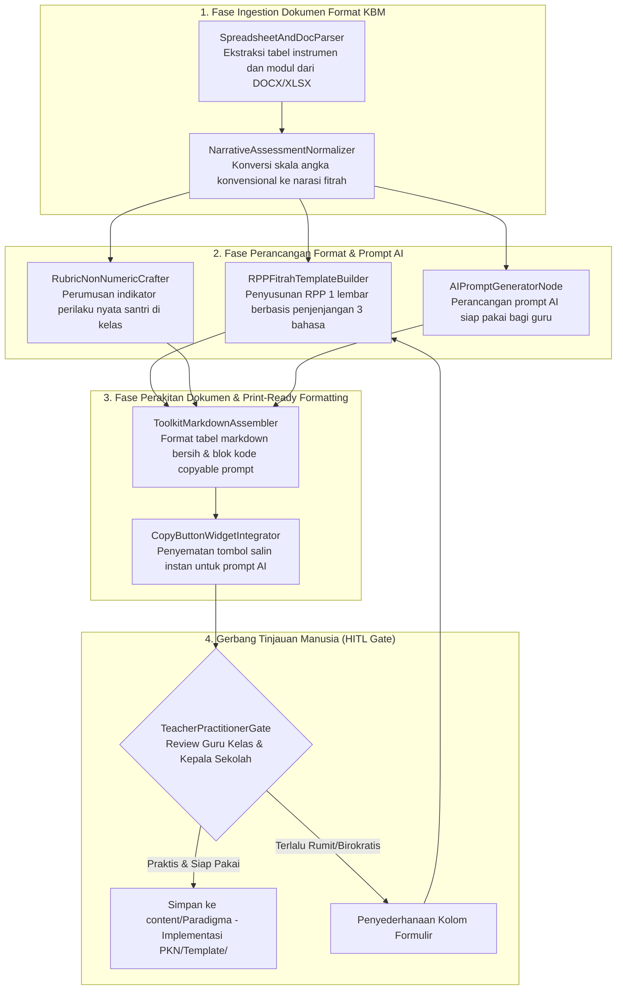

# Desain Pipeline 09: Halaman Template Siap Pakai & Toolkit Guru KBM (Operational Toolkit & AI Prompts)

Dokumen ini mengatur spesifikasi teknis dan pipeline otomatisasi untuk memproduksi **Halaman Template Operasional Siap Pakai, Instrumen Observasi Karakter Tanpa Angka, dan Bank Prompt AI KBM** di Wiki Pendidikan Karakter Nabawiyah.

---

## 1. Karakteristik & Target Output Halaman

Halaman template dan toolkit KBM adalah instrumen praktis yang langsung dapat diunduh, disalin, atau dicetak oleh para guru dan pengelola madrasah untuk aktivitas belajar-mengajar harian.
- **Tujuan Utama:** Mengubah konsep filosofis PKN menjadi format administratif yang mudah dijalankan di kelas: Rencana Pembelajaran Berbasis Fitrah (RPP Nabawiyah), Rubrik Observasi Adab Naratif (menolak reduksi karakter menjadi angka mati 1–100), dan Generator Prompt AI untuk asisten guru.
- **Komponen Kunci Output Markdown:**
  - **Pratinjau Format Dokumen (Clean Printable Layout):** Blok tabel terstruktur yang siap disalin ke Google Docs / Word.
  - **Format Observasi Karakter Non-Angka:**
    - Indikator perilaku empiris (apa yang terlihat, terdengar, dan terasa).
    - Status perkembangan naratif: *Belum Terlihat (BT)*, *Mulai Tumbuh (MT)*, *Berkembang Konsisten (BK)*, *Membudaya Menjadi Teladan (MM)*.
    - Kolom catatan dialog hati guru dengan santri.
  - **Sistem Prompt AI Terstruktur (Few-Shot Prompt Toolkit):** Prompt yang dapat langsung di-copy-paste guru ke ChatGPT/Claude/Gemini untuk menyusun apersepsi kisah sirah, rencana proyek sains berbasis fitrah, atau lembar refleksi santri.
  - **Petunjuk Pengisian & Pantangan Evaluasi Guru.**

---

## 2. Sumber Bahan Baku (Multi-Modal Ingestion)

1. **Dokumen Format RPP & Silabus Eksisting:** Berkas DOCX/XLSX kurikulum sekolah mitra dan modul KBM di `data/`.
2. **Instrumen Observasi Rapor Karakter:** Pola skema penilaian dari repositori `rapor-karakter` (Postgres kluster port 5432).
3. **Pustaka Prompt AI Pendidik:** Template prompt instruksional yang telah diuji oleh guru penggerak PKN.

---

## 3. Diagram Alur State Graph LangGraph



---

## 4. Spesifikasi Node & State Schema

### Skema State Spesifik: `ToolkitPageState`

```python
from typing import TypedDict, List, Dict, Any

class ObservationRubricRow(TypedDict):
    pillar_trait: str              # e.g., 'Amanah terhadap Fasilitas Belajar'
    development_stages: Dict[str, str] # BT, MT, BK, MM indicators
    guiding_questions: List[str]

class TeacherPromptKit(TypedDict):
    prompt_title: str
    target_ai_model: str           # e.g., 'Universal (ChatGPT / Claude / Gemini)'
    system_instruction: str
    sample_user_input: str
    expected_output_format: str

class ToolkitPageState(TypedDict):
    toolkit_category: str          # 'RPP', 'Observasi', 'Prompt KBM'
    template_title: str
    target_grade_level: str        # 'Kelas 1-3 SD', 'Kelas 4-6 SD', 'SMP'
    rubric_rows: List[ObservationRubricRow]
    prompt_kits: List[TeacherPromptKit]
    markdown_output: str
    hitl_approved: bool
```

### Rincian Fungsi Node Kunci:
1. **`NarrativeAssessmentNormalizer`**: Mengeliminasi praktik memberi angka pada akhlak (misal: "Akhlak: 75"). Digantikan dengan deskripsi otentik berbasis pengamatan: *"Ananda F telah mampu mengembalikan buku perpustakaan tepat waktu tanpa diingatkan guru."*
2. **`AIPromptGeneratorNode`**: Menyusun prompt terstruktur menggunakan format XML-tags (`<context>`, `<role>`, `<rules>`, `<output_format>`) agar guru cukup mengisi satu variabel (misal: judul bab sains) dan AI langsung menghasilkan rencana KBM bernuansa nabawiyah.

---

## 5. Strategi Prompting AI

```markdown
### System Prompt: AIPromptGeneratorNode
Rancang template prompt AI untuk para guru sekolah Islam:

Aturan Perancangan Prompt Guru:
1. Prompt harus meminta AI bertindak sebagai 'Fasilitator Pembelajaran Karakter Nabawiyah'.
2. Prompt mewajibkan setiap materi pelajaran (Matematika, IPA, Bahasa) dihubungkan dengan ayat Al-Qur'an atau hadits yang relevan pada fase apersepsi.
3. Prompt melarang pemberian hukuman fisik atau penulisan kata-kata merendahkan santri.
4. Output prompt wajib memuat skenario interaksi 3 bahasa: Bahasa Hati (koneksi batin), Bahasa Lisan (ajakan logis), dan Bahasa Tangan (pendampingan langsung).
```

---

## 6. Level Kebutuhan Human-in-the-Loop (HITL)

- **Tingkat Kebutuhan HITL:** `Sedang - Tinggi`
- **Kriteria Tinjauan:**
  - Kemudahan aplikasi lembar kerja di tengah keterbatasan waktu guru di sekolah.
  - Kejelasan bahasa indikator agar tidak terjadi perbedaan tafsir antar guru penilai.
  - Efektivitas prompt AI saat diuji langsung pada model AI publik.

---

## 7. Contoh Cuplikan Dokumen Markdown Terformat

```markdown
---
title: "Template: Lembar Observasi Karakter Tanpa Angka (Format Naratif)"
description: "Instrumen penilaian adab dan fitrah santri berbasis deskripsi naratif untuk rapor perkembangan anak."
tags:
  - template
  - instrumen-kbm
  - evaluasi-karakter
---

# Template: Lembar Observasi Karakter Naratif

> [!important] Larangan Reduksi Karakter Menjadi Angka
> Karakter adalah kondisi kejiwaan dan adab yang hidup, bukan besaran angka matematika. Jangan pernah melabeli anak dengan skor '60' atau '90' dalam urusan akhlak.

## 📋 Matriks Observasi Karakter Adab di Kelas

| Dimensi Karakter | Belum Terlihat (BT) | Mulai Tumbuh (MT) | Berkembang Konsisten (BK) | Membudaya Menjadi Teladan (MM) |
| :--- | :--- | :--- | :--- | :--- |
| **Shidq (Kejujuran)** | Masih menyembunyikan kesalahan saat ditanya guru. | Mengakui kesalahan setelah diajak bicara empati berdua. | Terbiasa melapor jujur secara spontan tanpa rasa takut. | Mengajak dan membela kebenaran saat teman berselisih. |
| **Amanah (Tanggung Jawab)** | Meninggalkan tugas atau alat belajar berantakan. | Merapikan alat belajar jika diingatkan oleh guru. | Merapikan dan merawat meja belajarnya sendiri. | Membantu merapikan fasilitas kelas bersama teman. |

---

## 🤖 Prompt AI Siap Pakai: Generator RPP Karakter Nabawiyah

Salin prompt di bawah ini ke peramban AI Anda (ChatGPT / Claude / Gemini):

```text
Anda adalah Konsultan Kurikulum Pendidikan Karakter Nabawiyah (PKN).
Saya ingin Anda membuat Rencana Pembelajaran (RPP 1 Lembar) untuk topik berikut:

Mata Pelajaran: [Isi: Contoh: IPA / Sains]
Topik Bahasan: [Isi: Contoh: Siklus Air dan Hujan]
Tingkat Kelas: [Isi: Contoh: Kelas 4 SD (Usia Tamyiz)]

Instruksi Khusus PKN:
1. Apersepsi: Mulai pembelajaran dengan menelaah ayat Al-Qur'an tentang hujan (misal: QS. Qaf: 9) dan membangkitkan kekaguman anak pada kasih sayang Allah.
2. Aktivitas Inti: Hubungkan pemahaman siklus air dengan adab bersyukur saat air melimpah dan adab berhemat saat wudhu.
3. Metode Pendidik: Gunakan 'Bahasa Hati' di awal pertemuan dan 'Bahasa Lisan' yang memicu nalar kritis fitrah belajar anak.
```
```
