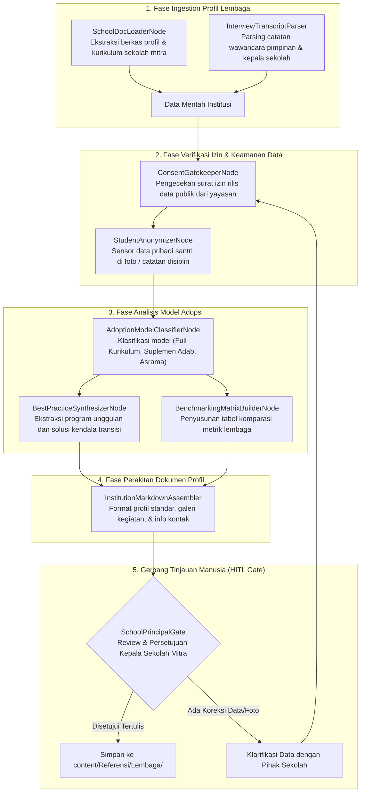

# Desain Pipeline 10: Halaman Profil Lembaga & Praktik Baik Sekolah Pengadopsi (Institutional Best Practices)

Dokumen ini mengatur arsitektur pipeline pemrosesan dokumen untuk mempublikasikan **Halaman Profil Lembaga, Sekolah, Pesantren Mitra, dan Studi Lapangan Pengadopsi PKN**.

---

## 1. Karakteristik & Target Output Halaman

Halaman profil lembaga menyajikan bukti empiris keberhasilan penerapan PKN di berbagai institusi pendidikan Islam (SDIT, Pesantren, Sekolah Alam, Homeschooling Group, dll.).
- **Tujuan Utama:** Menjadi wahana saling belajar antar institusi (*benchmarking*), mendokumentasikan model adaptasi kurikulum, mencatat kendala transisi dari sistem lama ke sistem nabawiyah, serta memberikan kontak rujukan bagi pegiat pendidikan yang ingin berkunjung/studi banding.
- **Komponen Kunci Output Markdown:**
  - **Identitas Institusi:** Nama sekolah/pesantren, lokasi, yayasan penaung, jenjang pendidikan, dan tahun mulai mengadopsi PKN.
  - **Model Integrasi Kurikulum:** Bagaimana sekolah mengintegrasikan PKN (apakah sebagai kurikulum utama utuh, program pembiasaan harian, atau matrikulasi adab santri).
  - **Dinamika Transisi & Kendala Lapangan:** Kisah nyata tantangan meyakinkan orang tua murid dan pelatihan guru.
  - **Praktik Terbaik (*Best Practices*):** Program unggulan yang terbukti menumbuhkan karakter santri (misal: halaqah subuh ayah-anak, magang bakat usia baligh, ekspedisi kemandirian).
  - **Tabel Rekapitulasi Metrik Perkembangan.**
  - **Verifikasi Izin Publikasi (Consent Gate).**

---

## 2. Sumber Bahan Baku (Multi-Modal Ingestion)

1. **Dokumen Profil Sekolah & Laporan Tahunan:** Brosur, naskah kurikulum internal, dan laporan akreditasi sekolah.
2. **Wawancara Audio Kepala Sekolah / Yayasan:** Rekaman wawancara mendalam mengenai riwayat penerapan PKN.
3. **Dokumentasi Visual & Kegiatan:** Foto kegiatan santri beresolusi optimal.

---

## 3. Diagram Alur State Graph LangGraph



---

## 4. Spesifikasi Node & State Schema

### Skema State Spesifik: `InstitutionProfileState`

```python
from typing import TypedDict, List, Dict, Any, Optional

class AdoptionModel(TypedDict):
    category: str                   # 'Kurikulum Penuh', 'Suplemen Pembiasaan', 'Pesantren Terpadu'
    year_started: int
    pilot_grade: str                # e.g., 'Dimulai dari jenjang TK dan Kelas 1 SD'
    teacher_training_method: str

class SchoolBestPractice(TypedDict):
    program_name: str
    target_character_trait: str     # Sesuai pilar TB40
    operational_routine: str
    impact_observed: str

class InstitutionProfileState(TypedDict):
    school_name: str
    city_province: str
    leadership_contact: str
    official_website_url: Optional[str]
    has_written_consent: bool
    adoption_details: AdoptionModel
    best_practices: List[SchoolBestPractice]
    transitional_challenges_solved: List[Dict[str, str]]
    markdown_output: str
    hitl_approved: bool
```

### Rincian Fungsi Node Kunci:
1. **`ConsentGatekeeperNode`**: Mengunci status publikasi sampai terdapat verifikasi persetujuan tertulis dari pengurus yayasan/kepala sekolah untuk mencegah sengketa data atau pelanggaran privasi internal.
2. **`BestPracticeSynthesizerNode`**: Mengambil sari program unggulan sekolah dan menerjemahkannya ke dalam bahasa sistem yang dapat direplikasi oleh sekolah lain (*replicable SOP*).

---

## 5. Strategi Prompting AI

```markdown
### System Prompt: BestPracticeSynthesizerNode
Anda adalah Analis Manajemen Lembaga Pendidikan Islam.
Susun profil implementasi sekolah mitra PKN ini dengan gaya laporan profesional:

1. Fokuskan ulasan pada **proses transformasi**: bagaimana sekolah merubah budaya lama (yang mungkin serba menuntut angka dan ancaman) menjadi budaya saling menyayangi berbasis fitrah.
2. Ungkapkan kendala nyata yang dihadapi (misal: resistensi orang tua santri yang mencemaskan ujian nasional) dan strategi komunikasi yang ditempuh sekolah untuk mengatasinya.
3. Hindari nada promosi/marketing berlebihan; kedepankan semangat berbagi ilmu (*ta'awun 'alal birri wat taqwa*).
```

---

## 6. Level Kebutuhan Human-in-the-Loop (HITL)

- **Tingkat Kebutuhan HITL:** `Sedang`
- **Kriteria Tinjauan:**
  - Konfirmasi keabsahan data kontak dan alamat lembaga.
  - Verifikasi keaslian foto dan izin publikasi dari orang tua santri yang bersangkutan.
  - Keselarasan program sekolah dengan prinsip manhaj PKN.

---

## 7. Contoh Cuplikan Dokumen Markdown Terformat

```markdown
---
title: "Profil Lembaga: Sekolah Karakter Nabawiyah Insan Mustaqbal"
description: "Model implementasi penuh kurikulum fitrah dan penjenjangan 3 bahasa pendidik pada jenjang pendidikan dasar."
tags:
  - profil-lembaga
  - sekolah-mitra
  - best-practices
---

# Profil Lembaga: Sekolah Karakter Insan Mustaqbal

Lembaga pendidikan dasar yang berfokus pada integrasi fitrah iman dan penumbuhan bakat 40 karakter nabawiyah sejak usia dini...

## 🏫 Identitas & Riwayat Adopsi
- **Jenjang:** SD (Kelas 1 - 6).
- **Lokasi:** Jawa Barat, Indonesia.
- **Mulai Adopsi PKN:** Tahun 2021.
- **Model Adopsi:** Implementasi Kurikulum Penuh (Peniadaan sistem ranking angka & penggantian dengan Rapor Deskripsi Fitrah).

## 🌟 Praktik Terbaik Unggulan (*Best Practices*)
1. **Morning Heart Connection (15 Menit Pertama):** Setiap pagi guru menyambut santri di depan gerbang dengan senyuman dan menanyakan kabar tangki cinta mereka sebelum pelajaran dimulai.
2. **Program Magang Bakat (Usia 10-12 Tahun):** Santri magang pada unit usaha sekolah sesuai hasil asesmen TB40 masing-masing.
```
