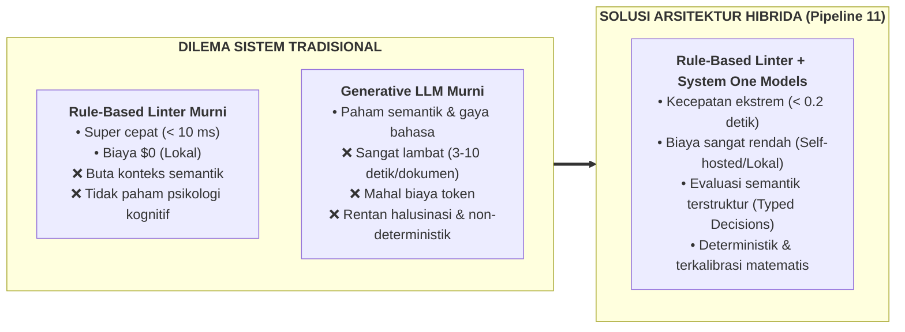
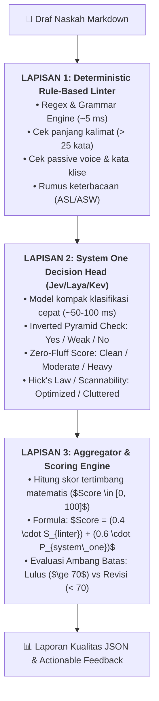
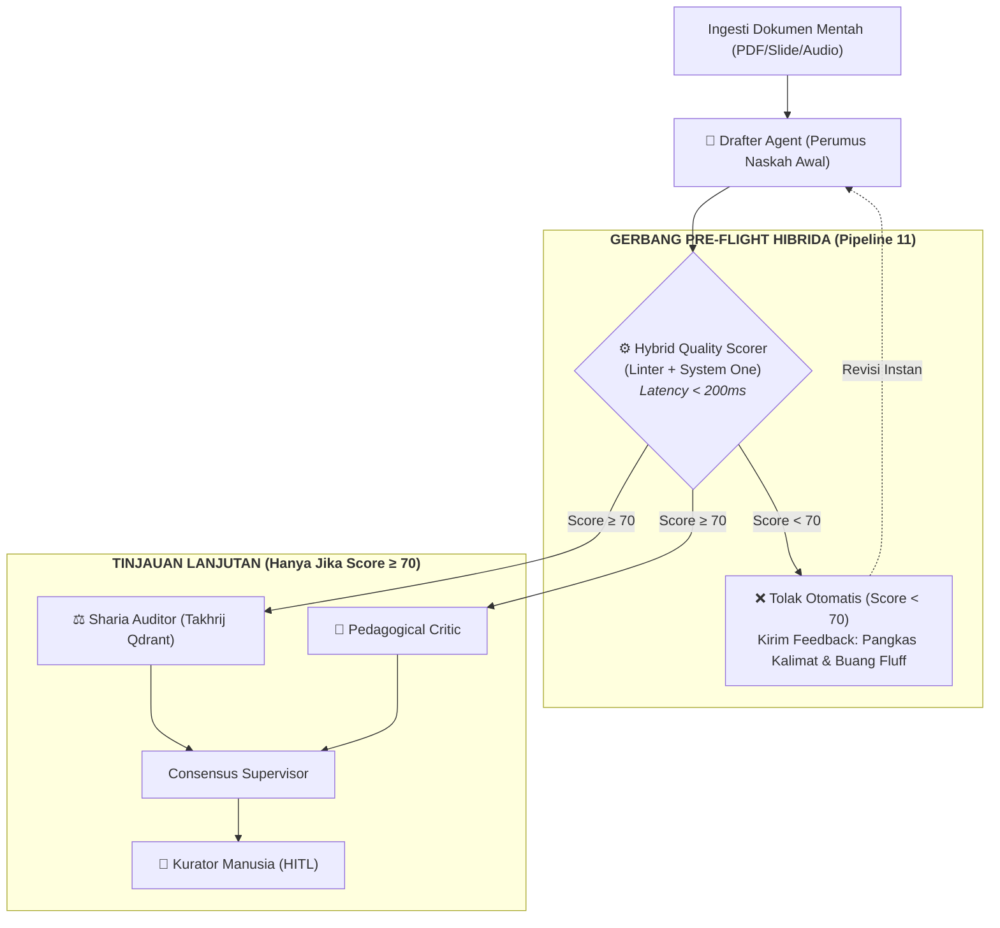

# Pipeline 11 — Arsitektur Hibrida: Otomasi Penilaian Kualitas Tulisan Menggunakan Rule-Based Linters dan Model System One (Jev/Laya/Kev)

**Status:** Spesifikasi teknis arsitektur penilaian kualitas (*Automated Quality Gate Specification*). Mengintegrasikan penyaringan deterministik berbasis aturan (*Rule-Based Linters*) dan model klasifikasi semantik cepat (*System One Decision Head*) untuk mengevaluasi kepatuhan kognitif dan keterbacaan naskah wiki secara otomatis.

---

## 1. Konteks Masalah & Dilema Otomasi Kualitas

Otomasi penilaian kualitas artikel dalam repositori Wiki PKN (482+ berkas) menghadapi dilema klasik antara kecepatan, biaya, dan kedalaman evaluasi:



Dengan memadukan **Linter Berbasis Aturan** (untuk kesalahan mekanis) dan **Model System One** (Jev/Laya/Kev untuk evaluasi kognitif semantik), sistem mampu menerbitkan laporan penilaian lengkap dalam waktu **kurang dari 200 milidetik** sebelum draf naskah masuk ke siklus telaah manusia (*HITL Gate*).

---

## 2. Tiga Lapisan Arsitektur Hibrida

Sistem evaluasi bekerja melalui tiga lapisan sekuensial berkecepatan tinggi:



---

### Lapisan 1: Deterministic Rule-Based Linter (Penyaringan Formal)
* **Peran:** Menangkap kesalahan mekanika penulisan, sintaksis, dan kepatuhan style guide dasar.
* **Waktu Eksekusi:** $\approx 5$ milidetik.
* **Metrik yang Dievaluasi:**
  1. **Panjang Kalimat (*Sentence Length*):** Menandai kalimat yang melebihi batas maksimal $25$ kata per kalimat.
  2. **Passive Voice yang Berlebihan:** Mendeteksi rasio kalimat pasif terhadap aktif (disarankan pasif $< 15\%$).
  3. **Kepatuhan Larangan Kata (*Style Guide Cluster*):** Memindai 8 kluster kosa kata terlarang manhaj (misal: *etape*, *archetype*, *behavioral conditioning*, *punishment*).
  4. **Keterbacaan Dasar (*Readability Formula*):** Menghitung Average Sentence Length (ASL) dan Average Syllables per Word (ASW).
* **Luaran:** Skor Linter ($S_{linter} \in [0, 100]$) dan daftar pelanggaran per nomor baris.

---

### Lapisan 2: System One Decision Head (Evaluasi Semantik & Kognitif)
* **Peran:** Mengevaluasi aspek struktural tingkat tinggi yang tidak dapat dibaca oleh regex, menggunakan model klasifikasi kompak berlatensi rendah (ModernBERT / Qwen-LoRA / Jev / Laya / Kev).
* **Waktu Eksekusi:** $\approx 50 - 100$ milidetik.
* **Keputusan Terstruktur (*Typed Decisions*):**

| Parameter Kognitif | Definisi Evaluasi Model | Label Keputusan Terstruktur |
|---|---|:---:|
| **Inverted Pyramid Check** | Apakah paragraf pertama memuat jawaban langsung, definisi inti, atau esensi masalah tanpa didahului pengantar berbelit? | `Yes` (1.0)<br>`Weak` (0.5)<br>`No` (0.0) |
| **Zero-Fluff / Objectivity** | Apakah teks terbebas dari basa-basi retorika klise ("Di era modern...", "Seperti yang kita ketahui...")? | `Clean` (1.0)<br>`Moderate Fluff` (0.5)<br>`Heavy Fluff` (0.0) |
| **Hick's Law / Scannability** | Apakah dokumen memecah paragraf menjadi 3–4 kalimat, memiliki sub-heading per 200 kata, dan tautan keluar proporsional? | `Optimized` (1.0)<br>`Cluttered` (0.0) |

* **Luaran:** Probabilitas Kognitif Gabungan ($P_{system\_one} \in [0, 100]$):
  $$P_{system\_one} = \left(\frac{Score_{Pyramid} + Score_{ZeroFluff} + Score_{Scannability}}{3}\right) \times 100$$

---

### Lapisan 3: Aggregator & Scoring Engine (Mesin Kalkulasi Nilai)
* **Formula Tertimbang:**
  $$Score = (w_1 \cdot S_{linter}) + (w_2 \cdot P_{system\_one})$$
  * $w_1 = 0.4$ (Bobot kepatuhan formal dan mekanika teks)
  * $w_2 = 0.6$ (Bobot arsitektur kognitif dan struktur semantik)
* **Kriteria Kelulusan:**
  * **$Score \ge 70$:** Status **`APPROVED`** $\rightarrow$ Draf diizinkan lanjut ke siklus musyawarah redaksi AI dan validasi dalil syar'i.
  * **$Score < 70$:** Status **`NEEDS_REVISION`** $\rightarrow$ Sistem menghentikan alur (*fast-fail*) dan mengembalikan catatan perbaikan spesifik kepada kontributor atau agen penulis.

---

## 3. Integrasi dalam Orkestrasi LangGraph Wiki-PKN

Dalam arsitektur pipeline pemrosesan dokumen makro, Mesin Penilaian Kualitas Hibrida diposisikan sebagai **Pre-Flight Quality Gate** langsung setelah agen perumus draf (*Drafter Agent*):



### Manfaat Efisiensi Pipeline:
1. **Menghemat Token & Waktu LLM Berat:** Naskah yang struktur kognitifnya berantakan langsung ditolak di detik ke-0.2, tanpa membuang biaya kueri ke Qdrant, OpenBayan, atau LLM evaluasi berukuran besar.
2. **Koreksi Terfokus:** Agen pembuat naskah langsung menerima diagnosa biner yang jelas (misal: *"Paragraf pembuka tidak memiliki definisi piramida terbalik"* dan *"Terdapat 3 kalimat dengan lebih dari 25 kata"*).

---

## 4. Spesifikasi Skema Output JSON

Setiap evaluasi menghasilkan dokumen payload JSON standar:

```json
{
  "document_path": "content/Paradigma - Implementasi PKN/Fase Tamyiz.md",
  "timestamp": "2026-10-01T12:45:00Z",
  "execution_time_ms": 118,
  "overall_score": 84.5,
  "status": "APPROVED",
  "layers": {
    "layer_1_linter": {
      "score": 87.5,
      "violations": [
        {
          "line": 42,
          "rule": "sentence_length_max_25",
          "message": "Kalimat memiliki 32 kata, melebihi batas 25 kata.",
          "snippet": "Pendidikan anak pada usia ini harus benar-benar memperhatikan..."
        }
      ],
      "metrics": {
        "asl": 18.2,
        "asw": 2.31,
        "passive_ratio_pct": 8.4
      }
    },
    "layer_2_system_one": {
      "score": 83.3,
      "decisions": {
        "inverted_pyramid": "Yes",
        "zero_fluff": "Clean",
        "scannability": "Optimized"
      },
      "details": {
        "lead_has_definition": true,
        "rhetorical_openers_detected": 0,
        "chunking_ratio_ok": true
      }
    }
  },
  "actionable_feedback": [
    "Pecah kalimat panjang pada baris 42 menjadi 2 kalimat terpisah."
  ]
}
```

---

## 5. Implementasi & Pengujian

Sistem ini diimplementasikan secara mandiri pada modul skrip:
* Modul Engine: [`scripts/hybrid_quality_scorer.py`](../scripts/hybrid_quality_scorer.py)
* Pengujian Unit: [`tests/test_hybrid_quality_scorer.py`](../tests/test_hybrid_quality_scorer.py)
