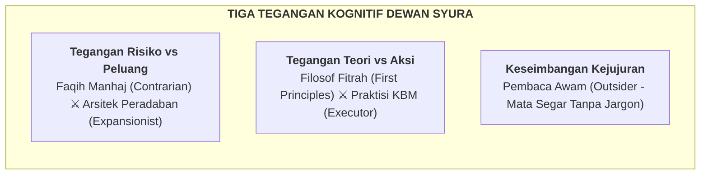
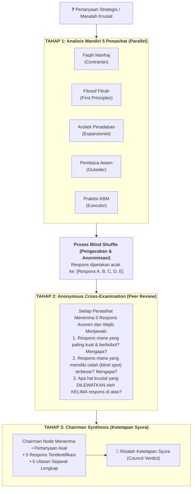

# Pipeline 12 — Arsitektur Dewan Syura Multi-Perspektif (LLM Council Karpathy)
## *(Multi-Agent Council Deliberation & Anonymous Peer-Review Architecture)*

**Status:** Spesifikasi teknis arsitektur musyawarah ilmiah (*Deliberation Engine Specification*). Mengadaptasi metodologi **LLM Council Andrej Karpathy** menjadi sistem pengambilan keputusan manhaj dan kurikulum berisiko tinggi (*High-Stakes Decision Making*) di lingkungan Wiki Pendidikan Karakter Nabawiyah.

**Batas implementasi:** `scripts/llm_council.py` adalah **simulasi offline belum disetujui manusia** berbasis template; konteks tidak menjamin grounding isi dan tidak ada provider live yang berfungsi. JSON mencakup identity mapping sehingga bukan tampilan anonim publik. Desain high-stakes di bawah bukan otorisasi otomatis atau bukti sidang manusia. CLI lama tetap tersedia untuk eksperimen privat.

Workflow lokal rendah–sedang tersedia terpisah di `scripts/hitl_workflow.py`: menerima Markdown kontributor aktual, konteks dan sumber wajib, preflight scorer, ledger keputusan manusia dengan SHA-256 versi tepat, revisi baru, serta resume handoff di luar `content/`. Council tidak digunakan sebagai draf atau persetujuan manusia. Risiko tinggi tetap memerlukan prosedur manusia di luar adapter; belum ada bukti signoff operasional. Lihat [panduan CLI](../README.md#review-manusia-lokal-hitl-rendahsedang).

---

## 1. Landasan Filosofis: Mengapa Satu Model AI Tidak Cukup?

Dalam proyek ensiklopedia ilmu syar'i dan pendidikan karakter seperti Wiki PKN, mengajukan pertanyaan krusial kepada satu AI menghasilkan risiko epistemik:
1. **Bias Konfirmasi (*Sycophancy*):** Model tunggal cenderung mengiyakan asumsi penanya dan menghindari friksi.
2. **Ketiadaan Perspektif Tandingan:** Jawaban yang tampak meyakinkan bisa jadi menyimpan celah hukum syar'i atau mustahil diterapkan guru di kelas.
3. **Halusinasi Teoretis:** Teori yang terdengar canggih di atas kertas sering kali melanggar kaidah *tadarruj* (bertahap) atau membebani kognisi anak.

**Prinsip Karpathy Council:**
> *"The council is for questions where being wrong is expensive."*  
> (Dewan ini ditujukan untuk persoalan di mana jika kita salah mengambil keputusan, akibatnya sangat mahal).

Metodologi ini memecah analisis ke dalam **5 lensa berpikir yang saling menciptakan ketegangan alami (*creative tension*)**, melakukan **pengujian silang secara anonim (*Anonymous Peer-Review*)**, dan merumuskan **sintesis ketetapan syura (*Chairman Verdict*)**.

---

## 2. Lima Kursi Dewan Syura PKN (*The 5 Council Lenses*)

Setiap penasihat tidak didefinisikan sebagai nama fiktif, melainkan sebagai **gaya berpikir kognitif murni** yang dilarang bersikap netral atau kompromistis pada putaran pertama:



### 1. Faqih Manhaj (Lensa: *The Contrarian*)
* **Misi:** Mencari titik gagal, celah takwil, dan risiko penyimpangan manhaj.
* **Pertanyaan Inti:** *"Apa cacat fatal dari gagasan ini? Apakah ini terjebak ifrath (berlebihan) atau tafrith (meremehkan)? Apa risiko fitnah hukum syar'i atau benturan dengan hukum positif jika ini diterapkan?"*
* **Sikap:** Skeptis konstruktif, menolak kompromi semu, menyelamatkan proyek dari keputusan gegabah.

### 2. Filosof Fitrah & Tauhid (Lensa: *The First Principles Thinker*)
* **Misi:** Menelanjangi asumsi permukaan dan membongkar persoalan ke akar tauhid dan fitrah insan.
* **Pertanyaan Inti:** *"Masalah mendasar apa yang sebenarnya sedang kita selesaikan? Apakah kita sedang terjebak doktrin sekuler yang dibungkus istilah Arab? Apa hakikat ruh, nafs, dan akal dalam kasus ini?"*
* **Sikap:** Menolak formalitas kurikulum dangkal; berani berkata *"Pertanyaan yang Anda ajukan salah total sejak awal."*

### 3. Arsitek Peradaban (Lensa: *The Expansionist*)
* **Misi:** Melihat potensi perluasan, penskalaan ekosistem, dan visi peradaban 20 tahun ke depan.
* **Pertanyaan Inti:** *"Bagaimana jika konsep ini berhasil melampaui ekspektasi? Bagaimana gagasannya dapat diterapkan di 1.000 pesantren dan komunitas homeschooling? Peluang besar apa yang diabaikan oleh para penasihat lain?"*
* **Sikap:** Visioner, tidak memusingkan risiko mikro (karena itu tugas Faqih), berfokus pada daya ungkit strategis.

### 4. Pembaca Awam & Santri (Lensa: *The Outsider*)
* **Misi:** Menilai dengan mata segar tanpa beban istilah (*Anti-Curse of Knowledge*).
* **Pertanyaan Inti:** *"Saya orang tua awam / santri pemula. Mengapa kalimat ini sangat berbelit-belit? Apa makna praktisnya bagi anak saya yang sedang tantrum di rumah?"*
* **Sikap:** Menangkap kebingungan publik, memangkas keangkuhan akademis, menolak naskah yang tidak bisa dipahami manusia biasa.

### 5. Praktisi KBM & Guru Sekolah (Lensa: *The Executor*)
* **Misi:** Menguji kelayakan pelaksanaan teknis di lapangan (*The Monday Morning Test*).
* **Pertanyaan Inti:** *"Teori ini sangat indah, tapi apa persisnya yang harus dilakukan guru hari Senin jam 07.15 di kelas? Siapa yang memegang instrumennya? Berapa menit waktu yang dihabiskan?"*
* **Sikap:** Realistis, menuntut langkah 1-2-3 yang operasional, menolak konsep muluk tanpa SOP terukur.

---

## 3. Tiga Tahap Alur Musyawarah (*The 3-Stage Deliberation Engine*)

Proses persidangan dewan berlangsung melalui tiga tahap berurutan:



---

### Tahap 1: Analisis Mandiri Paralel
* Kelima agen menerima rumusan masalah yang sama.
* **Instruksi Keras:** Dilarang bersikap netral atau mencari jalan tengah (*no hedging*). Masing-masing wajib membela sudut pandang lensa kognitifnya secara maksimal dalam 150–300 kata.

### Tahap 2: Ulasan Sejawat Anonim (*The Core Innovation*)
* Kelima respons dikumpulkan dan diberi label **Respons A s.d. E** secara acak.
* Kelima penasihat bertindak sebagai reviewer anonim. Mereka saling menguji kekuatan dan kelemahan argumen tanpa mengetahui identitas penulis aslinya.
* **Tiga Pertanyaan Wajib:**
  1. *Respons mana yang paling kuat dan berbobot? Mengapa?*
  2. *Respons mana yang memiliki celah (blind spot) paling berbahaya? Mengapa?*
  3. *Apa hal fundamental yang luput diperhatikan oleh kelima respons di atas?*

### Tahap 3: Sintesis Ketetapan Syura (*Chairman Verdict*)
* Chairman (Ketua Sidang) menerima berkas utuh: rumusan masalah, 5 opini asli (setelah dibuka anonimitasnya), dan 5 ulasan sejawat.
* Chairman menghasilkan dokumen ketetapan terstruktur:
  1. **Where the Council Agrees (Konsensus):** Poin-poin di mana banyak penasihat sepakat secara mandiri.
  2. **Where the Council Clashes (Khilaf / Tegangan):** Perdebatan tajam antar sudut pandang yang sah.
  3. **Blind Spots Caught (Celah yang Terungkap):** Hal-hal penting yang baru muncul pada tahap peer review.
  4. **The Recommendation (Ketetapan):** Rekomendasi tegas dan berani (bukan *"tergantung"*).
  5. **The One Thing to Do First (Langkah Perdana):** Satu aksi nyata yang harus dieksekusi pertama kali.

---

## 4. Kapan Dewan Syura Wajib Diaktifkan?

Dewan Syura **TIDAK** dijalankan untuk tugas mekanis rutin (seperti pengecekan ejaan atau perbaikan format markdown). Dewan Syura **WAJIB** diaktifkan pada situasi berisiko tinggi (*High-Stakes Decisions*):

| Kategori Pemicu | Contoh Kasus Nyata di Wiki PKN |
|---|---|
| **Dilema Fiqih Tarbiyah** | Penerapan sanksi disiplin fisik usia 10 tahun tanpa melanggar syariat dan UU perlindungan anak. |
| **Penyelarasan Kurikulum** | Mengintegrasikan adab sebelum ilmu ke dalam silabus formal Kemendikbud/Kemenag tanpa menambah jam tatap muka. |
| **Dilema Restrukturisasi Konten** | Apakah transkrip ceramah 122 video dipecah menjadi artikel mikro atau dipertahankan sebagai arsip ensiklopedis? |
| **Kriteria Asesmen Sensitif** | Apakah asesmen 40 Bakat (TB-40) bagi santri boleh mengeluarkan skor angka kompetitif atau wajib portofolio naratif? |
| **Pemberian Istilah Manhaj** | Keputusan mengganti terminologi psikologi populer barat dengan istilah baku turats. |

---

## 5. Implementasi Perangkat Lunak

Arsitektur Dewan Syura ini diwujudkan dalam perangkat lunak operasional:
* **Skrip Eksekusi:** [`scripts/llm_council.py`](../scripts/llm_council.py)
* **Pengujian Unit:** [`tests/test_llm_council.py`](../tests/test_llm_council.py)
* **Format Perintah CLI:**
  ```bash
  python3 scripts/llm_council.py --topic "Apakah Asesmen TB-40 santri SMP wajib berbasis portofolio naratif?" --offline
  ```
