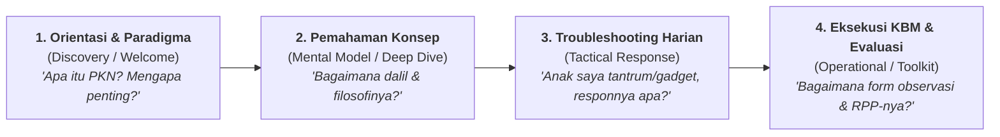
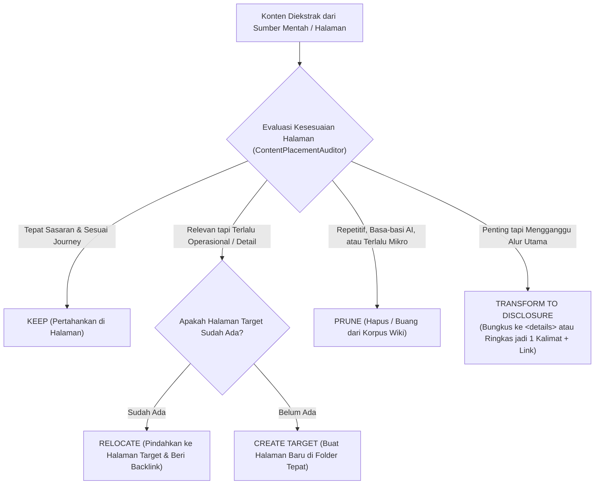

# Standar Evaluasi Penempatan Konten: User Journey, Navigasi & Arsitektur Informasi (Placement, Relocation & Pruning Framework)

Dokumen ini mendefinisikan framework dan algoritma evaluasi otomatis untuk menentukan **kelayakan penempatan konten (Placement Appropriateness)**, **relokasi terarah (Content Relocation)**, atau **eliminasi/pruning (Content Pruning)** di seluruh hierarki halaman Wiki Pendidikan Karakter Nabawiyah (Wiki-PKN).

Framework ini dirancang untuk menyelesaikan masalah *cognitive overload*, salah sasaran audiens (*misplaced context*), dan terganggunya *user journey*—seperti penempatan instrumen evaluasi/rubrik detail atau tips taktis harian di Halaman Beranda (Home).

---

## 1. Prinsip Dasar: Hirarki Kebutuhan Pembaca & User Journey

Setiap pengunjung Wiki-PKN berada pada salah satu dari empat tahapan *User Journey*:



### Matriks Kesesuaian Tipe Halaman vs User Journey:

| Tipe Halaman (Page Intent) | Target User Journey | Karakteristik Konten yang **Wajib Ada (IN)** | Konten yang **TIDAK COCOK / DILARANG (OUT)** | Tindakan Jika Ditemukan Konten Tidak Cocok |
| :--- | :--- | :--- | :--- | :--- |
| **Beranda / Home Portal (`index.md`)** | **Tahap 1: Orientasi & Navigasi** | • Visi peradaban makro<br>• Executive Summary 3 Pilar<br>• Peta Alur Belajar (*Reading Path*)<br>• Kartu Akses Cepat (*Navigation Hub*) | ❌ Tips operasional harian mikro<br>❌ Form/Rubrik asesmen teknis<br>❌ Matriks perbandingan rumit<br>❌ Transkrip audio panjang | **Pindahkan (RELOCATE)**:<br>• Tips $\to$ Portal Tips / FAQ<br>• Rubrik $\to$ Toolkit KBM / Templates<br>• Matriks $\to$ Halaman Komparasi |
| **Halaman Navigasi / MOC (`content_flow/`)** | **Tahap 1–2: Pemetaan Mental** | • Pohon topik hierarkis<br>• Diagram Mermaid alur materi<br>• Matriks prasyarat bacaan (*prerequisites*) | ❌ Teks narasi khotbah panjang<br>❌ Takhrij hadits lengkap ratusan baris | **Pindahkan (RELOCATE)** $\to$ Halaman Fokus Tema terkait |
| **Halaman Fokus Satu Tema (Pillar Deep-Dive)** | **Tahap 2: Pemahaman Menyeluruh** | • 9 Lapisan Standar Manhaj<br>• Dalil teks Arab + Terjemah + Syarah<br>• Analisis Tafrith vs Ifrath<br>• Hubungan konsep ke etape usia | ❌ Lampiran form cetak kosong<br>❌ Tips kasuistik spesifik rumah tangga | **Pindahkan (RELOCATE)**:<br>• Form $\to$ Toolkit Template<br>• Kasus $\to$ Case Study / FAQ Tips |
| **Halaman Kasus & Tips Praktisi (FAQ / Quick Response)** | **Tahap 3: Solusi Cepat Lapangan** | • Pertanyaan gejala perilaku riil<br>• Perspektif fitrah jiwa anak<br>• Protokol darurat 3 menit pertama<br>• Langkah penataan sepekan | ❌ Perdebatan filsafat panjang<br>❌ Matriks taksonomi 40 bakat mentah | **Eliminasi (PRUNE)** basa-basi teoritis, fokus pada aksi praktis nabawi |
| **Halaman Template & Toolkit KBM** | **Tahap 4: Operasional Sekolah & Rumah** | • Format RPP 1 lembar berbasis fitrah<br>• Rubrik observasi 3-level non-angka<br>• Prompt AI untuk guru/orang tua | ❌ Teori epistemologi umum yang berulang | **Pusatkan (CONSOLIDATE)** sebagai referensi alat siap pakai |

---

## 2. Taksonomi Keputusan Pipeline: KEEP, RELOCATE, PRUNE, TRANSFORM

Ketika sebuah konten dipindai oleh pipeline, mesin mengevaluasi 4 metrik:
1. **Journey Alignment Score ($S_{\text{journey}} \in [0.0, 1.0]$):** Apakah konten ini menjawab kebutuhan pembaca pada level halaman tersebut?
2. **Cognitive Load Impact ($C_{\text{load}} \in [0.0, 1.0]$):** Apakah konten ini menyebabkan halaman menjadi terlalu padat dan mengalihkan pembaca dari tujuan utama?
3. **Actionability Level ($A_{\text{level}}$):** Apakah konten berupa inspirasi filosofis (*macro*), taktis lapangan (*meso*), atau instrumen teknis (*micro*)?
4. **Information Redundancy ($R_{\text{dup}}$):** Apakah konten ini hanya repetisi dari halaman lain tanpa nilai tambah?



---

## 3. Matriks Aturan Khusus untuk Halaman Beranda (`index.md`)

Halaman beranda adalah **etalase dan gerbang sambutan**, bukan tempat menumpuk seluruh perkakas teknis.

| Elemen Konten di Beranda | Status Rekomendasi | Alasan Berdasarkan UX & User Journey | Target Relokasi Ideal |
| :--- | :---: | :--- | :--- |
| **Visi & Nilai Dasar PKN** | **KEEP** | Memberikan pemahaman instan (Hook 10 detik). | Tetap di Beranda |
| **Executive Summary 3 Pilar** | **KEEP** | Memberikan kerangka berpikir utuh (*Insan - Metode - Praktik*). | Tetap di Beranda |
| **Tiga Jalur Belajar (Ayah, Bunda, Guru)** | **KEEP** | Mengarahkan user baru ke persona yang sesuai. | Tetap di Beranda |
| **Katalog Dalil & Buku Sumber** | **KEEP (Ringkas)** | Bukti otoritas sanad keilmuan. | Beranda memuat indeks ringkas $\to$ rincian di `content/Dalil/` |
| **Rubrik Ceklist Kesiapan Transformasi** | **RELOCATE** | ⚠️ **Mengganggu fokus Beranda**. Pengunjung baru belum butuh form asesmen diri sebelum memahami isi materi. | Pindah ke: `content/Templates/Instrumen Evaluasi Kesiapan Transformasi.md` (Hubungkan via link di Beranda) |
| **Diagnosis Tafrith vs Ifrath Gerbang Wiki** | **TRANSFORM / RELOCATE** | ⚠️ Teori polaritas terlalu berat untuk halaman muka; cocok untuk halaman metodologi implementasi. | Pindahkan ke: `content/Paradigma - Implementasi PKN/.../Implementasi.md` atau ringkas menjadi 1 diagram peradaban |
| **Studi Kasus Kuratif 4 Fase Beranda** | **RELOCATE** | ⚠️ Kasus hipotetis mengaburkan fungsi beranda sebagai hub navigasi. | Pindah ke: `content/Studi Kasus/` atau `content/Tips/` |
| **Tips Praktis Hari Ini (Micro-Action)** | **RELOCATE / EMBED WIDGET** | ⚠️ Tips satu butir tampak terisolasi di halaman indeks makro. | Pindah ke portal `content/Tips/` atau sajikan sebagai *Daily Dynamic Tip Box* kecil |
| **Embed PPTX Berukuran Besar (36 MB)** | **TRANSFORM** | ⚠️ Memperlambat muat laman ponsel dan mendorong konten esensial ke bawah. | Ganti dengan kartu unduh & tautan penampil di `content/Bahan Tayang & Slide PPTX.md` |

---

## 4. Spesifikasi Node LangGraph: `ContentPlacementAuditorNode`

Node ini diintegrasikan ke dalam siklus penyusunan halaman (`01_pipeline_halaman_utama.md`, `03_pipeline_halaman_fokus_satu_tema.md`, dll.) sebelum tahap *Assembler*:

```python
from typing import TypedDict, List, Literal, Optional

class PlacementRecommendation(TypedDict):
    section_title: str
    current_page_type: str
    recommended_action: Literal["KEEP", "RELOCATE", "PRUNE", "TRANSFORM_COLLAPSIBLE"]
    target_destination_slug: Optional[str]
    rationale: str
    user_journey_stage: Literal["1_Orientation", "2_Comprehension", "3_Troubleshooting", "4_Execution"]

class ContentAuditorState(TypedDict):
    page_slug: str
    page_type: str
    detected_sections: List[dict]
    placement_recommendations: List[PlacementRecommendation]
    cleaned_content: str
    relocated_snippets: List[dict]
```

### Logika Eksekusi Auditor:
1. **Deteksi Pola Komponen (Pattern Matching & Semantics):**
   - Jika `page_type == 'home'` dan terdeteksi `table` dengan header checklist `[ ]` atau skala nilai $\to$ REKOMENDASI: `RELOCATE` ke `content/Templates/`.
   - Jika `page_type == 'home'` dan terdeteksi `[!tip] Tips Praktis` kasuistik $\to$ REKOMENDASI: `RELOCATE` ke `content/Tips/` atau ganti dengan link navigasi.
   - Jika `page_type == 'theme'` dan terdeteksi transkrip verbatim $> 500$ kata $\to$ REKOMENDASI: `TRANSFORM_COLLAPSIBLE` (bungkus dalam `<details>`).
   - Jika terdeteksi basa-basi AI (*"Pada bagian ini kita akan membahas..."*) $\to$ REKOMENDASI: `PRUNE` (Hapus permanen).

2. **Konsistensi Navigasi:**
   - Setiap kali konten di-*relocate*, node wajib membuat stub/pointer link di halaman asal:
     > 💡 *Untuk instrumen praktis dan rubrik observasi lengkap, rujuk ke: `[[Target Halaman]]`.*

---

## 5. Checklist Verifikasi Manual (HITL Review)

Kurator manusia memastikan:
- [ ] Apakah halaman Beranda dapat dipahami dalam 30 detik pertama tanpa terdistraksi dokumen administratif?
- [ ] Apakah seluruh instrumen evaluasi (tabel ceklist, kuisioner) berada di direktori `content/Templates/` atau sub-bab operasional?
- [ ] Apakah tips taktis harian berada di kategori yang mudah dicari orang tua saat krisis pengasuhan (FAQ / Tips)?
- [ ] Apakah setiap relokasi konten meninggalkan wikilink dua arah (*bidirectional link*) yang valid?
