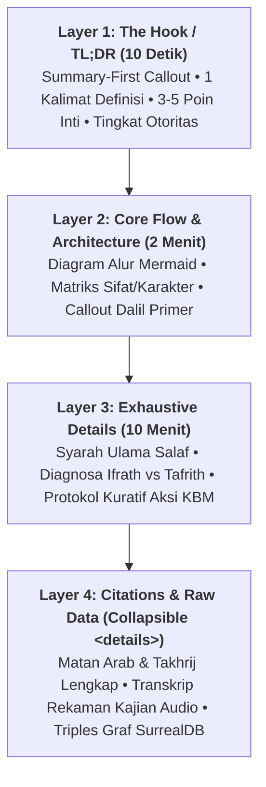
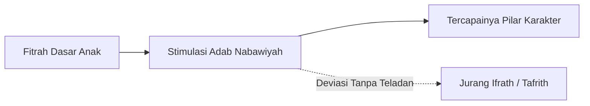

# Standar Arsitektur Informasi: Progressive Disclosure & Framework Diátaxis

Dokumen ini merupakan pedoman standar penulisan teknis dan arsitektur informasi untuk generator konten AI dan penyunting manusia di lingkungan **Wiki Pendidikan Karakter Nabawiyah (Wiki-PKN)**.

Tujuannya adalah menyelesaikan dilema sentral dokumentasi keilmuan: **keseimbangan antara keterbacaan (*readability*), keringkasan (*brevity*), dan kedalaman materi (*exhaustive detail*)**, mencegah wiki menjadi timbunan teks datar (*flat text dump*) sekaligus mencegah hilangnya detail dalil/kasus akibat simplifikasi berlebih.

---

## 1. Solusi Arsitektural: Progressive Disclosure (4 Lapisan Informasi)

Pembaca wiki datang dengan kebutuhan berbeda: seorang guru yang butuh respon cepat (10 detik), asatidzah yang ingin mengevaluasi konsep (2 menit), praktisi yang membutuhkan panduan langkah-demi-langkah (10 menit), atau peneliti yang memerlukan sanad dan teks mentah.

Informasi disusun bertingkat mengikuti pola **Progressive Disclosure**:



### Implementasi Praktis:
1. **Pola "Summary-First":** Setiap halaman wajib diawali dengan box ringkasan eksekutif (`> [!SUMMARY]`) yang memuat esensi konsep, rukun utama, dan status otoritas manhaj.
2. **Komponen Lipat Bawaan (`<details> / <summary>`):** Rincian mentah (transkrip video verbatim, teks hadits panjang beserta takhrij nomor kitab, atau skema data JSON/SurrealDB) dibungkus dalam tag `<details>` agar tidak mengaburkan fokus pembaca.
3. **Footnotes & Deep Links:** Tangensial audio dan kutipan buku diletakkan pada tautan catatan kaki atau tautan silang wikilinks `[[Halaman]]`, bukan menjadi narasi bertele-tele di tengah artikel.

---

## 2. Taksonomi Diátaxis: Pembagian Kuadran Konten PKN

Framework **Diátaxis** membagi dokumentasi teknis ke dalam 4 kuadran tujuan agar tidak terjadi percampuran intensi:

| Kuadran | Orientasi | Gaya Penulisan | Sumber Korpus PKN | Contoh Halaman di Wiki |
|:---|:---|:---|:---|:---|
| **Tutorials** | *Learning-oriented* (Belajar awal) | Bertahap, ramah pemula, bebas distorsi | Materi orientasi wali murid, modul daurah dasar | [[Thufulah]], Panduan Awal Orang Tua |
| **How-To Guides** | *Task-oriented* (Menyelesaikan problem riil) | Instruksi imperatif, resep tindakan (*recipe*) | Penanganan tantrum, panduan detoks gadget, SOP KBM | [[Luka dan Hutang Pengasuhan/Recovery]], Lembar KBM |
| **Reference** | *Information-oriented* (Rujukan/Lookup) | Netral, terstruktur, berbasis tabel matriks | Matriks 40 Pilar TB-40, daftar nomor dalil Qdrant | [[Kuisioner Asesmen 40 Bakat Nabawiyah]], Kamus Dalil |
| **Explanation** | *Understanding-oriented* (Pemahaman mendalam) | Diskursif, filosofis, komparatif, holistik | Bedah buku, telaah syarah salaf, rekaman video | [[Tujuan Hidup Manusia]], [[Benang Merah Pendidikan]] |

> ⚠️ **Aturan Ingestion AI:** Jangan pernah melakukan *raw dump* dari transkrip ceramah atau isi buku. Agen AI harus mengekstrak bagian **Reference** (fakta, indikator, matriks) dan **Explanation** (alasan filosofis, hikmah syar'i) lalu menempatkannya pada lapisan yang tepat.

---

## 3. Template Halaman Standar Baku (Quartz v5 Compliant)

Berikut adalah template resmi yang wajib dihasilkan oleh *Markdown Assembler Node* pada setiap pipeline:

````markdown
---
title: "[Nama Konsep / Pilar Karakter / Tema PKN]"
description: "Ringkasan 1-2 kalimat padat mengenai definisi dan fungsi tema ini."
tags:
  - pkn/manhaj
  - karakter/[nama-kluster]
  - usia/[thufulah-tamyiz-murahaqah-syabab]
authority_score: 0.9
---

![[assets/banners/banner_[slug].webp]]

# [Nama Konsep / Pilar Karakter / Tema PKN]

> [!SUMMARY] Ringkasan Eksekutif (TL;DR)
> **Definisi Inti:** [1 kalimat padat menjelaskan apa konsep ini dan mengapa ia mutlak diperlukan dalam fitrah anak].
> * **Tujuan Utama:** [Poin 1]
> * **Batas Usia Kritis:** [Poin 2 - misal: Fase Tamyiz 7-10 tahun]
> * **Tingkat Otoritas:** High (Prinsip Pokok Manhaj) • Didukung Korpus [[Korpus Dalil & Atsar Klasik]]

---

## 1. Sifat Pokok & Matriks Karakter
| Atribut | Spesifikasi Nabawiyah | Catatan Lapangan |
|:---|:---|:---|
| **Kutub Energi** | Introvert (*As-Sirr*) / Extrovert (*Al-'Alaniyyah*) | Berdasarkan pemetaan TB40 |
| **Rumpun Jiwa** | Bekerja Keras / Berpikir / Bekerjasama / Melayani | Terhubung ke [[Tujuan Hidup Manusia]] |
| **Ketergantungan Hulu** | Membutuhkan tuntasnya [[Tangki Cinta]] | Prasyarat sebelum penegakan disiplin |

---

## 2. Arsitektur Alur & Hubungan Konsep



[Penjelasan singkat 1-2 paragraf mengenai diagram alur dan mekanisme kerja fitrah di atas tanpa basa-basi].

---

## 3. Landasan Dalil Nabawiyah Primer

> [!QUOTE] HR. Al-Bukhari No. 1234 (Kitab Al-Adab)
> <div dir="rtl" lang="ar" style="font-size: 1.3em; line-height: 2em; text-align: right; font-family: 'Amiri', 'Traditional Arabic', serif;">
> كُلُّكُمْ رَاعٍ وَكُلُّكُمْ مَسْؤولٌ عَنْ رَعِيَّتِهِ
> </div>
> 
> *"Setiap kalian adalah pemimpin, dan setiap kalian akan dimintai pertanggungjawaban atas apa yang dipimpinnya..."*
> 
> 💡 **Relevansi Pedagogis:** [Ulasan 1-2 kalimat mengenai kaitan hadits dengan tema KBM].

---

## 4. Protokol Aksi Operasional (Langkah KBM / Parenting)
1. **Fase Ta'rif (Pengenalan):** [Instruksi imperatif langkah 1].
2. **Fase Ta'alluf (Pembiasaan Hati):** [Instruksi imperatif langkah 2].
3. **Fase Tamkin (Peneguhan Adab):** [Instruksi imperatif langkah 3].

---

## 5. Diagnosis Jurang Ekstrim & Solusi Kuratif (*'Ilaj*)
* **Jurang Tafrith (Meremehkan / Defisit):** [Gejala anak jika pilar ini hilang].
* **Jurang Ifrath (Berlebihan / Obsesif):** [Gejala jika pilar ini dipaksakan tanpa hikmah].
* **Terapi Penyeimbang (*'Ilaj*):** Tanamkan pilar [[Nama Pilar Komplementer]] untuk mengembalikan keseimbangan (*wasathiyah*).

---

## 6. Rujukan Teknis, Transkrip & Sanad Korpus

<details>
<summary><b>📜 Buka Takhrij Hadits Lengkap & Kitab Syarah Salaf</b></summary>

* **Kitab Rujukan:** *Fathul Bari Syarah Shahih Al-Bukhari*, Bab Adab, Jilid 10, Halaman 450.
* **Koleksi OpenBayan Qdrant ID:** `shamela_11m_doc_882910`
* **Derajat Hadits:** Shahih Muttafaqun 'Alaih.
</details>

<details>
<summary><b>🕰️ Catatan Sejarah & Evolusi Manhaj (Historical Evolution & Legacy Notes)</b></summary>

> **Catatan Pendekatan Terdahulu vs Standar Aktif (Pola Active Truth vs Legacy):**
> * **Standar Aktif (Edisi Mutakhir 2024):** Menekankan pemisahan tempat tidur dan penerapan Bahasa Tangan secara ketat pada usia 10 tahun penuh setelah 3 tahun pembiasaan Bahasa Hati & Lisan.
> * **Evolusi Konsep (Diktat 2016 / Kajian Lama):** Pada diktat edisi awal (2016), batasan usia 7–10 tahun belum dirinci secara operasional ke dalam matriks transisi tamyiz. Pembaca disarankan merujuk pada ketentuan buku manhaj terbaru edisi 2024 sebagai acuan baku yang mengesampingkan (*supersedes*) rumusan lama.
</details>

<details>
<summary><b>🎙️ Buka Catatan Transkrip Kajian Asli & Timestamp YouTube</b></summary>

* **Narasumber:** Ustadz Abdul Khaliq
* **Rekaman Video:** *Mendidik Anak dengan Bahasa Hati*
* **Timestamp Pembahasan:** `00:14:22 - 00:28:10`
* **Konteks Transkrip:** Tanya jawab mengenai respon ayah saat anak menolak instruksi ibadah.
</details>

<details>
<summary><b>🧬 Buka Relasi Graf Entitas (SurrealDB Graph Triples)</b></summary>

```surrealql
-- Relasi yang terdaftar di open-notebook-surrealdb-1
RELATE pilar:himmah -> MENDIDIK_DENGAN -> metode:bahasa_hati;
RELATE pilar:himmah -> MEMILIKI_ILAJ -> pilar:tawadhu;
RELATE pilar:himmah -> DITOPANG_DALIL -> dalil:bukhari_1234;
```
</details>
````

---

## 4. Kaidah Menjadikan Tulisan "Nikmat Dibaca" (*Enjoyable*)

1. **Hapus Basa-Basi Retoris (*No Conversational Filler*):**
   - Hapus kalimat pembuka seperti: *"Sebagaimana kita ketahui bersama..."*, *"Perlu diingat bahwa..."*, *"Pada kesempatan kali ini kita akan membahas..."*.
   - Langsung mulai kalimat pertama dengan subjek dan definisi substantif.
2. **Kepadatan Informasi Visual (*High Information Density*):**
   - Gantilah 3 paragraf narasi deskriptif yang membingungkan dengan **1 diagram alur Mermaid** atau **1 tabel komparasi markdown**.
3. **Tautan Silang Dua Arah (*Bidirectional WikiLinks*):**
   - Setiap kemunculan pilar karakter, nama konsep, atau nama fase usia wajib dibungkus dalam `[[Nama Halaman]]` agar pembaca dapat menjelajah konsep tanpa terhambat struktur folder.
4. **Disiplin Tipografi & Callouts:**
   - `> [!SUMMARY]` : Ringkasan eksekutif (wajib di atas).
   - `> [!QUOTE]` : Matan hadits / ayat Al-Qur'an.
   - `> [!NOTE]` : Catatan konteks penting.
   - `> [!WARNING]` : Peringatan bahaya kesalahan asuh / fatalitas tafrith.

---

## 5. Template Prompt AI untuk Dewan Musyawarah Redaksi (LangGraph Node)

Gunakan template instruksi sistem (*system prompt*) berikut pada agen perumus/drafter:

```text
Anda adalah Master Pedagogical Drafter untuk Wiki Pendidikan Karakter Nabawiyah (Wiki-PKN).
Tugas Anda adalah merumuskan naskah artikel berstandar Quartz v5 menggunakan prinsip Progressive Disclosure dan Diátaxis Framework.

ATURAN STRUKTUR WAJIB:
1. LAYER 1 (10s TL;DR): Awali naskah dengan callout [!SUMMARY] berisi 1 kalimat definisi inti + 3 poin capaian utama + tingkat otoritas manhaj.
2. LAYER 2 (2m CORE): Sajikan tabel properti inti, 1 diagram alur Mermaid.js yang padat informasi, dan callout [!QUOTE] untuk dalil primer (matan Arab berharakat + terjemahan + relevansi pedagogis).
3. LAYER 3 (10m DEEP DIVE): Jelaskan syarah ulama salaf, protokol aksi bertahap (Fase Ta'rif, Ta'alluf, Tamkin), serta analisis jurang Tafrith vs Ifrath dan formula penyeimbang ('Ilaj).
4. LAYER 4 (COLLAPSIBLE DETAILS): Tempatkan kutipan hadits panjang, takhrij sanad Shamela, timestamp transkrip video audio, dan relasi graf SurrealQL di dalam tag <details><summary>...</summary></details>.

ATURAN GAYA BAHASA:
- DILARANG menggunakan basa-basi pembuka ("Sebagaimana kita ketahui", "Dalam artikel ini"). Langsung mulai dengan definisi.
- Gunakan bidirectional wikilinks [[Nama Halaman]] untuk setiap pilar TB40, istilah syar'i, dan nama fase usia.
- Tulis teks Arab menggunakan font berharakat lengkap dan tag RTL.
```
