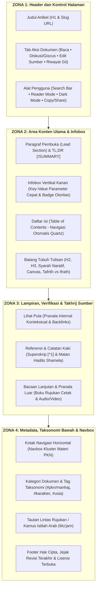

# Standar Arsitektur Informasi: Progressive Disclosure & Framework Diátaxis

Dokumen ini merupakan pedoman standar penulisan teknis dan arsitektur informasi untuk generator konten AI dan penyunting manusia di lingkungan **Wiki Pendidikan Karakter Nabawiyah (Wiki-PKN)**.

Tujuannya adalah menyelesaikan dilema sentral dokumentasi keilmuan: **keseimbangan antara keterbacaan (*readability*), keringkasan (*brevity*), dan kedalaman materi (*exhaustive detail*)**, mencegah wiki menjadi timbunan teks datar (*flat text dump*) sekaligus mencegah hilangnya detail dalil/kasus akibat simplifikasi berlebih.

---

## 1. Solusi Arsitektural: Progressive Disclosure & Pengalaman Membaca (Reader's Journey)

## 1. Solusi Arsitektural: Progressive Disclosure, 4 Zona Fungsional Wiki & Pengalaman Membaca

Pembaca wiki datang dengan kebutuhan dan kondisi kognitif berbeda: seorang guru yang butuh respon cepat (10 detik), orang tua yang butuh gambaran menyeluruh sebelum masuk ke teknis, atau asatidzah/peneliti yang ingin membedah dalil dan sanad. 

Untuk menjamin **aksesibilitas informasi, keterlacakan data (*traceability*), dan navigasi intuitif**, struktur halaman Wiki-PKN mengadopsi **Struktur Standar Industri Berbasis Ekosistem MediaWiki** yang diselaraskan dengan engine **Quartz v5** dan pola **Progressive Disclosure**.

### Empat Zona Fungsional Utama Halaman Wiki:



---

## 2. Taksonomi Diátaxis: Pembagian Kuadran Konten PKN

Framework **Diátaxis** membagi dokumentasi teknis ke dalam 4 kuadran tujuan agar tidak terjadi percampuran intensi:

| Kuadran | Orientasi | Gaya Penulisan | Sumber Korpus PKN | Contoh Halaman di Wiki |
|:---|:---|:---|:---|:---|
| **Tutorials** | *Learning-oriented* (Belajar awal) | Bertahap, ramah pemula, bebas distorsi | Materi orientasi wali murid, modul daurah dasar | [[Thufulah]], Panduan Awal Orang Tua |
| **How-To Guides** | *Task-oriented* (Menyelesaikan problem riil) | Instruksi imperatif, resep tindakan (*recipe*) | Penanganan tantrum, panduan detoks gadget, SOP KBM | [[Luka dan Hutang Pengasuhan/Recovery]], Lembar KBM |
| **Reference** | *Information-oriented* (Rujukan/Lookup) | Netral, terstruktur, berbasis tabel matriks | Matriks 40 Pilar TB-40, daftar nomor dalil Qdrant | [[Kuisioner Asesmen 40 Bakat Nabawiyah]], Kamus Dalil |
| **Explanation** | *Understanding-oriented* (Pemahaman mendalam) | Diskursif, filosofis, komparatif, holistik | Bedah buku, telaah syarah salaf, rekaman video | [[Tujuan Hidup Manusia]], [[Benang Merah Pendidikan]] |

> ⚠️ **Aturan Ingestion AI:** Jangan pernah melakukan *raw dump* dari transkrip ceramah atau isi buku. Agen AI harus mengekstrak bagian **Reference** (fakta, indikator, matriks) dan **Explanation** (alasan filosofis, hikmah syar'i) lalu menempatkannya pada lapisan yang tepat.

---

## 3. Template Halaman Standar Baku Wiki-PKN (4 Zona Fungsional)

Berikut adalah template resmi berstandar MediaWiki/Quartz v5 yang wajib dihasilkan oleh *Markdown Assembler Node* pada seluruh pipeline:

````markdown
---
title: "[Nama Konsep / Pilar Karakter / Tema PKN]"
description: "Ringkasan eksekutif padat mengenai esensi, landasan dalil, dan aplikasi praktis konsep ini."
tags:
  - pkn/manhaj
  - karakter/[nama-kluster]
  - usia/[thufulah-tamyiz-murahaqah-syabab]
authority_score: 0.95
aliases:
  - "[Sinonim Konsep 1]"
  - "[Istilah Bahasa Arab]"
---

<!-- ========================================================================== -->
<!-- ZONA 1: HEADER & KONTROL HALAMAN (Di-render otomatis oleh Quartz Layout)   -->
<!-- * Breadcrumbs navigasi hierarki folder                                     -->
<!-- * Judul Artikel (H1) & Metadata Waktu Modifikasi                           -->
<!-- * Tombol Toolbar: Search, Reader Mode, Dark/Light Mode, Graph View         -->
<!-- ========================================================================== -->

# [Nama Konsep / Pilar Karakter / Tema PKN]

<!-- ========================================================================== -->
<!-- ZONA 2: AREA KONTEN UTAMA                                                  -->
<!-- 1. Infobox Vertikal Kanan (Ringkasan Cepat & Parameter Kunci)              -->
<!-- 2. Paragraf Pembuka (Lead Section) & TL;DR Callout                         -->
<!-- 3. Daftar Isi Otomatis (Table of Contents pada panel kanan Quartz)         -->
<!-- 4. Batang Tubuh Tulisan (H2, H3, Obsidian Canvas, Syarah, Tafrith/Ifrath)  -->
<!-- ========================================================================== -->

<div class="wiki-infobox">
  <div class="wiki-infobox-header">[Nama Konsep]</div>
  <div class="wiki-infobox-image">
    
    <div class="wiki-infobox-caption">Visualisasi fitrah & pilar [Nama Konsep]</div>
  </div>
  <table class="wiki-infobox-table">
    <tr>
      <th>Istilah Syar'i</th>
      <td><span dir="rtl" lang="ar"><b>[الإصطلاح الشرعي]</b></span></td>
    </tr>
    <tr>
      <th>Tingkat Otoritas</th>
      <td><b>Tier 1: Active Truth</b> (Buku Utama & TB-40)</td>
    </tr>
    <tr>
      <th>Kluster Jiwa</th>
      <td>[[Bekerja Keras]] / [[Berpikir]] / [[Melayani]]</td>
    </tr>
    <tr>
      <th>Fase Usia Kritis</th>
      <td>[[Tamyiz]] (7–10 Tahun)</td>
    </tr>
    <tr>
      <th>Pilar Komplementer ('Ilaj)</th>
      <td>[[Nama Pilar Penyeimbang]]</td>
    </tr>
    <tr>
      <th>Rujukan Utama</th>
      <td>[[Buku Utama PKN]] Bab X; HR. Bukhari</td>
    </tr>
  </table>
</div>

> [!SUMMARY] Ringkasan Eksekutif (TL;DR Lead Section)
> **Definisi Inti:** [1 kalimat lugas dan padat mendefinisikan apa konsep ini secara substantif dan posisinya dalam fitrah insan].
> * **Capaian Karakter Utama:** [Poin 1 capaian adab/akhlak yang hendak dibentuk]
> * **Titik Kritis Pengasuhan:** [Poin 2 - momentum intervensi orang tua/guru yang tidak boleh terlewatkan]
> * **Landasan Epistemologi:** Bersumber dari nash shahih Al-Qur'an dan Sunnah dengan syarah salafus shalih.

[Paragraf Pembuka (Lead Paragraph 1): Menguraikan gambaran makro mengenai kedudukan tema ini dalam kerangka fitrah dan peradaban Islam. Disajikan dengan Bahasa Hati yang mengalir, reflektif, dan memikat pembaca].

[Paragraf Pembuka (Lead Paragraph 2): Menghubungkan tarikan dinamika jiwa anak dengan tanggung jawab tarbiyah orang tua sebelum melangkah ke rincian hukum dan implementasi teknis].

---

## 1. Arsitektur Konseptual & Peta Makro (Obsidian Canvas)

Untuk mengamati keterkaitan konsep ini dengan pilar fitrah lainnya secara spasial dan kausal, perhatikan bagan arsitektur berikut:

![[canvas/[Nama Konsep] - Arsitektur Hubungan Konsep.canvas]]
*Bagan 1.0: Peta Relasi Makro, Alur Kausalitas Pengasuhan, dan Titik Timbang Keseimbangan Manhaj.*

---

## 2. Landasan Dalil Nabawiyah & Syarah Ulama Salaf

Pondasi bangunan konsep ini berakar kuat pada nash wahyu Al-Qur'an dan As-Sunnah yang sharih:

> [!QUOTE] HR. Al-Bukhari No. 1234 (Kitab Al-Adab)
> <div dir="rtl" lang="ar" style="font-size: 1.3em; line-height: 2em; text-align: right; font-family: 'Amiri', 'Traditional Arabic', serif;">
> كُلُّكُمْ رَاعٍ وَكُلُّكُمْ مَسْؤولٌ عَنْ رَعِيَّتِهِ
> </div>
> 
> *"Setiap kalian adalah pemimpin, dan setiap kalian akan dimintai pertanggungjawaban atas apa yang dipimpinnya..."* [^1]
> 
> 💡 **Relevansi Pedagogis:** [Ulasan naratif 1-2 kalimat mengenai kaitan hadits dengan tema KBM dan pembiasaan adab].

[Narasi syarah ulama salaf (misal: Ibnul Qayyim dalam *Tuhfatul Maudud* atau Al-Ghazali dalam *Ihya Ulumiddin*) yang mengalir menyambungkan teks wahyu dengan dinamika pertumbuhan jiwa anak].

---

## 3. Dinamika Jiwa & Penjabaran Bertahap

Dari landasan dalil di atas, pemahaman diurai secara bertahap ke dalam indikator perilaku dan karakter fitrah terukur:

| Atribut Fitrah | Spesifikasi Nabawiyah | Implikasi Lapangan & Pengamatan Pendidik |
|:---|:---|:---|
| **Kutub Energi** | Introvert (*As-Sirr*) / Extrovert (*Al-'Alaniyyah*) | Karakteristik interaksi sosial anak |
| **Rumpun Jiwa** | Bekerja Keras / Berpikir / Bekerjasama / Melayani | Orientasi kontribusi amal |
| **Ketergantungan Hulu** | Membutuhkan tuntasnya [[Tangki Cinta]] | Prasyarat sebelum penegakan disiplin |

[Narasi penghubung yang menjelaskan bagaimana pilar karakter ini bertumbuh secara organik seiring pertambahan usia dari fase [[Thufulah]] (0–7 tahun), [[Tamyiz]] (7–10 tahun), hingga [[Murahaqah]] (10–14 tahun)].

---

## 4. Diagnosis Patologi: Jurang Tafrith vs Ifrath & Solusi Kuratif (*'Ilaj*)

Setiap potensi fitrah senantiasa terancam oleh dua kutub penyimpangan ekstrem:

* **Jurang Tafrith (Meremehkan / Defisit Pengasuhan):** [Gejala dan kerusakan mental anak jika hak ini diabaikan].
* **Jurang Ifrath (Berlebihan / Memaksakan Kaku):** [Trauma psikologis anak jika target diterapkan melampaui tahapan usianya].
* **Jalan Wasathiyah (Keseimbangan Nabawi):** [Sikap proporsional Rasulullah ﷺ dalam menempatkan hak dan disiplin].
* **Terapi Penyeimbang (*'Ilaj*):** Tanamkan pilar komplementer [[Nama Pilar Komplementer]] untuk menyeimbangkan watak anak.

---

## 5. Protokol Operasional & Manhaj Tadarruj

1. **Fase Ta'rif (Pemahaman Kognitif & Pengenalan):** [Instruksi konkret langkah pertama pendidik].
2. **Fase Ta'alluf (Sentuhan Hati & Pembiasaan Emosional):** [Instruksi konkret langkah kedua].
3. **Fase Tamkin (Peneguhan Adab & Kemandirian Amaliyah):** [Instruksi konkret langkah ketiga].

---

## 6. Instrumen Observasi Terapan & Lembar Evaluasi Diri (Self-Assessment)

### A. Rubrik Observasi Ketercapaian Karakter
| No | Indikator Perilaku Fitrah Teramati | Belum Terlihat | Mulai Terlihat | Membudaya |
| :-: | :--- | :-: | :-: | :-: |
| 1 | [Indikator perilaku nyata 1] | [ ] | [ ] | [ ] |
| 2 | [Indikator perilaku nyata 2] | [ ] | [ ] | [ ] |
| 3 | [Indikator perilaku nyata 3] | [ ] | [ ] | [ ] |

### B. Tiga Pertanyaan Reflektif Malam Hari (Muhasabah Pendidik)
1. *Apakah respon saya terhadap anak hari ini lebih banyak mengisi rasa amannya atau melampiaskan kelelahan saya?*
2. *Sudahkah saya mencontohkan adab ini secara nyata sebelum menuntutnya dari anak?*
3. *Adakah tatapan kasih dan pelukan tulus yang belum sempat saya berikan kepadanya hari ini?*

### C. Aksi Cepat (*Quick Win*) Hari Ini
* **Lakukan Sekarang:** [Instruksi 1 tindakan spesifik berdurasi 1–5 menit yang langsung dapat dieksekusi detik ini].

---

<!-- ========================================================================== -->
<!-- ZONA 3: LAMPIRAN, VERIFIKASI SUMBER & TAKHRIJ                               -->
<!-- * Lihat Pula (Tautan Kontekstual Lintas Tema)                              -->
<!-- * Referensi & Catatan Kaki (Superskrip Takhrij Shamela/OpenBayan)          -->
<!-- * Bacaan Lanjutan & Pranala Luar                                           -->
<!-- ========================================================================== -->

## Lihat Pula
* [[Koneksi Sebelum Koreksi]] — Fondasi komunikasi Bahasa Hati sebelum pemberian arahan adab.
* [[Tangki Cinta]] — Prasyarat afeksi emosional anak sebelum penegakan disiplin dan taklif shalat.
* [[4 Fase Usia Nabawiyah]] — Peta pentahapan usia tumbuh kembang anak menurut sunnah.
* [[Tafsir Bakat 40]] — Taksonomi 40 pilar karakter dan instrumen asesmen fitrah.

---

## Referensi dan Catatan Kaki

[^1]: **HR. Al-Bukhari**, *Kitab Al-Adab*, Bab *Kullukum Ra'in*, No. 1234; **HR. Muslim**, *Kitab Al-Imarah*, No. 1829. Teks terverifikasi melalui koleksi OpenBayan Qdrant `shamela_11m_doc_882910`.

<details>
<summary><b>📜 Buka Takhrij Sanad Lengkap & Teks Kitab Syarah Salaf</b></summary>

* **Kitab Rujukan Klasik:** Ibnul Qayyim Al-Jauziyyah, *Tuhfatul Maudud bi Ahkam Al-Maulud*, Tahqiq Abdul Qadir Al-Arna'uth, Darul Bayan, Damaskus, Hal. 142.
* **Koleksi Vektor OpenBayan Qdrant ID:** `shamela_11m_doc_882910`
* **Derajat Hadits:** Shahih Muttafaqun 'Alaih (*Ijma' Shahihain*).
</details>

<details>
<summary><b>🕰️ Catatan Sejarah & Evolusi Manhaj (Historical Evolution & Precedence Notes)</b></summary>

> **Status Dokumen & Presedensi Sumber:**
> * **Standar Aktif (Active Truth - Edisi 2024):** Merujuk pada naskah buku mutakhir dan rumusan Tafsir Bakat (TB-40) resmi karya Ustadz Abdul Kholiq.
> * **Catatan Versi Terdahulu (Legacy Notes):** Pendekatan pemetaan bakat berbasis Talents Mapping / ST-30 yang termuat dalam naskah lama (Bab 8 edisi terdahulu) telah berstatus *superseded* dan digantikan sepenuhnya oleh 40 Karakter Nabawiyah.
</details>

<details>
<summary><b>🎙️ Buka Catatan Transkrip Kajian Asli & Multimedia</b></summary>

* **Narasumber:** Ustadz Abdul Kholiq
* **Kajian:** *Mendidik Karakter Berbasis Fitrah & Bahasa Hati*
* **Timestamp Arsip Audio/Video:** `00:14:22 - 00:28:10`
</details>

<details>
<summary><b>🧬 Buka Relasi Graf Entitas (SurrealDB Graph Triples)</b></summary>

```surrealql
-- Relasi yang terdaftar di open-notebook-surrealdb-1
RELATE pilar:konsep -> MENDIDIK_DENGAN -> metode:bahasa_hati;
RELATE pilar:konsep -> MEMILIKI_ILAJ -> pilar:penyeimbang;
RELATE pilar:konsep -> DITOPANG_DALIL -> dalil:bukhari_1234;
```
</details>

---

## Bacaan Lanjutan dan Pranala Luar
* **Buku Referensi:** Abdul Kholiq, *Pendidikan Karakter Nabawiyah: Menumbuhkan Fitrah Mewujudkan Peradaban*, Pustaka Insan Mustaqbal, 2024.
* **Portal Resmi PKN:** [Website Karakter Nabawiyah](https://karakternabawiyah.com/)
* **Platform Asesmen:** [Tes Online Tafsir Bakat (TB-40)](https://tafsirbakat.com/)
* **Pusat Pelatihan Guru:** [Sekolah Karakter Imam Syafi'i (SKIS)](https://sekolahkarakter.com/)

---

<!-- ========================================================================== -->
<!-- ZONA 4: METADATA & KLASIFIKASI BAWAH                                       -->
<!-- 1. Navbox Horizontal Kluster Materi PKN                                    -->
<!-- 2. Taksonomi Kategori Dokumen (Indeks Direktori Tematik)                   -->
<!-- 3. Tautan Antarbahasa / Mu'jam Istilah                                     -->
<!-- 4. Footer Hak Cipta, Jejak Revisi & Atribusi Terbuka                       -->
<!-- ========================================================================== -->

<div class="wiki-navbox">
  <div class="wiki-navbox-title">
    <span>Kluster Materi: Pendidikan Karakter Nabawiyah (Manhaj & Praktik)</span>
    <span>[ <a href="/content_flow/">Peta Navigasi</a> ]</span>
  </div>
  <div class="wiki-navbox-group">
    <div class="wiki-navbox-label">Fondasi & Manhaj</div>
    <div class="wiki-navbox-links">
      <a href="/content/index">Beranda PKN</a> <span class="wiki-navbox-sep">•</span>
      <a href="/content/Koneksi Sebelum Koreksi">Koneksi Sebelum Koreksi</a> <span class="wiki-navbox-sep">•</span>
      <a href="/content/Tangki Cinta">Tangki Cinta</a> <span class="wiki-navbox-sep">•</span>
      <a href="/content/Tujuan Hidup Manusia">Tujuan Hidup Manusia</a>
    </div>
  </div>
  <div class="wiki-navbox-group">
    <div class="wiki-navbox-label">4 Fase Usia</div>
    <div class="wiki-navbox-links">
      <a href="/content/Thufulah">Thufulah (0–7 Th)</a> <span class="wiki-navbox-sep">•</span>
      <a href="/content/Tamyiz">Tamyiz (7–10 Th)</a> <span class="wiki-navbox-sep">•</span>
      <a href="/content/Murahaqah">Murahaqah (10–14 Th)</a> <span class="wiki-navbox-sep">•</span>
      <a href="/content/Syabab">Syabab (15+ Th)</a>
    </div>
  </div>
  <div class="wiki-navbox-group">
    <div class="wiki-navbox-label">Instrumen & Asesmen</div>
    <div class="wiki-navbox-links">
      <a href="/content/Tafsir Bakat 40">Tafsir Bakat 40 (TB-40)</a> <span class="wiki-navbox-sep">•</span>
      <a href="/content/Kuisioner Asesmen 40 Bakat Nabawiyah">Kuisioner 40 Bakat</a> <span class="wiki-navbox-sep">•</span>
      <a href="/content/Peta Navigasi Wiki PKN">Peta Indeks MOC</a>
    </div>
  </div>
</div>

**Kategori Direktori:** [[Kategori:Manhaj Pendidikan Karakter Nabawiyah]] • [[Kategori:Pilar Akhlak Nabawi]] • [[Kategori:Fase Usia Tamyiz]]

*Tautan Mu'jam Istilah Arab (Interlanguage / Glossary):* [ar: التربية على منهج النبوة - الإصطلاحات](https://shamela.ws)

---
````

---

## 4. Kaidah Menjadikan Tulisan "Nikmat Dibaca", Kohesif & Terstruktur Standar Wiki

1. **Struktur 4 Zona Konsisten:**
   - Seluruh halaman artikel wajib menyajikan informasi dalam urutan 4 zona: Header $\to$ Lead Section + Infobox $\to$ Batang Tubuh Naratif + Bagan Canvas $\to$ Lampiran & Takhrij $\to$ Navbox & Kategori Bawah.
2. **Hapus Basa-Basi Retoris (*No Conversational Filler*):**
   - Hapus kalimat pembuka klise: *"Sebagaimana kita ketahui bersama..."*, *"Perlu diingat bahwa..."*, *"Pada kesempatan kali ini kita akan membahas..."*.
   - Mulai paragraf pembuka langsung dengan subjek dan definisi substantif.
3. **Kepadatan Informasi Visual dengan Infobox & Obsidian Canvas:**
   - Gunakan **Infobox Vertikal Kanan (`.wiki-infobox`)** untuk fakta cepat (*quick lookups*).
   - Gunakan **Obsidian Canvas (`![[canvas/Nama_Bagan.canvas]]`)** sebagai penjelas arsitektur konsep makro di awal artikel.
4. **Narasi Mengalir & Tersambung (*Cohesive Progressive Narrative*):**
   - Meskipun berformat wiki ensiklopedis deskriptif, artikel tidak boleh tersusun dari poin-poin terisolasi. Sambungkan antarpoin dengan jembatan narasi logis sehingga terbangun pemahaman yang utuh di benak pembaca.
5. **Verifisitas Sumber & Rujukan Superskrip:**
   - Setiap pernyataan dalil atau kutipan syarah wajib merujuk ke catatan kaki superskrip (`[^1]`) dan takhrij resmi Shamela / OpenBayan.
6. **Tautan Silang Dua Arah (*Bidirectional WikiLinks*) & Navbox Bawah:**
   - Gunakan `[[Nama Halaman]]` di dalam teks dan lengkapi bagian bawah dengan **Navbox Horizontal (`.wiki-navbox`)** untuk memudahkan navigasi kluster materi.

---

## 5. Template Prompt AI untuk Dewan Musyawarah Redaksi (LangGraph Node)

Gunakan template instruksi sistem (*system prompt*) berikut pada agen perumus/drafter (*Markdown Assembler Node*):

```text
Anda adalah Master Pedagogical Drafter untuk Wiki Pendidikan Karakter Nabawiyah (Wiki-PKN).
Tugas Anda adalah merumuskan naskah artikel berstandar Quartz v5 dan standar industri MediaWiki (4 Zona Fungsional) menggunakan prinsip Progressive Disclosure, Diátaxis Framework, dan Reader's Journey.

ATURAN STRUKTUR 4 ZONA FUNGSIONAL WAJIB:
1. ZONA 1 (HEADER & CONTROLS): Frontmatter lengkap (title, description, tags, authority_score, aliases).
2. ZONA 2 (AREA KONTEN UTAMA):
   - Infobox Vertikal Kanan (<div class="wiki-infobox">...</div>) memuat parameter kunci cepat.
   - Paragraf Pembuka (Lead Section) diawali Callout [!SUMMARY] TL;DR (1 kalimat definisi inti + 3 poin capaian utama + usia kritis).
   - 1-2 paragraf narasi pembuka holistik sebelum detail teknis.
   - Bagan konsep Obsidian Canvas (![[canvas/...canvas]]) sebagai visualisasi peta konsep global makro (BUKAN diagram kode Mermaid).
   - Batang Tubuh Tulisan (H2, H3) mengalir padu, menghubungkan dalil Al-Qur'an/Hadits Arab berharakat, syarah ulama salaf, diagnosis Tafrith vs Ifrath, protokol tadarruj, dan Instrumen Terapan (Rubrik 3-level, 3 pertanyaan muhasabah malam, 1 aksi Quick Win).
3. ZONA 3 (LAMPIRAN & VERIFIKASI SUMBER):
   - Sub-bab "Lihat Pula" dengan wikilinks relevan.
   - Sub-bab "Referensi dan Catatan Kaki" dengan superskrip [^1] terhubung ke takhrij OpenBayan/Shamela.
   - Tag collapsible <details> untuk takhrij panjang, catatan sejarah evolusi manhaj (Active Truth vs Superseded), transkrip kajian, dan SurrealQL triples.
   - Sub-bab "Bacaan Lanjutan dan Pranala Luar" rujukan buku fisik dan web resmi.
4. ZONA 4 (METADATA & NAVIGASI BAWAH):
   - Navbox Horizontal (<div class="wiki-navbox">...</div>) merangkum tautan kluster materi terkait.
   - Kategori Dokumen ([[Kategori:...]]) dan Tautan Mu'jam Istilah Arab.

ATURAN GAYA BAHASA & KOHESI:
- DILARANG menggunakan basa-basi pembuka ("Sebagaimana kita ketahui", "Dalam artikel ini").
- Tulis dengan gaya Bahasa Hati (Ustadz Abdul Kholiq): empati, reflektif, bersanad, dan membumi.
- Seluruh poin wajib disambung dengan transisi logika yang runtut agar terbangun gagasan yang kokoh.
- Gunakan bidirectional wikilinks [[Nama Halaman]] untuk setiap pilar TB40, istilah syar'i, dan nama fase usia.
- Tulis teks Arab menggunakan font berharakat lengkap dan tag RTL.
```

