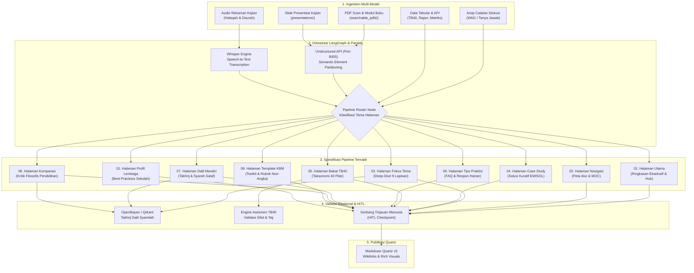

# Desain Pipeline Pemrosesan Dokumen Wiki Pendidikan Karakter Nabawiyah (Wiki-PKN)

Dokumen ini merupakan pedoman arsitektural dan spesifikasi master untuk rancang bangun sistem pipeline pemrosesan dokumen cerdas berbantuan AI di lingkungan **Wiki Pendidikan Karakter Nabawiyah (Wiki-PKN)**.

Sistem ini mengorkestrasi konversi bahan ajar multi-modal mentah (PDF hasil scan, slide PPTX, audio kajian, catatan observasi KBM, dan arsip diskusi) menjadi dokumen Markdown terstruktur dan kaya visual yang siap dipublikasikan pada engine **Quartz v5**.

---

## 1. Landasan Filosofis & Arsitektur Ekosistem

Pipeline pemrosesan dokumen Wiki-PKN didesain dengan memadukan ketelitian ilmiah, keabsahan dalil syar'i, dan otomatisasi modern:
1. **Otentisitas & Validasi Syar'i (Manhaj Nabawiyah):** Setiap kutipan ayat Al-Qur'an dan Hadits diverifikasi secara semantik dan tekstual ke korpus digital terpercaya (Maktabah Syamilah / OpenBayan).
2. **Standardisasi Anatomi 9 Lapisan:** Dokumen wiki menjaga konsistensi format mulai dari frontmatter, callout metodologi, konsep fondasional, relevansi syarah salaf, diagnosis *tafrith-ifrath*, hingga solusi kuratif praktis (*manhaj tadarruj*).
3. **Ekosistem Multi-Kontainer Terpadu:** Pipeline memanfaatkan kontainer yang telah aktif di lingkungan server (lihat [CONTAINERS_ECOSYSTEM.md](../CONTAINERS_ECOSYSTEM.md)):
   - **`unstructured-api` (Port 8005):** Ekstraksi elemen dokumen mentah (Title, Table, NarrativeText).
   - **`local_qdrant` (Port 6333):** Vector DB korpus Hadits `shamela_11m` untuk takhrij dan pencarian syarah.
   - **`api-tb40` & `pocketbase-tb40` (Port 4040, 8090):** Engine data master taksonomi bakat 40 karakter.
   - **`langflow` & LangGraph Engine:** Orkestrator state graph cerdas dan visualisasi alur eksekusi.
   - **`portainer` (Port 9000/9443):** Manajemen orkestrasi deployment kontainer.
4. **Prinsip Human-in-the-Loop (HITL):** Kecerdasan buatan memproses draf awal dan menyusun kerangka; asatidzah, kurator, dan tim redaksi melakukan tinjauan kritis pada gerbang kendali mutu sebelum naskah masuk ke repositori utama.

---

## 2. Peta Taksonomi 10 Pipeline Berdasarkan Tema Halaman

Setiap tema halaman wiki memiliki karakteristik pedagogis, sumber masukan, dan standar verifikasi yang berbeda. Berikut adalah pembagian 10 pipeline pemrosesan dokumen:



---

## 3. Matriks Komparasi Karakteristik Pipeline

| No | Berkas Rancangan | Karakteristik Halaman | Sumber Data Input Utama | Komponen AI & Engine Kunci | Tingkat HITL |
|---|---|---|---|---|---|
| **01** | [01_pipeline_halaman_utama.md](01_pipeline_halaman_utama.md) | Agregasi makro, ringkasan eksekutif 3 pilar, metrik korpus, dan portal masuk | Dokumen blueprint, ringkasan direktori, metadata indeks | Synthesizer Eksekutif, Aggregator Metrik, Router Portal | `Sedang` |
| **02** | [02_pipeline_halaman_navigasi.md](02_pipeline_halaman_navigasi.md) | Pohon hierarki materi, reading path bertahap, peta konsep, dan alur visual | `nav_structure.json`, tag materi, relasi prasyarat topik | Graph Dependency Builder, Mermaid Generator, Path Optimizer | `Rendah - Sedang` |
| **03** | [03_pipeline_halaman_fokus_satu_tema.md](03_pipeline_halaman_fokus_satu_tema.md) | Pembahasan mendalam (deep-dive) 9 lapisan baku anatomi tema pokok PKN | Transkrip kajian, modul cetak PDF, naskah presentasi PPTX | Unstructured Parser, Syarah Enricher, Ifrath-Tafrith Auditor | `Tinggi` |
| **04** | [04_pipeline_halaman_case_study.md](04_pipeline_halaman_case_study.md) | Dokumentasi studi kasus lapangan, analisis luka asuh, dan tahapan kuratif EMISOL | Catatan konseling, laporan santri, log kasus harian guru | Anonymizer Node, Root Cause Diagnostician, Tadarruj Protocol | `Tinggi` |
| **05** | [05_pipeline_halaman_bakat.md](05_pipeline_halaman_bakat.md) | Profil 40 pilar karakter nabawiyah, rukun 3A, kutub energi, dan terapi *'ilaj* | Skema OpenAPI TB40, matriks karakter, database asesmen | TB40 API Connector, Polarity Balance Calculator, 'Ilaj Matcher | `Sedang - Tinggi` |
| **06** | [06_pipeline_halaman_tips.md](06_pipeline_halaman_tips.md) | Panduan praktis problem harian anak (gadget, emosi, kedisiplinan) dan FAQ | Arsip chat WAG tanya-jawab, rekaman konsultasi parenting | QnA Cleaner, Theme Clusterer, Quick Nabawi Action Formulator | `Tinggi` |
| **07** | [07_pipeline_halaman_dalil.md](07_pipeline_halaman_dalil.md) | Halaman mandiri dalil (Al-Qur'an & Hadits), takhrij sanad, syarah ulama salaf | Korpus Maktabah Syamilah, query teks Arab, kitab induk hadits | OpenBayan/Qdrant Matcher, Harakat Sanitizer, Takhrij Engine | `Sangat Tinggi` |
| **08** | [08_pipeline_halaman_komparasi_konsep.md](08_pipeline_halaman_komparasi_konsep.md) | Matriks perbandingan filosofis: PKN vs Konvensional vs Montessori vs FBE | Buku rujukan teori pendidikan, modul komparasi tarbiyah | Matrix Comparator, Philosophical Deconstructer, Sharia Gate | `Tinggi` |
| **09** | [09_pipeline_halaman_template_toolkit.md](09_pipeline_halaman_template_toolkit.md) | Instrumen siap pakai (RPP, Lembar Observasi Karakter, Rubrik Non-Angka, AI Prompt) | Dokumen administratif sekolah, formulir evaluasi santri | Rubric Builder, Structured Prompt Crafter, Checklist Normalizer | `Sedang - Tinggi` |
| **10** | [10_pipeline_halaman_profil_lembaga.md](10_pipeline_halaman_profil_lembaga.md) | Profil lembaga & sekolah mitra, adaptasi kurikulum, dan evaluasi implementasi | Profil sekolah mitra, dokumentasi KBM, wawancara pimpinan | Institutional Profiler, Consent Gatekeeper, Benchmark Engine | `Sedang` |

---

## 4. Pola State Graph LangGraph Terstandarisasi

Semua pipeline dibangun di atas skema state Python terstandarisasi (`DocumentProcessingState`):

```python
from typing import TypedDict, List, Dict, Any, Optional

class DocumentProcessingState(TypedDict):
    # Data Masukan Mentah
    source_file_path: str
    source_file_type: str            # 'pdf', 'pptx', 'audio', 'chat', 'json'
    raw_text: str
    raw_elements: List[Dict[str, Any]] # Hasil Unstructured API
    
    # Metadata & Klasifikasi
    page_type: str                   # 'index', 'nav', 'theme', 'case_study', dll.
    title: str
    target_slug: str
    tags: List[str]
    
    # Hasil Ekstraksi & Pengayaan
    extracted_concepts: List[str]
    dalil_candidates: List[Dict[str, Any]]
    verified_dalil: List[Dict[str, Any]] # Hasil takhrij OpenBayan
    syarah_quotes: List[Dict[str, Any]]
    tafrith_ifrath_analysis: Dict[str, Any]
    action_protocols: List[Dict[str, Any]]
    
    # Draf Dokumen
    markdown_draft: str
    mermaid_diagrams: List[str]
    canvas_references: List[str]
    
    # Gerbang Kontrol Mutu (HITL)
    hitl_status: str                 # 'pending', 'approved', 'rejected', 'needs_revision'
    reviewer_notes: Optional[str]
    review_level: str                # 'Rendah', 'Sedang', 'Tinggi', 'Sangat Tinggi'
```

---

## 5. Direktori Dokumen Desain Pipeline

Silakan merujuk ke masing-masing dokumen spesifikasi detail berikut:
- 📖 [01. Pipeline Halaman Utama (Portal Indeks)](01_pipeline_halaman_utama.md)
- 🗺️ [02. Pipeline Halaman Navigasi (Peta Alur & MOC)](02_pipeline_halaman_navigasi.md)
- 💎 [03. Pipeline Halaman Fokus Bahasan Satu Tema](03_pipeline_halaman_fokus_satu_tema.md)
- 🩺 [04. Pipeline Halaman Case Study & Solusi Kuratif](04_pipeline_halaman_case_study.md)
- 🧬 [05. Pipeline Halaman Bakat & Fitrah TB40](05_pipeline_halaman_bakat.md)
- 💡 [06. Pipeline Halaman Tips & Trik Problematika Harian](06_pipeline_halaman_tips.md)
- 📜 [07. Pipeline Halaman Dalil Mandiri & Syarah](07_pipeline_halaman_dalil.md)
- ⚖️ [08. Pipeline Halaman Komparasi Konsep Pendidikan](08_pipeline_halaman_komparasi_konsep.md)
- 📋 [09. Pipeline Halaman Template & Toolkit KBM](09_pipeline_halaman_template_toolkit.md)
- 🏫 [10. Pipeline Halaman Profil Lembaga Pengadopsi](10_pipeline_halaman_profil_lembaga.md)
