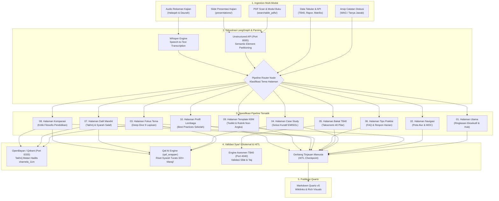
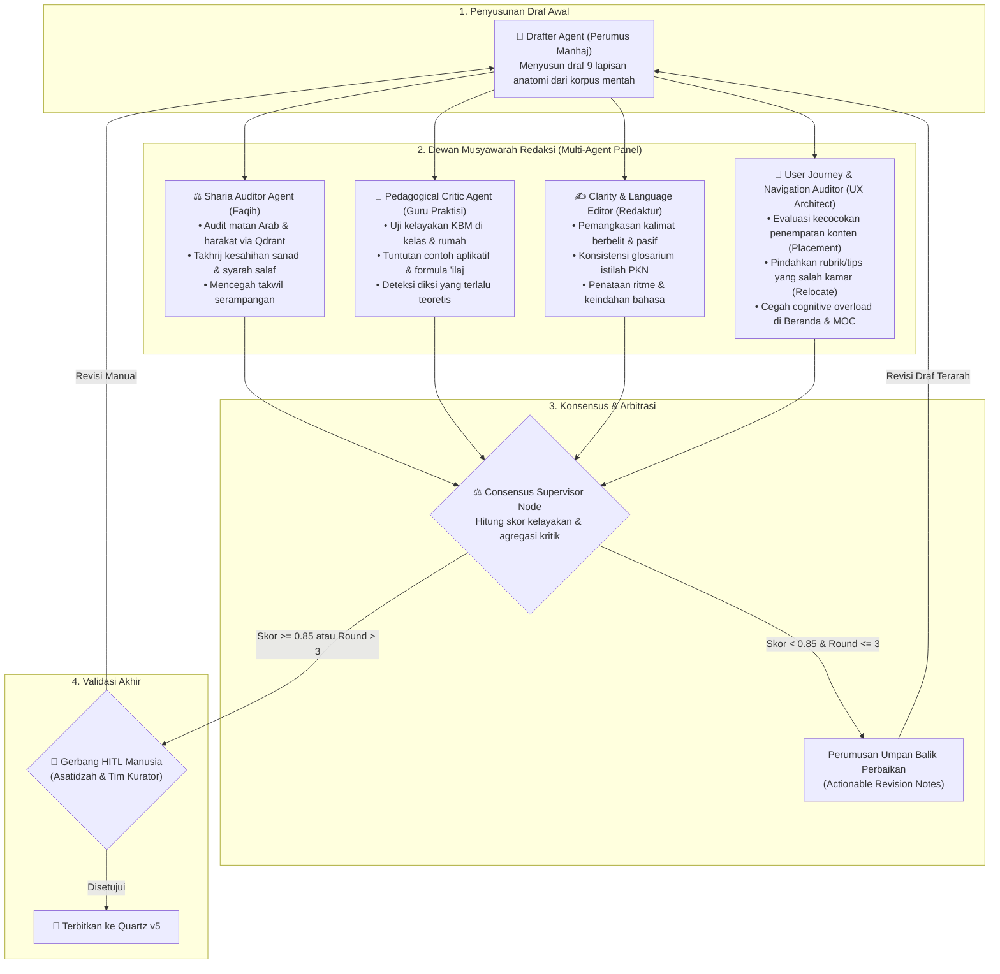
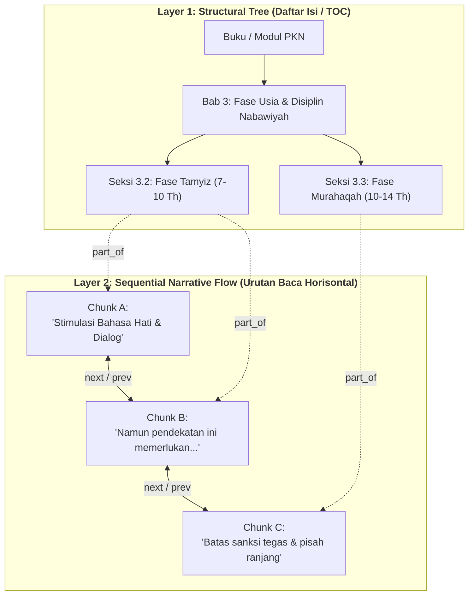

# Desain Pipeline Pemrosesan Dokumen Wiki Pendidikan Karakter Nabawiyah (Wiki-PKN)

Dokumen ini merupakan pedoman arsitektural dan spesifikasi master untuk rancang bangun sistem pipeline pemrosesan dokumen cerdas berbantuan AI di lingkungan **Wiki Pendidikan Karakter Nabawiyah (Wiki-PKN)**.

Sistem ini mengorkestrasi konversi bahan ajar multi-modal mentah (PDF hasil scan, slide PPTX, audio kajian, catatan observasi KBM, dan arsip diskusi) menjadi dokumen Markdown terstruktur dan kaya visual yang siap dipublikasikan pada engine **Quartz v5**.

---

## 1. Landasan Filosofis & Arsitektur Ekosistem

Pipeline pemrosesan dokumen Wiki-PKN didesain dengan memadukan ketelitian ilmiah, keabsahan dalil syar'i, dan otomatisasi modern:
1. **Otentisitas & Validasi Syar'i Ganda (OpenBayan & Qaf AI):** 
   - **OpenBayan (`local_qdrant` :6333):** Memverifikasi keaslian teks Al-Qur'an dan Hadits bersanad melalui pencarian vektor ke 11 juta matan Maktabah Syamilah (`shamela_11m`).
   - **Qaf AI (`qaf_wrapper`):** Menyuplai syarah ulama salaf, atsar sahabat, dan kajian maqashid syariah dari 320+ rujukan kitab klasik (*Ihya Ulumiddin, Tuhfatul Maudud, Al-Muwafaqat, Fathul Bari*).
2. **Standardisasi Progressive Disclosure & Framework Diátaxis:** Menerapkan pedoman [DIATAXIS_PROGRESSIVE_DISCLOSURE.md](DIATAXIS_PROGRESSIVE_DISCLOSURE.md) untuk menyusun naskah 4 lapisan progresif (TL;DR Hook 10 detik, Arsitektur Inti 2 menit, Detail Eksekutif 10 menit, dan Data Mentah/Takhrij/Transkrip dalam `<details>` collapsible) agar materi padat informasi namun tetap nikmat dibaca.
3. **Ekosistem Multi-Kontainer Terpadu:** Pipeline memanfaatkan kontainer yang telah aktif di lingkungan server (lihat [CONTAINERS_ECOSYSTEM.md](../CONTAINERS_ECOSYSTEM.md)):
   - **`unstructured-api` (Port 8005):** Ekstraksi elemen dokumen mentah (Title, Table, NarrativeText).
   - **`local_qdrant` (Port 6333):** Vector DB korpus Hadits `shamela_11m` untuk takhrij dan pencarian syarah.
   - **`api-tb40` & `pocketbase-tb40` (Port 4040, 8090):** Engine data master taksonomi bakat 40 karakter.
   - **`langflow` & LangGraph Engine:** Orkestrator state graph cerdas dan visualisasi alur eksekusi.
   - **`portainer` (Port 9000/9443):** Manajemen orkestrasi deployment kontainer.
4. **Prinsip Human-in-the-Loop (HITL):** Kecerdasan buatan memproses draf awal dan menyusun kerangka; asatidzah, kurator, dan tim redaksi melakukan tinjauan kritis pada gerbang kendali mutu sebelum naskah masuk ke repositori utama.

---

## 2. Peta Taksonomi 10 Pipeline Berdasarkan Tema Halaman

Setiap tema halaman wiki memiliki karakteristik pedagogis, sumber masukan, dan standar verifikasi yang berbeda. Berikut adalah pembagian 10 pipeline pemrosesan dokumen:



---

## 3. Matriks Komparasi Karakteristik Pipeline

| No | Berkas Rancangan | Karakteristik Halaman | Sumber Data Input Utama | Komponen AI & Engine Kunci | Tingkat HITL |
|---|---|---|---|---|---|
| **01** | [01_pipeline_halaman_utama.md](01_pipeline_halaman_utama.md) | Agregasi makro, ringkasan eksekutif 3 pilar, metrik korpus, dan portal masuk | Dokumen blueprint, ringkasan direktori, metadata indeks | Synthesizer Eksekutif, Aggregator Metrik, Router Portal | `Sedang` |
| **02** | [02_pipeline_halaman_navigasi.md](02_pipeline_halaman_navigasi.md) | Pohon hierarki materi, reading path bertahap, peta konsep, dan alur visual | `nav_structure.json`, tag materi, relasi prasyarat topik | Graph Dependency Builder, Mermaid Generator, Path Optimizer | `Rendah - Sedang` |
| **03** | [03_pipeline_halaman_fokus_satu_tema.md](03_pipeline_halaman_fokus_satu_tema.md) | Pembahasan mendalam (deep-dive) 9 lapisan baku anatomi tema pokok PKN | Transkrip kajian, modul cetak PDF, naskah presentasi PPTX | Unstructured Parser, Syarah Enricher, Ifrath-Tafrith Auditor | `Tinggi` |
| **04** | [04_pipeline_halaman_case_study.md](04_pipeline_halaman_case_study.md) | Dokumentasi studi kasus lapangan, analisis luka asuh, dan tahapan kuratif EMISOL | Catatan konseling, laporan santri, log kasus harian guru | Anonymizer Node, Root Cause Diagnostician, Tadarruj Protocol | `Tinggi` |
| **05** | [05_pipeline_halaman_bakat.md](05_pipeline_halaman_bakat.md) | Profil 40 pilar karakter nabawiyah, rukun 3A, kutub energi, dan terapi *'ilaj* | Skema OpenAPI TB40, matriks karakter, database asesmen | TB40 API Connector, Polarity Balance Calculator, 'Ilaj Matcher | `Sedang - Tinggi` |
| **06** | [06_pipeline_halaman_tips.md](06_pipeline_halaman_tips.md) | Panduan praktis problem harian anak (gadget, emosi, kedisiplinan) dan FAQ | Arsip chat WAG tanya-jawab, rekaman konsultasi parenting | QnA Cleaner, Theme Clusterer, Quick Nabawi Action Formulator | `Tinggi` |
| **07** | [07_pipeline_halaman_dalil.md](07_pipeline_halaman_dalil.md) | Halaman mandiri dalil (Al-Qur'an & Hadits), takhrij sanad, syarah ulama salaf | Korpus Maktabah Syamilah, query teks Arab, kitab induk hadits | OpenBayan/Qdrant Matcher, Harakat Sanitizer, Takhrij Engine | `Sangat Tinggi` |
| **08** | [08_pipeline_halaman_komparasi_konsep.md](08_pipeline_halaman_komparasi_konsep.md) | Matriks perbandingan filosofis: PKN vs Konvensional vs Montessori vs FBE | Buku rujukan teori pendidikan, modul komparasi tarbiyah | Matrix Comparator, Philosophical Deconstructer, Sharia Gate | `Tinggi` |
| **09** | [09_pipeline_halaman_template_toolkit.md](09_pipeline_halaman_template_toolkit.md) | Instrumen siap pakai (RPP, Lembar Observasi Karakter, Rubrik Non-Angka, AI Prompt) | Dokumen administratif sekolah, formulir evaluasi santri | Rubric Builder, Structured Prompt Crafter, Checklist Normalizer | `Sedang - Tinggi` |
| **10** | [10_pipeline_halaman_profil_lembaga.md](10_pipeline_halaman_profil_lembaga.md) | Profil lembaga & sekolah mitra, adaptasi kurikulum, dan evaluasi implementasi | Profil sekolah mitra, dokumentasi KBM, wawancara pimpinan | Institutional Profiler, Consent Gatekeeper, Benchmark Engine | `Sedang` |

---

## 4. Pola State Graph LangGraph Terstandarisasi

Semua pipeline dibangun di atas skema state Python terstandarisasi (`DocumentProcessingState`):

```python
from typing import TypedDict, List, Dict, Any, Optional

class DocumentProcessingState(TypedDict):
    # Data Masukan Mentah & Pembobotan Otoritas Sumber
    source_file_path: str
    source_file_type: str              # 'pdf', 'pptx', 'audio', 'chat', 'json'
    source_authority_score: float      # 0.9 (Buku Manhaj), 0.7 (Slide), 0.4 (Transkrip Audio), 0.8 (Data TB40)
    raw_text: str
    raw_elements: List[Dict[str, Any]] # Hasil partisi Unstructured API (Port 8005)
    
    # Metadata & Klasifikasi
    page_type: str                     # 'index', 'nav', 'theme', 'case_study', dll.
    title: str
    target_slug: str
    tags: List[str]
    
    # Hasil Ekstraksi & Relasi Graf (SurrealDB & Qdrant)
    extracted_concepts: List[str]
    graph_triples: List[Dict[str, str]] # [{'sub': '...', 'pred': 'RELATE', 'obj': '...'}] untuk SurrealDB
    dalil_candidates: List[Dict[str, Any]]
    verified_dalil: List[Dict[str, Any]] # Hasil takhrij Qdrant shamela_11m
    syarah_quotes: List[Dict[str, Any]]
    tafrith_ifrath_analysis: Dict[str, Any]
    action_protocols: List[Dict[str, Any]]
    
    # Draf Dokumen
    markdown_draft: str
    mermaid_diagrams: List[str]
    canvas_references: List[str]
    
    # Siklus Musyawarah Multi-Agent (Debate & Critique Loop)
    iteration_round: int               # Batas putaran perdebatan (default: 1, maks: 3)
    multi_agent_critiques: List[Dict[str, Any]] # Riwayat ulasan dari Sharia, Pedagogy, & Clarity Agent
    consensus_score: float             # Nilai kelayakan publikasi (0.0 - 1.0)
    
    # Gerbang Kontrol Mutu Akhir (HITL)
    hitl_status: str                   # 'pending', 'approved', 'rejected', 'needs_revision'
    reviewer_notes: Optional[str]
    review_level: str                  # 'Rendah', 'Sedang', 'Tinggi', 'Sangat Tinggi'
```

---

## 5. Arsitektur Multi-Agent Debate & Refinement Loop ("Dewan Musyawarah Redaksi AI")

Untuk menjamin mutu naskah setara telaah dewan pakar, pipeline mengadopsi pola **Multi-Agent Collaborative Critique & Debate** sebelum naskah diserahkan ke manusia (*HITL Gate*). Empat persona agen berkolaborasi dalam siklus refleksi terkelola:



### Rincian Peran & Tugas Dewan Agen:
1. **Drafter Agent (Perumus Manhaj):**
   - Mengambil intisari dari Unstructured elements dan menyusun struktur lengkap 9 lapisan.
2. **Sharia Auditor Agent (Penelaah Syar'i / Faqih Persona):**
   - Menghubungkan dalil ke **OpenBayan (Qdrant `shamela_11m`)** untuk verifikasi teks Arab berharakat & takhrij nomor hadits.
   - Memanggil **Qaf AI (`qaf_wrapper`)** untuk cross-check kutipan syarah ulama salaf (Ibnul Qayyim, Al-Ghazali, Ibnu Hajar, Asy-Syathibi) guna mencegah takwil serampangan.
3. **Pedagogical Critic Agent (Praktisi Lapangan & Auditor Gaya Ustadz Abdul Kholiq):**
   - Menguji kepatuhan naskah terhadap 6 pilar pedagogis Ustadz Abdul Kholiq (lihat [USTADZ_ABDUL_KHOLIQ_STYLE_GUIDE.md](USTADZ_ABDUL_KHOLIQ_STYLE_GUIDE.md)): metafora fitrah (*Koneksi Sebelum Koreksi*, dll.), pembagian 4 fase usia (*Thufulah–Syabab*), diagnosis *Tafrith vs Ifrath*, rubrik observasi 3-level non-angka, 3 pertanyaan muhasabah malam, dan 1 aksi cepat (*Quick Win*). Menolak draf yang hanya berisi teori tanpa instrumen terapan.
4. **Clarity & Language Editor (Redaktur Bahasa):**
   - Mengaudit skor keterbacaan (*readability score*), menyelaraskan ejaan kata serapan Arab (misal: *Shalat, Ifrath, Tafrith, Syaja'ah*), dan menyusun struktur paragraf yang enak dibaca.
5. **User Journey & Navigation Auditor (Arsitek UX & Kurator Navigasi):**
   - Menguji kelayakan penempatan konten (*Content Placement*) berdasarkan tahapan perjalanan pembaca (lihat [CONTENT_PLACEMENT_AND_NAVIGATION_RULES.md](CONTENT_PLACEMENT_AND_NAVIGATION_RULES.md)).
   - Memastikan konten mikro/taktis (tips harian, formulir ceklist, tabel asesmen) tidak mengotori gerbang makro (Beranda/MOC), melainkan dialihkan secara disiplin ke *hub* yang semestinya (`content/Templates/` atau `content/Tips/`) dengan menyisakan tautan penunjuk arah (*navigational pointers*).
6. **Consensus Supervisor Node (Arbitrator):**
   - Membatasi debat maksimal 2–3 putaran untuk mencegah pemborosan token (*token burn limit*). Menguji ambang batas kepatuhan gaya $\ge 85\%$ sebelum naskah diajukan ke kurator manusia.

---

## 6. Arsitektur Graf Dokumen Dua Lapis (Tree-of-Content & Sequential Narrative Graph)

Untuk mengeliminasi risiko *flat vector search* yang kerap memotong konteks syar'i secara arbitrer (misalnya fatwa tahapan usia terlepas dari bab aslinya), sistem pemrosesan dokumen PKN mengadopsi arsitektur **Graf Dokumen Dua Lapis**:



### Mekanisme Perayapan Berstatus (*Stateful Hierarchical Crawl*):
1. **Top-Down TOC Routing:** Kueri pengguna dicocokkan terlebih dahulu ke simpul **Daftar Isi (TOC)** untuk mengisolasi bab yang relevan (misal: membedakan aturan *Fase Tamyiz* vs *Fase Murahaqah*).
2. **Scoped Vector Search:** Pencarian vektor hanya dilakukan pada *chunks* di bawah naungan simpul TOC tersebut, mengeliminasi false-positive dari bab yang tidak relevan.
3. **Horizontal Narrative Expansion:** Jika potongan teks terpilih mengandung kata rujukan (*"pendekatan ini"*, *"tahapan tersebut"*), agen otomatis merayap $\pm 1$ hop horisontal (`<-previous-` dan `-next->`) untuk menarik konteks pembuka dan penutup.
4. **Implementasi SurrealDB:** Struktur ini diekstrak otomatis oleh [`scripts/unstructured_adapter.py`](../scripts/unstructured_adapter.py) melalui method `build_hierarchical_narrative_graph` dan disimpan dengan relasi `part_of`, `next`, dan `previous` pada container `open-notebook-surrealdb-1` (Port 8000).

---

## 7. Pola Enterprise RAG & Kompilasi Wiki 3-Pass (Map-Reduce)

Untuk menjamin presisi ilmiah dan mencegah halusinasi saat mereduksi puluhan dokumen multi-modal, pipeline menerapkan 5 pola standar industri modern:

### A. Small-to-Big Retrieval (Parent-Document Indexing)
* **Child Chunk (~150 token):** Di-generate per butir dalil atau per indikator adab, lalu diindeks ke Vector DB untuk akurasi pencarian tinggi.
* **Parent Section (~1.200-1.500 token):** Sub-bab tematik lengkap yang disimpan dengan pointer `parent_id`.
* **Eksekusi:** Mesin mencocokkan *child vector*, namun menyuplai *parent section* utuh ke prompt LLM agar konteks tidak terpotong.

### B. Contextual Document Embeddings (Situational Prefix)
Setiap potongan teks diberikan awalan situasional 50–100 token sebelum proses embedding (mengurangi *retrieval failure* hingga 35-50%):
```text
[Konteks: Modul Standar PKN | Bab: 4 Fase Usia Nabawiyah | Fase: Murahaqah (10-14 Th) | Topik: Disiplin Shalat]
"Terapkan sanksi tegas dan pisahkan tempat tidurnya setelah 3 tahun pembiasaan bahasa hati..."
```

### C. Dense Proposition Extraction (Dekomposisi Proposisi Atomik)
Narasi panjang dipecah menjadi klaim fakta atomik mandiri bebas basa-basi. Proposisi ini memetakan langsung ke simpul graf SurrealDB dan butir matriks indikator TB-40.

### D. Hybrid Search dengan Reciprocal Rank Fusion (RRF)
Menggabungkan keunggulan pencarian teks Arab presisi (BM25/Full-text) dan pencarian semantik (Vector HNSW) di SurrealDB:
$$\text{RRF Score}(d) = \sum_{m \in \{\text{vector, bm25}\}} \frac{1}{60 + r_m(d)}$$
Sangat tangguh menangani nomor ayat (*QS. Qaf: 9*), nomor hadits (*Bukhari 5997*), dan transliterasi istilah Arab (*Shidq*, *Iffah*).

### E. Arsitektur Kompilasi Wiki 3-Pass (The Map-Reduce Pattern)
1. **Pass 1: Extraction & Ingestion (Per File):** Parsing dokumen via Unstructured, ekstraksi proposisi & TOC Tree.
2. **Pass 2: Topic / Entity Clustering (Grouping):** Mengumpulkan seluruh proposisi yang terkait `[[Nama_Entitas]]`, dikelompokkan berdasarkan bobot otoritas (`Buku Manhaj 0.9 > Slide 0.7 > Transkrip Audio 0.4`). Menerapkan algoritma *Louvain Community Detection* (pola `nashsu/llm_wiki`) untuk mendeteksi klaster materi yang saling bertalian.
3. **Pass 3: Wiki Synthesis (The Reduce Step):** Menulis naskah final berstandar Diátaxis & Progressive Disclosure. Jika terjadi pertentangan materi antar-sumber, sistem memprioritaskan skor otoritas tertinggi dan mencatat perbedaan pandangan di seksi *Catatan Khilafiyah Lapangan*.

### F. Dual-Level GraphRAG (Pola LightRAG) & AutoMergingRetriever
Mengadopsi keunggulan arsitektur open-source mutakhir:
1. **Dual-Level Retrieval (Pola LightRAG):**
   - *High-Level Retrieval:* Menjawab kueri komprehensif, tema makro, ringkasan bab, dan filosofi manhaj tarbiyah.
   - *Low-Level Retrieval:* Menjawab detail teknis, takhrij dalil ayat/hadits tertentu, batasan usia, dan indikator perilaku TB-40.
   - Mendukung pembaruan graf secara inkremental tanpa komputasi ulang seluruh graf.
2. **AutoMergingRetriever (Pola LlamaIndex):**
   - Mengindeks *leaf chunks* kecil (~150 token). Jika lebih dari $N$ child chunk dari sub-bab yang sama memenuhi ambang pencarian (*search threshold*), engine otomatis mengonsolidasikan dan menyuplai *parent section* (bab utuh) ke LLM untuk menjaga keutuhan konteks hukum/dalil.
3. **Traceability Back-Pointers (Pola Karpathy & nashsu/llm_wiki):**
   - Setiap berkas halaman di `content/` menyertakan blok frontmatter pelacak sumber mentah:
   ```yaml
   sources:
     - file: "searchable_pdfs/Buku_Manhaj_PKN_Vol1.pdf"
       pages: [42, 43, 44]
       authority: 0.9
     - file: "pkn.db/videos/104"
       timestamp: "00:14:20 - 00:18:45"
       authority: 0.4
   ```

### G. Standard Recommended Toolchain Setup
```text
[Buku Cetak, Slide PPTX, Transkrip Audio pkn.db, Arsip Catatan]
                     │
                     ▼
1. INGESTION        : Unstructured-IO (Port 8005) Layout & Element Partitioning
                     │
                     ▼
2. ORCHESTRATE      : LightRAG & LlamaIndex HierarchicalNodeParser (TOC + Dual-Level Retrieval)
                     │
                     ▼
3. STORAGE          : SurrealDB (Graph & Hybrid RRF) + Qdrant (Port 6333 shamela_11m)
                     │
                     ▼
4. COMPILER         : Karpathy/nashsu LLM-Wiki Prompt Script (Differential Patching & [[WikiLinks]])
                     │
                     ▼
5. PRESENTATION     : Quartz v5 (Fast SPA, Native Graph View, Backlinks, Diátaxis Markdown)
```

### H. Kerangka Presedensi Berjenjang & Peluruhan Waktu (Tiered Precedence & Decay Framework)
Untuk menyelesaikan benturan materi antar-dokumen dengan masa rilis dan daur hidup berbeda (misal: edisi buku baru vs diktat lama vs rekaman video lisan):
1. **Pendaftaran Terpusat (*Master Sources Registry*):** Seluruh sumber dipetakan pada berkas [`data/sources_registry.csv`](../data/sources_registry.csv) dengan penetapan Tier ($1.0$ Active Truth, $0.5$ Legacy/Foundational, $0.3$ Ephemeral Audio).
2. **Kewenangan Otoritas Penulis (*Author Authority Multiplier*):**
   - **Konseptor Utama Manhaj (Ustadz Abdul Kholiq, S.Pd):** Mendapatkan pengali otoritas penuh ($1.0\times$) sebagai perumus rujukan resmi PKN.
   - **Penulis Eksternal / Tim Mitra:** Dikenakan penalti pengali otoritas ($0.65\times$) agar materi sekunder/opini umum tidak mendistorsi kaidah pokok manhaj.
3. **Formula Peluruhan Waktu (*Exponential Time-Decay*) & Pengecualian Syar'i:**
   $$\text{Final Authority} = W_{\text{tier}} \times W_{\text{author}} \times e^{-\lambda \cdot (t_{\text{current}} - t_{\text{published}})}$$
   - **Pengecualian Kebal Peluruhan ($\lambda = 0.00$):**
     * *Al-Qur'an Al-Karim:* Kalamullah abadi.
     * *As-Sunnah Nabawiyah (Kutubut Tis'ah):* Sabda Rasulullah ﷺ shahih.
     * *Kitab Turats Ulama Salaf:* Syarah Imam An-Nawawi, Ibnul Qayyim, Al-Ghazali, Ibnu Hajar.
   - **Sumber Kontemporer yang Mengalami Peluruhan (Tulisan lebih tua bobotnya menurun):**
     * *Buku Manhaj Inti:* $\lambda = 0.02 - 0.05$ (edisi baru mengesampingkan edisi lama).
     * *Kajian Lisan / SOTAB QnA:* $\lambda = 0.10 - 0.15$ (kontekstual lapangan).
     * *Literatur Umum:* $\lambda = 0.18 - 0.25$ (cepat usang).
4. **Relasi Graf *SUPERSEDES* di SurrealDB:**
   - Ketika edisi baru (misal `BOOK-MANHAJ-2024`) menggantikan edisi lama (`BOOK-MANHAJ-2016`), graf menyematkan edge `[:SUPERSEDES]`.
   - Node lama tidak dihapus, melainkan ditandai `status: superseded` dan disajikan pada blok collapsible Quartz: `<details><summary>Catatan Sejarah & Evolusi Manhaj</summary></details>` agar jejak historis pemikiran tetap terpelihara.


---

## 8. Direktori Dokumen Desain Pipeline
 
Silakan merujuk ke masing-masing dokumen spesifikasi detail berikut:
- 📐 **[Standar Progressive Disclosure & Framework Diátaxis](DIATAXIS_PROGRESSIVE_DISCLOSURE.md)** *(Pedoman Format & Anatomi Naskah 4 Zona MediaWiki)*
- 🏛️ **[Standar Templat Halaman Khusus MediaWiki](SPECIAL_PAGE_TEMPLATES.md)** *(Disambiguasi, Redirect, Daftar Terstruktur, Portal, Noticebox, Media, & Kebijakan)*
- 🧭 **[Evaluasi Penempatan Konten & Navigasi User Journey](CONTENT_PLACEMENT_AND_NAVIGATION_RULES.md)** *(Aturan Placement, Pruning & Relokasi Konten)*
- 🖋️ **[Panduan Gaya Penulisan Ustadz Abdul Kholiq](USTADZ_ABDUL_KHOLIQ_STYLE_GUIDE.md)** *(Pedoman Voice, Tone, & 6 Pilar Pedagogis)*
- 🔬 **[Panduan Evidence-Based Research Workflow](EVIDENCE_BASED_RESEARCH_WORKFLOW.md)** *(Alur Riset Ilmiah, Audit Replikasi, MCP Servers & Komparasi PKN)*
- 📖 [01. Pipeline Halaman Utama (Portal Indeks)](01_pipeline_halaman_utama.md)
- 🗺️ [02. Pipeline Halaman Navigasi (Peta Alur & MOC)](02_pipeline_halaman_navigasi.md)
- 💎 [03. Pipeline Halaman Fokus Bahasan Satu Tema](03_pipeline_halaman_fokus_satu_tema.md)
- 🩺 [04. Pipeline Halaman Case Study & Solusi Kuratif](04_pipeline_halaman_case_study.md)
- 🧬 [05. Pipeline Halaman Bakat & Fitrah TB40](05_pipeline_halaman_bakat.md)
- 💡 [06. Pipeline Halaman Tips & Trik Problematika Harian](06_pipeline_halaman_tips.md)
- 📜 [07. Pipeline Halaman Dalil Mandiri & Syarah](07_pipeline_halaman_dalil.md)
- ⚖️ [08. Pipeline Halaman Komparasi Konsep Pendidikan](08_pipeline_halaman_komparasi_konsep.md)
- 📋 [09. Pipeline Halaman Template & Toolkit KBM](09_pipeline_halaman_template_toolkit.md)
- 🏫 [10. Pipeline Halaman Profil Lembaga Pengadopsi](10_pipeline_halaman_profil_lembaga.md)
