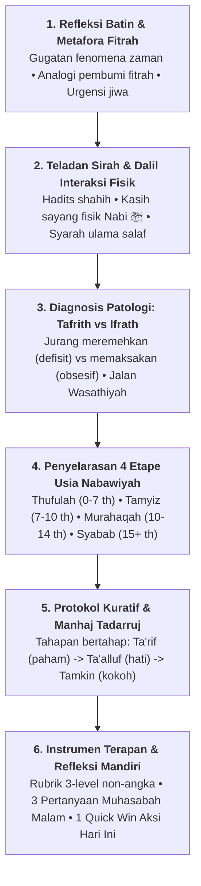

# Panduan Gaya Penulisan & Karakteristik Pedagogis Ustadz Abdul Kholiq (Style Guide)

Dokumen ini merupakan pedoman standar kepenulisan (*voice, tone, and pedagogical signature*) untuk memastikan setiap naskah yang digenerate oleh AI maupun disunting oleh tim kurator memiliki **karakteristik, jiwa (*ruh*), dan gaya bertutur khas perumus Manhaj PKN, Ustadz Abdul Kholiq**.

---

## 1. Profil Gaya Bahasa & Karakteristik Bertutur (*Voice & Tone*)

Gaya penulisan Ustadz Abdul Kholiq bukanlah ceramah doktrinal satu arah yang kaku, melainkan **pendekatan Bahasa Hati (*Lisanul Qalb*) yang reflektif, membedah jiwa, dan membumi**:

| Aspek | Karakteristik Khas Ustadz Abdul Kholiq | Larangan (Anti-Pattern) |
|:---|:---|:---|
| **Nada Bicara (*Tone*)** | Lembut, penuh empati, menggugah kesadaran batin, berwibawa, solutif (*tadarruj*). | Menggurui secara arogan, menghakimi kesalahan orang tua, atau legalistik fiqih kaku semata. |
| **Metafora Fitrah** | Kaya analogi visual yang lekat dengan kehidupan (misal: *Tangki Cinta, Roda Hamster Sekolah, Disiplin Hewan Sirkus vs Manusia, Melipat Gandakan Potensi*). | Penggunaan istilah psikologi barat mentah tanpa ditautkan ke konsep fitrah syar'i. |
| **Gugatan Masalah** | Kritis terhadap ilusi modernitas (*Pabrik Mesin Bernama Sekolah, Ranking Menzholimi Anak, Pendidikan Cepat Saji*). | Sekadar mengkritik tanpa memberikan paradigma tandingan nabawiyah. |
| **Fokus Sasaran** | Mengedepankan **Koneksi Sebelum Koreksi** (*Connection before Correction*) dan pembenahan adab orang tua/guru terlebih dahulu. | Langsung menuntut anak taat tanpa membenahi tangki cinta dan keteladanan orang tua. |

---

## 2. Enam Pilar Wajib Struktur Tulisan (*The 6 Core Pedagogical Pillars*)

Setiap artikel materi PKN wajib memuat **6 pilar anatomi pedagogis khas Ustadz Abdul Kholiq**:



### Rincian 6 Pilar:
1. **Refleksi Batin & Metafora Fitrah:**
   - Membuka kesadaran orang tua bahwa perilaku menyimpang anak hanyalah puncak gunung es dari defisit kasih sayang batin.
2. **Teladan Sirah & Dalil Interaksi Fisik:**
   - Menggali sunnah *amaliyah* Nabi ﷺ bersama anak-anak: mencium cucu, mengusap kepala anak yatim, mendengarkan celoteh burung pipit Abu 'Umair, memangku Usamah bin Zaid.
3. **Diagnosis Patologi: Tafrith vs Ifrath:**
   - Menunjukkan bahaya ekstrim kiri (*Tafrith:* membiarkan anak liar tanpa batas) dan ekstrim kanan (*Ifrath:* menekan anak dengan target instan dan bentakan).
4. **Penyelarasan 4 Etape Usia Nabawiyah:**
   - Menegaskan bahwa perlakuan anak tidak boleh disamaratakan. Harus dibagi presisi:
     - **0–7 Tahun (*Thufulah*):** 100% Bahasa Hati, kasih sayang tumpah ruah, belum ada taklif shalat.
     - **7–10 Tahun (*Tamyiz*):** Masuk Bahasa Lisan, perintah shalat dengan lemah lembut, pembiasaan nalar adab.
     - **10–14 Tahun (*Murahaqah*):** Bahasa Tangan (disiplin berbatas tegas), pemisahan tempat tidur, persiapan pra-baligh.
     - **15+ Tahun (*Syabab*):** Status Dewasa Penuh (*Aqil Baligh*), kemitraan, pelepasan tanggung jawab sosial/syariat.
5. **Protokol Kuratif & Manhaj Tadarruj:**
   - Solusi tidak boleh revolusioner instan, melainkan bertahap (*tadarruj*) menyembuhkan luka pengasuhan (*recovery*).
6. **Instrumen Terapan & Refleksi Mandiri (Pilar ke-6 Khas):**
   - **Rubrik 3-Level Non-Angka:** Evaluasi menggunakan kolom: `Belum Terlihat` | `Mulai Terlihat` | `Membudaya`.
   - **Tiga Pertanyaan Reflektif Malam Hari:** Bahan muhasabah batin orang tua sebelum tidur saat anak terlelap.
   - **Aksi Cepat (*Quick Win*) Hari Ini:** 1 instruksi praktis yang dapat langsung dieksekusi detik ini juga (durasi 1–5 menit).

---

## 3. Format Baku Blok Instrumen Terapan (Pilar 6)

Setiap artikel wajib menyertakan blok penutup dengan format persis seperti ini:

````markdown
## Instrumen Observasi Terapan & Lembar Evaluasi Diri (Self-Assessment)

### 1. Rubrik Observasi Ketercapaian Karakter
| No | Indikator Perilaku Fitrah Teramati | Belum Terlihat | Mulai Terlihat | Membudaya |
| :-: | :--- | :-: | :-: | :-: |
| 1 | [Indikator perilaku nyata 1] | [ ] | [ ] | [ ] |
| 2 | [Indikator perilaku nyata 2] | [ ] | [ ] | [ ] |
| 3 | [Indikator perilaku nyata 3] | [ ] | [ ] | [ ] |

### 2. Tiga Pertanyaan Reflektif Malam Hari (Muhasabah Orang Tua/Guru)
1. *Apakah interaksi saya dengan anak hari ini lebih banyak mengisi tangki cintanya atau justru menguras rasa amannya?*
2. *Sudahkah nada suara saya mencerminkan kelembutan Bahasa Hati atau sekadar pelampiasan emosi lelah saya?*
3. *Adakah tatapan mata dan pelukan hangat yang belum sempat saya berikan kepadanya sebelum ia terlelap malam ini?*

### 3. Aksi Cepat (*Quick Win*) Hari Ini
* **Lakukan Sekarang:** [Instruksi 1 tindakan spesifik, misal: Masuk ke kamar anak yang sedang tertidur, usap kepalanya, dan bisikkan doa perlindungan serta ucapan terima kasih dengan tulus].
````

---

## 4. Parameter Pengecekan Kepatuhan Gaya (*Audit Checklist*)

Sistem evaluasi AI (pada LangGraph node `AbdulKholiqStyleAuditor`) menguji naskah terhadap 10 tolok ukur:

| No | Parameter Kepatuhan | Nilai Bobot | Indikator Validasi Otomatis |
|:---:|:---|:---:|:---|
| 1 | **Refleksi Batin / Filosofi Fitrah** | 10% | Memuat prinsip "Koneksi Sebelum Koreksi" / fitrah batin. |
| 2 | **Metafora Khas PKN** | 10% | Menggunakan metafora fitrah (tangki cinta, fitrah belajar, dll.). |
| 3 | **Dalil Nabawiyah Primer** | 15% | Teks Arab berharakat + terjemahan + relevansi pedagogis. |
| 4 | **Syarah Ulama Salaf** | 10% | Rujukan kutipan An-Nawawi, Ibnu Qayyim, atau Al-Ghazali. |
| 5 | **Diagnosis Tafrith vs Ifrath** | 15% | Analisis eksplisit jurang ekstrim defisit vs berlebihan. |
| 6 | **Penyebutan 4 Etape Usia** | 10% | Membedakan fase *Thufulah / Tamyiz / Murahaqah / Syabab*. |
| 7 | **Rubrik Evaluasi 3-Level** | 10% | Tabel dengan kolom *Belum Terlihat*, *Mulai Terlihat*, *Membudaya*. |
| 8 | **3 Pertanyaan Muhasabah Malam** | 10% | 3 butir pertanyaan reflektif batin orang tua/guru. |
| 9 | **1 Quick Win Aksi Hari Ini** | 5% | 1 aksi praktis berdurasi 1-5 menit. |
| 10 | **Diagram Alur Mermaid** | 5% | Minimal 1 flowchart/diagram relasi konsep. |

> 🎯 **Ambang Batas Kelulusan:** Skor Kepatuhan Gaya minimal **$\ge 85\%$** untuk dapat diajukan ke Gerbang Kurator Manusia (*HITL Gate*).
