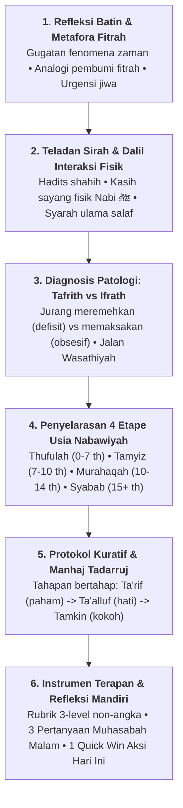

# Panduan Gaya Penulisan & Karakteristik Pedagogis Ustadz Abdul Kholiq (Style Guide)

Dokumen ini merupakan pedoman standar kepenulisan (*voice, tone, and pedagogical signature*) untuk memastikan setiap naskah yang digenerate oleh AI maupun disunting oleh tim kurator memiliki **karakteristik, jiwa (*ruh*), dan gaya bertutur khas perumus Manhaj PKN, Ustadz Abdul Kholiq**.

---

## 1. Profil Gaya Bahasa & Karakteristik Bertutur (*Voice & Tone*)

Gaya penulisan Ustadz Abdul Kholiq bukanlah ceramah doktrinal satu arah yang kaku, melainkan **pendekatan Bahasa Hati (*Lisanul Qalb*) yang reflektif, membedah jiwa, dan membumi**:

| Aspek | Karakteristik Khas Ustadz Abdul Kholiq | Larangan (Anti-Pattern) |
|:---|:---|:---|
| **Nada Bicara (*Tone*)** | Lembut, penuh empati, menggugah kesadaran batin, berwibawa, solutif (*tadarruj*). | Menggurui secara arogan, menghakimi kesalahan orang tua, atau legalistik fiqih kaku semata. |
| **Metafora Fitrah** | Kaya analogi visual yang lekat dengan kehidupan (misal: *Tangki Cinta, Roda Hamster Sekolah, Disiplin Hewan Sirkus vs Manusia, Melipat Gandakan Potensi*). | Penggunaan istilah psikologi barat mentah tanpa ditautkan ke konsep fitrah syar'i. |
| **Gugatan Masalah** | Kritis terhadap ilusi modernitas (*Pabrik Mesin Bernama Sekolah, Ranking Menzholimi Anak, Pendidikan Cepat Saji*). | Sekadar mengkritik tanpa memberikan paradigma tandingan nabawiyah. |
| **Fokus Sasaran** | Mengedepankan **Koneksi Sebelum Koreksi** (*Connection before Correction*) dan pembenahan adab orang tua/guru terlebih dahulu. | Langsung menuntut anak taat tanpa membenahi tangki cinta dan keteladanan orang tua. |

---

## 2. Enam Pilar Wajib Struktur Tulisan (*The 6 Core Pedagogical Pillars*)

Setiap artikel materi PKN wajib memuat **6 pilar anatomi pedagogis khas Ustadz Abdul Kholiq**:



### Rincian 6 Pilar:
1. **Refleksi Batin & Metafora Fitrah:**
   - Membuka kesadaran orang tua bahwa perilaku menyimpang anak hanyalah puncak gunung es dari defisit kasih sayang batin.
2. **Teladan Sirah & Dalil Interaksi Fisik:**
   - Menggali sunnah *amaliyah* Nabi ﷺ bersama anak-anak: mencium cucu, mengusap kepala anak yatim, mendengarkan celoteh burung pipit Abu 'Umair, memangku Usamah bin Zaid.
3. **Diagnosis Patologi: Tafrith vs Ifrath:**
   - Menunjukkan bahaya ekstrim kiri (*Tafrith:* membiarkan anak liar tanpa batas) dan ekstrim kanan (*Ifrath:* menekan anak dengan target instan dan bentakan).
4. **Penyelarasan 4 Etape Usia Nabawiyah:**
   - Menegaskan bahwa perlakuan anak tidak boleh disamaratakan. Harus dibagi presisi:
     - **0–7 Tahun (*Thufulah*):** 100% Bahasa Hati, kasih sayang tumpah ruah, belum ada taklif shalat.
     - **7–10 Tahun (*Tamyiz*):** Masuk Bahasa Lisan, perintah shalat dengan lemah lembut, pembiasaan nalar adab.
     - **10–14 Tahun (*Murahaqah*):** Bahasa Tangan (disiplin berbatas tegas), pemisahan tempat tidur, persiapan pra-baligh.
     - **15+ Tahun (*Syabab*):** Status Dewasa Penuh (*Aqil Baligh*), kemitraan, pelepasan tanggung jawab sosial/syariat.
5. **Protokol Kuratif & Manhaj Tadarruj:**
   - Solusi tidak boleh revolusioner instan, melainkan bertahap (*tadarruj*) menyembuhkan luka pengasuhan (*recovery*).
6. **Instrumen Terapan & Refleksi Mandiri (Pilar ke-6 Khas):**
   - **Rubrik 3-Level Non-Angka:** Evaluasi menggunakan kolom: `Belum Terlihat` | `Mulai Terlihat` | `Membudaya`.
   - **Tiga Pertanyaan Reflektif Malam Hari:** Bahan muhasabah batin orang tua sebelum tidur saat anak terlelap.
   - **Aksi Cepat (*Quick Win*) Hari Ini:** 1 instruksi praktis yang dapat langsung dieksekusi detik ini juga (durasi 1–5 menit).

---

## 3. Format Baku Blok Instrumen Terapan (Pilar 6)

Setiap artikel wajib menyertakan blok penutup dengan format persis seperti ini:

````markdown
## Instrumen Observasi Terapan & Lembar Evaluasi Diri (Self-Assessment)

### 1. Rubrik Observasi Ketercapaian Karakter
| No | Indikator Perilaku Fitrah Teramati | Belum Terlihat | Mulai Terlihat | Membudaya |
| :-: | :--- | :-: | :-: | :-: |
| 1 | [Indikator perilaku nyata 1] | [ ] | [ ] | [ ] |
| 2 | [Indikator perilaku nyata 2] | [ ] | [ ] | [ ] |
| 3 | [Indikator perilaku nyata 3] | [ ] | [ ] | [ ] |

### 2. Tiga Pertanyaan Reflektif Malam Hari (Muhasabah Orang Tua/Guru)
1. *Apakah interaksi saya dengan anak hari ini lebih banyak mengisi tangki cintanya atau justru menguras rasa amannya?*
2. *Sudahkah nada suara saya mencerminkan kelembutan Bahasa Hati atau sekadar pelampiasan emosi lelah saya?*
3. *Adakah tatapan mata dan pelukan hangat yang belum sempat saya berikan kepadanya sebelum ia terlelap malam ini?*

### 3. Aksi Cepat (*Quick Win*) Hari Ini
* **Lakukan Sekarang:** [Instruksi 1 tindakan spesifik, misal: Masuk ke kamar anak yang sedang tertidur, usap kepalanya, dan bisikkan doa perlindungan serta ucapan terima kasih dengan tulus].
````

---

## 4. Parameter Pengecekan Kepatuhan Gaya, Arsitektur 4 Zona Wiki & Pengalaman Membaca (*Audit Checklist*)

Sistem evaluasi AI (pada LangGraph node `AbdulKholiqStyleAuditor` dan `ContentPlacementAuditor`) menguji naskah terhadap 10 tolok ukur kepatuhan manhaj, arsitektur 4 zona standar MediaWiki, dan *reader's journey*:

| No | Parameter Kepatuhan | Nilai Bobot | Indikator Validasi Otomatis |
|:---:|:---|:---:|:---|
| 1 | **TL;DR & Paragraf Pembuka (Lead Section)** | 10% | Callout `> [!SUMMARY]` di awal artikel (1 kalimat definisi + 3 capaian) & 1-2 paragraf narasi pembuka. |
| 2 | **Infobox Parameter Cepat & Frontmatter (Zona 1 & 2)** | 10% | Keberadaan Frontmatter lengkap dan `.wiki-infobox` di sudut kanan atas memuat parameter kunci cepat. |
| 3 | **Bagan Visual Obsidian Canvas** | 10% | Embed visual konsep `![[canvas/...canvas]]` sebagai peta gagasan global (bukan Mermaid datar). |
| 4 | **Dalil Nabawiyah Primer** | 15% | Teks Arab berharakat + terjemahan + relevansi pedagogis. |
| 5 | **Syarah Ulama Salaf & Narasi Mengalir** | 10% | Rujukan kutipan An-Nawawi, Ibnu Qayyim, atau Al-Ghazali yang tersambung secara kohesif. |
| 6 | **Diagnosis Tafrith vs Ifrath** | 10% | Analisis eksplisit jurang ekstrim defisit vs berlebihan dan jalan tengah (*wasathiyah*). |
| 7 | **Penyebutan 4 Etape Usia** | 10% | Penjenjangan bertahap fase *Thufulah / Tamyiz / Murahaqah / Syabab*. |
| 8 | **Instrumen Terapan (Rubrik 3-Level, Muhasabah & Quick Win)** | 15% | Rubrik Non-Angka (*Belum*, *Mulai*, *Membudaya*), 3 Pertanyaan Muhasabah, dan 1 Quick Win. |
| 9 | **Lampiran & Catatan Kaki (Zona 3: Takhrij & Superskrip)** | 10% | Sub-bab "Lihat Pula", rujukan superskrip `[^1]`, takhrij Shamela, dan "Bacaan Lanjutan/Pranala Luar". |
| 10 | **Navigasi Bawah & Taksonomi (Zona 4: Navbox & Kategori)** | 10% | Kotak navigasi horizontal `.wiki-navbox`, kategori tematik `[[Kategori:...]]`, dan tautan mu'jam. |

> 🎯 **Ambang Batas Kelulusan:** Skor Kepatuhan Gaya minimal **$\ge 85\%$** untuk dapat diajukan ke Gerbang Kurator Manusia (*HITL Gate*).
> ⚠️ **Catatan Alur Membaca:** Dilarang menyajikan artikel dalam bentuk deretan *bullet points* terisolasi. Seluruh poin harus dirangkai dengan jembatan narasi transisi logis agar pembaca memahami kausalitas konsep secara utuh dalam kerangka 4 zona wiki.

---

## 5. Mekanisme Penulisan Kepadatan Tinggi & Pembatasan Negatif (High-Density Engineering Prompts)

Agar naskah teknis/tarbiyah tetap tajam, kaya data, dan tidak terjebak dalam basa-basi khas AI (*LLM tells*), generator LLM wajib menerapkan 6 aturan mekanik penulisan berikut:

### A. Pembatasan Negatif Mutlak (*Ban the "LLM Tells"*)
1. **Dilarang Menulis Pengumuman Meta (*No Meta-Announcements*):**
   - ❌ *Dilarang:* "Dalam bab ini kita akan membahas...", "Mari kita selami lebih dalam...", "Berikut adalah ikhtisar ringkas mengenai...".
   - ✔️ *Wajib:* Langsung masuk ke subjek inti pada kalimat pertama.
2. **Eliminasi Kata Sifat Klise & Berlebihan (*Ban Fluffy Adjectives*):**
   - ❌ *Dilarang:* Kata-kata seperti *krusial, luar biasa, revolusioner, sangat penting, pilar fundamental yang tak tergantikan, menjembatani secara mulus*.
   - ✔️ *Wajib:* Paparkan fakta dan konsekuensi amaliah secara langsung dan lugas.
3. **Dilarang Menulis Judul Kesimpulan Berlabel (*No Labeled Closings*):**
   - ❌ *Dilarang:* Bagian dengan judul "Kesimpulan", "Rangkuman", "Inti Sari".
   - ✔️ *Wajib:* Artikel wiki selesai setelah sub-bab *Instrumen Observasi Terapan* (Pilar 6) selesai disajikan.
4. **Gunakan Kalimat Aktif & Aksi Konkret (*Active Voice*):**
   - ❌ *Hindari:* "Pemberian hukuman fisik dilakukan oleh orang tua apabila terjadi pengabaian shalat setelah anak berusia 10 tahun."
   - ✔️ *Gunakan:* "Orang tua menerapkan sanksi tegas terukur jika anak tetap meninggalkan shalat setelah menginjak usia 10 tahun."

### B. Pola Buffer Penalaran: "Ekstraksi Dulu, Baru Sintesis" (*Scratchpad-Then-Synthesize*)
Sebelum menulis naskah final, prompt LLM wajib mengekstrak seluruh fakta atomik di dalam tag `<scratchpad_extraction>` agar tidak ada batasan usia atau peringatan syar'i yang tereliminasi:
```xml
<phase_1_fact_extraction>
- Pindai teks sumber/transkrip dan catat:
  * Dalil hadits/ayat spesifik dan nomor rujukannya
  * Batasan rentang usia anak (0-7, 7-10, 10-14, 15+)
  * Patologi parenting (gejala Tafrith vs gejala Ifrath)
  * Rukun 3A atau pilar TB-40 yang terkait
</phase_1_fact_extraction>

<phase_2_wiki_draft>
- Susun naskah wiki Quartz lengkap 9 lapisan.
- Pastikan seluruh poin yang tercatat pada phase_1 termuat utuh dalam tabel atau narasi.
</phase_2_wiki_draft>
```

### C. Format Kepadatan Tinggi Menggantikan Paragraf Panjang (*High-Density Formats*)
1. **Matriks Kasus (*Condition $\to$ Root Cause $\to$ Exact Remediation*):**
   - Setiap kali mengurai dinamika santri/anak, gunakan tabel keputusan:
   | Kondisi / Gejala Perilaku | Akar Masalah Batin | Protokol Terapi Nabawiyah (*'Ilaj*) |
   |:---|:---|:---|
2. **Aturan "Specification Box":**
   - Jika sebuah paragraf memuat $\ge 3$ parameter (misal: rentang usia, durasi KBM, batasan kuota gadget, tahapan bertahap), **dilarang menuliskannya dalam bentuk prosa panjang**. Wajib disajikan dalam bentuk tabel kunci-nilai (*key-value table*) atau *callout card*.

### D. Multi-Pass "Editor" Chaining (Two-Agent Pipeline)
Proses penulisan dipisahkan menjadi 2 agen sekuensial:
1. **Agent 1 (The Technical Drafter):** Berfokus pada kelengkapan 100% fakta, dalil, dan studi kasus. Menghasilkan draf komprehensif tanpa peduli gaya prosa.
2. **Agent 2 (The Ruthless Copy-Editor):** Berfokus memotong 20–25% kata-kata mubazir, membuang kata klise AI, mengubah kalimat pasif menjadi aktif, dan memadatkan paragraf ke dalam tabel tanpa menghilangkan satu pun parameter teknis atau dalil.

### E. Kalibrasi Parameter Inferensi Model
- **Temperature ($T = 0.0 - 0.2$):** Sangat rendah untuk menjamin presisi kutipan dalil, nomor perawi hadits, dan batasan usia hukum tanpa halusinasi kreatif.
- **Top-P ($0.9$):** Menjaga determinisme istilah syar'i (*Ihsan, Ta'dib, Iffah, Syaja'ah*) agar tidak tergantikan sinonim modern yang melenceng.

