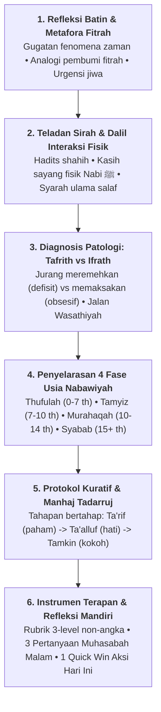

# Panduan Gaya Penulisan & Karakteristik Pedagogis Ustadz Abdul Kholiq (Style Guide)

Dokumen ini adalah **referensi pendamping suara penulisan dan ciri pedagogis materi Ustadz Abdul Kholiq**, bukan kebijakan editorial atau gerbang publikasi mandiri. Kebijakan kanonis terdapat dalam [`PANDUAN_PENULISAN_KONTEN.md`](../PANDUAN_PENULISAN_KONTEN.md), termasuk jenis halaman, retensi fakta, sitasi, dan HITL. Penggunaan gaya ini tidak membuktikan atribusi ucapan kepada beliau atau persetujuan ahli terhadap naskah AI/kontributor. Kutipan langsung dan parafrasa harus tetap ditelusuri ke materi asal.

---

## 1. Profil Gaya Bahasa & Karakteristik Bertutur (*Voice & Tone*)

Gaya penulisan Ustadz Abdul Kholiq bukanlah ceramah doktrinal satu arah yang kaku, melainkan **pendekatan Bahasa Hati (*Lisanul Qalb*) yang reflektif, membedah jiwa, dan membumi**:

| Aspek | Karakteristik Khas Ustadz Abdul Kholiq | Larangan (Anti-Pattern) |
|:---|:---|:---|
| **Nada Bicara (*Tone*)** | Lembut, penuh empati, menggugah kesadaran batin, berwibawa, solutif (*tadarruj*). | Menggurui secara arogan, menghakimi kesalahan orang tua, atau legalistik fiqih kaku semata. |
| **Metafora Fitrah** | Kaya analogi visual yang lekat dengan kehidupan (misal: *Tangki Cinta, Roda Hamster Sekolah, Disiplin Hewan Sirkus vs Manusia, Melipat Gandakan Potensi*). | Penggunaan istilah psikologi barat mentah tanpa ditautkan ke konsep fitrah syar'i. |
| **Gugatan Masalah** | Kritis terhadap ilusi modernitas (*Pabrik Mesin Bernama Sekolah, Ranking Menzholimi Anak, Pendidikan Cepat Saji*). | Sekadar mengkritik tanpa memberikan paradigma tandingan nabawiyah. |
| **Fokus Sasaran** | Mengedepankan **Koneksi Sebelum Koreksi** (*Connection before Correction*) dan pembenahan adab orang tua/guru terlebih dahulu. | Langsung menuntut anak taat tanpa membenahi tangki cinta dan keteladanan orang tua. |

---

## 2. Enam Pilar Referensi Struktur Tulisan (*The 6 Core Pedagogical Pillars*)

Enam pilar berikut membantu menyusun **artikel panjang** bila sesuai tema dan sumber. Pilar bukan kewajiban seragam untuk MOC, formulir, atau setiap artikel. Jangan menambah dalil, analisis usia, maupun instrumen yang tidak bersumber demi kelengkapan gaya.


```mermaid
flowchart TD
    P1["<b>1. Refleksi Batin & Metafora Fitrah</b><br/>Gugatan fenomena zaman • Analogi pembumi fitrah • Urgensi jiwa"]
    P2["<b>2. Teladan Sirah & Dalil Interaksi Fisik</b><br/>Hadits shahih • Kasih sayang fisik Nabi ﷺ • Syarah ulama salaf"]
    P3["<b>3. Diagnosis Patologi: Tafrith vs Ifrath</b><br/>Jurang meremehkan (defisit) vs memaksakan (obsesif) • Jalan Wasathiyah"]
    P4["<b>4. Penyelarasan 4 Fase Usia Nabawiyah</b><br/>Thufulah (0-7 th) • Tamyiz (7-10 th) • Murahaqah (10-14 th) • Syabab (15+ th)"]
    P5["<b>5. Protokol Kuratif & Manhaj Tadarruj</b><br/>Tahapan bertahap: Ta'rif (paham) -> Ta'alluf (hati) -> Tamkin (kokoh)"]
    P6["<b>6. Instrumen Terapan & Refleksi Mandiri</b><br/>Rubrik 3-level non-angka • 3 Pertanyaan Muhasabah Malam • 1 Quick Win Aksi Hari Ini"]

    P1 --> P2 --> P3 --> P4 --> P5 --> P6
```

### Rincian 6 Pilar:

Rincian di bawah adalah kerangka gaya yang telah tercatat dalam referensi ini, bukan dalil mandiri, diagnosis, atau validasi hukum/perkembangan. Sebelum menerapkannya sebagai klaim dalam artikel, cari materi asal dan cantumkan lokasinya sesuai panduan kanonis. Pernyataan sebab tunggal, usia/taklif, serta istilah kuratif memerlukan review substansi; penyunting gaya tidak berwenang mengesahkannya. Jika belum terverifikasi, jangan memperlakukannya sebagai aturan universal.
1. **Refleksi Batin & Metafora Fitrah:**
   - Membuka kesadaran orang tua bahwa perilaku menyimpang anak hanyalah puncak gunung es dari defisit kasih sayang batin.
2. **Teladan Sirah & Dalil Interaksi Fisik:**
   - Menggali sunnah *amaliyah* Nabi ﷺ bersama anak-anak: mencium cucu, mengusap kepala anak yatim, mendengarkan celoteh burung pipit Abu 'Umair, memangku Usamah bin Zaid.
3. **Diagnosis Patologi: Tafrith vs Ifrath:**
   - Menunjukkan bahaya ekstrim kiri (*Tafrith:* membiarkan anak liar tanpa batas) dan ekstrim kanan (*Ifrath:* menekan anak dengan target instan dan bentakan).
4. **Penyelarasan 4 Fase Usia Nabawiyah:**
   - Menegaskan bahwa perlakuan anak tidak boleh disamaratakan. Harus dibagi presisi:
     - **0–7 Tahun (*Thufulah*):** 100% Bahasa Hati, kasih sayang tumpah ruah, belum ada taklif shalat.
     - **7–10 Tahun (*Tamyiz*):** Masuk Bahasa Lisan, perintah shalat dengan lemah lembut, pembiasaan nalar adab.
     - **10–14 Tahun (*Murahaqah*):** Bahasa Tangan (disiplin berbatas tegas), pemisahan tempat tidur, persiapan pra-baligh.
     - **15+ Tahun (*Syabab*):** Status Dewasa Penuh (*Aqil Baligh*), kemitraan, pelepasan tanggung jawab sosial/syariat.
5. **Protokol Kuratif & Manhaj Tadarruj:**
   - Solusi tidak boleh revolusioner instan, melainkan bertahap (*tadarruj*) menyembuhkan luka pengasuhan (*recovery*).
6. **Instrumen Terapan & Refleksi Mandiri (Pilar ke-6 Khas):**
   - **Rubrik 3-Level Non-Angka:** Evaluasi menggunakan kolom: `Belum Terlihat` | `Mulai Terlihat` | `Membudaya`.
   - **Tiga Pertanyaan Reflektif Malam Hari:** Bahan muhasabah batin orang tua sebelum tidur saat anak terlelap.
   - **Aksi Cepat (*Quick Win*) Hari Ini:** 1 instruksi praktis yang dapat langsung dieksekusi detik ini juga (durasi 1–5 menit).

---

## 3. Format Baku Blok Instrumen Terapan (Pilar 6)

Blok berikut adalah **contoh format**, bukan instrumen tervalidasi atau skala wajib. Gunakan pertanyaan reflektif dan aksi yang relevan; untuk observasi, rujuk instrumen proyek yang sudah ada beserta kategori aslinya. Jangan mengganti kategori instrumen 19 butir dengan tiga level ini atau membuat indikator/skala baru tanpa review risiko tinggi. MOC dapat cukup menautkan toolkit, dan formulir mengikuti tujuan pengisian.

````markdown
## Instrumen Observasi Terapan & Lembar Evaluasi Diri (Self-Assessment)

### 1. Rubrik Observasi Ketercapaian Karakter
| No | Indikator Perilaku Fitrah Teramati | Belum Terlihat | Mulai Terlihat | Membudaya |
| :-: | :--- | :-: | :-: | :-: |
| 1 | [Indikator perilaku nyata 1] | [ ] | [ ] | [ ] |
| 2 | [Indikator perilaku nyata 2] | [ ] | [ ] | [ ] |
| 3 | [Indikator perilaku nyata 3] | [ ] | [ ] | [ ] |

### 2. Tiga Pertanyaan Reflektif Malam Hari (Muhasabah Orang Tua/Guru)
1. *Apakah interaksi saya dengan anak hari ini lebih banyak mengisi tangki cintanya atau justru menguras rasa amannya?*
2. *Sudahkah nada suara saya mencerminkan kelembutan Bahasa Hati atau sekadar pelampiasan emosi lelah saya?*
3. *Adakah tatapan mata dan pelukan hangat yang belum sempat saya berikan kepadanya sebelum ia terlelap malam ini?*

### 3. Aksi Cepat (*Quick Win*) Hari Ini
* **Lakukan Sekarang:** [Instruksi 1 tindakan spesifik, misal: Masuk ke kamar anak yang sedang tertidur, usap kepalanya, dan bisikkan doa perlindungan serta ucapan terima kasih dengan tulus].
````

---

## 4. Parameter Pengecekan Kepatuhan Gaya, Arsitektur 4 Zona Wiki & Pengalaman Membaca (*Audit Checklist*)

Tolok ukur berikut adalah referensi audit desain untuk artikel panjang, bukan persyaratan universal atau bukti bahwa node AI telah dijalankan. Pilih parameter yang sesuai jenis halaman dan sumber; pola Quartz yang sudah digunakan (callout, Mermaid/canvas, wikilink) tidak perlu diganti hanya untuk mengejar skor atau arsitektur MediaWiki.

| No | Parameter Kepatuhan | Nilai Bobot | Indikator Validasi Otomatis |
|:---:|:---|:---:|:---|
| 1 | **TL;DR & Paragraf Pembuka (Lead Section)** | 10% | Callout `> [!SUMMARY]` di awal artikel (1 kalimat definisi + 3 capaian) & 1-2 paragraf narasi pembuka. |
| 2 | **Infobox Parameter Cepat & Frontmatter (Zona 1 & 2)** | 10% | Keberadaan Frontmatter lengkap dan `.wiki-infobox` di sudut kanan atas memuat parameter kunci cepat. |
| 3 | **Bagan Visual Obsidian Canvas** | 10% | Embed visual konsep `![[canvas/...canvas]]` sebagai peta gagasan global (bukan Mermaid datar). |
| 4 | **Dalil Nabawiyah Primer** | 15% | Teks Arab berharakat + terjemahan + relevansi pedagogis. |
| 5 | **Syarah Ulama Salaf & Narasi Mengalir** | 10% | Rujukan kutipan An-Nawawi, Ibnu Qayyim, atau Al-Ghazali yang tersambung secara kohesif. |
| 6 | **Diagnosis Tafrith vs Ifrath** | 10% | Analisis eksplisit jurang ekstrim defisit vs berlebihan dan jalan tengah (*wasathiyah*). |
| 7 | **Penyebutan 4 Fase Usia** | 10% | Penjenjangan bertahap fase *Thufulah / Tamyiz / Murahaqah / Syabab*. |
| 8 | **Instrumen Terapan (Rubrik 3-Level, Muhasabah & Quick Win)** | 15% | Rubrik Non-Angka (*Belum*, *Mulai*, *Membudaya*), 3 Pertanyaan Muhasabah, dan 1 Quick Win. |
| 9 | **Lampiran & Catatan Kaki (Zona 3: Takhrij & Superskrip)** | 10% | Sub-bab "Lihat Pula", rujukan superskrip `[^1]`, takhrij Shamela, dan "Bacaan Lanjutan/Pranala Luar". |
| 10 | **Navigasi Bawah & Taksonomi (Zona 4: Navbox & Kategori)** | 10% | Kotak navigasi horizontal `.wiki-navbox`, kategori tematik `[[Kategori:...]]`, dan tautan mu'jam. |

> **Skor bersifat advisori:** bobot pada tabel adalah rancangan audit, bukan persentase terkalibrasi atau ukuran kebenaran. Jangan menganggap ambang 85% sebagai syarat masuk HITL, kelulusan, atau tanda tangan manusia. Catat masalah per parameter dan perbaiki yang relevan; sumber dan review risiko mengikuti panduan kanonis.
> **Alur membaca:** artikel panjang memerlukan hubungan gagasan yang jelas. Daftar bernomor, checklist, tabel, MOC, dan kolom formulir tetap tepat untuk instruksi praktis; jangan menambah transisi pengisi atau paragraf demi skor/panjang.

---

## 5. Mekanisme Penulisan Kepadatan Tinggi & Pembatasan Negatif (High-Density Engineering Prompts)

Untuk menjaga naskah teknis/tarbiyah padat tanpa kehilangan fakta, gunakan pola penyuntingan berikut sesuai kebutuhan. Target 5.000 karakter hanya sasaran elaborasi artikel panjang dalam panduan kanonis, bukan minimum MOC/formulir atau alasan menambah teks.

### A. Pembatasan Negatif Mutlak (*Ban the "LLM Tells"*)
1. **Dilarang Menulis Pengumuman Meta (*No Meta-Announcements*):**
   - ❌ *Dilarang:* "Dalam bab ini kita akan membahas...", "Mari kita selami lebih dalam...", "Berikut adalah ikhtisar ringkas mengenai...".
   - ✔️ *Wajib:* Langsung masuk ke subjek inti pada kalimat pertama.
2. **Eliminasi Kata Sifat Klise & Berlebihan (*Ban Fluffy Adjectives*):**
   - ❌ *Dilarang:* Kata-kata seperti *krusial, luar biasa, revolusioner, sangat penting, pilar fundamental yang tak tergantikan, menjembatani secara mulus*.
   - ✔️ *Wajib:* Paparkan fakta dan konsekuensi amaliah secara langsung dan lugas.
3. **Penutup Sesuai Kebutuhan Pembaca:**
   - Ringkasan, tindak lanjut, referensi, dan navigasi boleh ditempatkan di akhir bila membantu pembaca. Tidak ada kewajiban mengakhiri semua artikel pada blok instrumen.
4. **Gunakan Kalimat Aktif & Aksi Konkret (*Active Voice*):**
   - Hindari: “Pencatatan kejadian dilakukan oleh pendamping setelah kegiatan.”
   - Gunakan: “Pendamping mencatat kejadian setelah kegiatan.”
   - Perbaikan bentuk kalimat tidak boleh mengubah saran menjadi perintah, ketidakpastian menjadi kepastian, atau materi berisiko tinggi menjadi instruksi tanpa review.

### B. Pola Buffer Penalaran: "Ekstraksi Dulu, Baru Sintesis" (*Scratchpad-Then-Synthesize*)
Sebelum menulis naskah final, catat fakta dan lokasi sumber dalam catatan kerja agar batasan usia, atribusi, pengecualian, dan peringatan tidak hilang. Catatan ini adalah inventaris sumber yang dapat diperiksa, bukan penalaran internal model atau bukti verifikasi otomatis:
```xml
<phase_1_fact_extraction>
- Pindai teks sumber/transkrip dan catat:
  * Dalil hadits/ayat spesifik dan nomor rujukannya
  * Batasan rentang usia anak (0-7, 7-10, 10-14, 15+)
  * Patologi parenting (gejala Tafrith vs gejala Ifrath)
  * Rukun 3A atau pilar TB-40 yang terkait
</phase_1_fact_extraction>

<phase_2_wiki_draft>
- Susun naskah sesuai jenis halaman dan empat lapisan penyajian bila relevan.
- Petakan setiap fakta yang digunakan ke sumber; pertahankan syarat dan ketidakpastiannya. Catat alasan jika fakta tidak relevan atau belum layak dimuat, bukan memaksakan seluruh hasil ekstraksi ke artikel.
</phase_2_wiki_draft>
```

### C. Format Kepadatan Tinggi Menggantikan Paragraf Panjang (*High-Density Formats*)
1. **Matriks Kasus Deskriptif:**
   - Gunakan tabel bila membantu memisahkan kejadian dari tafsir dan tindak lanjut. Jangan menyimpulkan akar masalah batin atau terapi dari satu perilaku tanpa dasar dan review substansi:
   | Kejadian Teramati & Konteks | Tafsir Sementara / Pertanyaan Pendamping | Tindak Lanjut Sesuai Sumber |
   |:---|:---|:---|
2. **Aturan "Specification Box":**
   - Jika paragraf memuat banyak parameter, pertimbangkan tabel kunci-nilai atau callout agar mudah dipindai. Pertahankan kalimat penjelas ketika tabel akan menghilangkan syarat, pengecualian, atau hubungan gagasan.

### D. Multi-Pass "Editor" Chaining (Two-Agent Pipeline)
Proses dapat dibagi menjadi penyusunan draf dan copy-edit, oleh manusia atau dengan bantuan AI:
1. **Penyusun draf:** catat fakta, dalil, lokasi sumber, dan status verifikasi; susun naskah sesuai kebutuhan pembaca.
2. **Copy-editor:** buang pengulangan, perjelas kalimat, dan rapikan struktur dengan checklist retensi fakta dalam panduan kanonis. Tidak ada kuota pemotongan 20–25%; kutipan, parameter, syarat, dan peringatan tidak boleh hilang demi kepadatan.

### E. Batas Bantuan Model
Pengaturan temperature atau top-p dapat membantu konsistensi keluaran, tetapi **tidak menjamin** akurasi kutipan, nomor hadits, istilah, atau batas usia/hukum. Cocokkan hasil dengan sumber asal, dokumentasikan ketidakpastian, dan serahkan review manusia sesuai risiko. Jangan menyebut keluaran model sebagai takhrij, validasi instrumen, atau signoff ahli.

